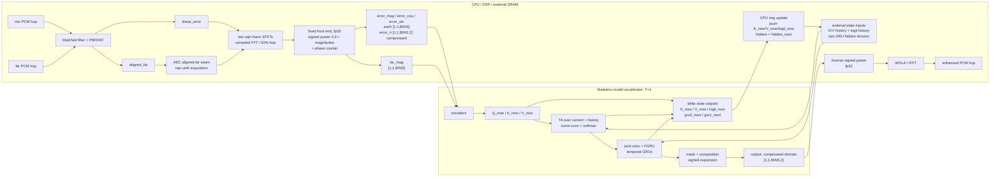

# Align-ULCNet

Hybrid `linear AEC -> joint RES + NR` reference candidate. Inputs are the
**frozen production linear-AEC error** and far-end reference. That frontend
runs on the context-only seam (`enable_res=0`, `return_res_context=1`) — the
same seam the board pipelines use — so its over-output capture guard is live:
a hop the filtering-quality analyzer has not cleared and whose residual
outweighs the capture publishes the capture instead. The target is
the common denoised, echo-free, early/dereverberated near-end speech. It is
not a direct neural AEC. This target is the project's comparison contract and
should not be reported as an upstream checkpoint-equivalent setting.

The implementation follows arXiv:2410.13620: component-wise power-law
compression; separate 32-channel NE/error and FE streams; two separable
convolutions per stream and max-pooling; 32-channel latent cross-attention;
ordinary joint convolutions with 64/96 channels; a 64-unit frequency GRU; two
parallel, two-layer 128-unit temporal subband GRUs; two full-band FC layers;
and the ULCNet second-stage CNN complex mask. The compressed real/imaginary
estimate is decompressed component-wise.

C-SamFR follows Figure 2 at the subband level. On the 16 kHz grid, `K=257`,
`K_B=2`, `gamma=5` pads to 130 subbands and produces five 52-bin channels; the
same formula derives the larger 48 kHz widths from `K=513`. It does not
interleave individual FFT bins and break two-bin subbands apart.

Paper defaults are 16 kHz, `512/512/256`, 3-second samples, `alpha=0.3`, and a
64-frame (~1 s) delay buffer. The project ships two grids, and every width
below is derived from `n_fft` rather than written down anywhere:

| grid | `n_fft`/win/hop | `K` (bins) | C-SamFR channel width | attention `ta_bins` | hop duration |
| --- | --- | ---: | ---: | ---: | ---: |
| 16 kHz | `512/512/256` | 257 | 52 | 26 | 16.00 ms |
| 48 kHz | `1024/1024/512` | 513 | 104 | 52 | 10.67 ms |

Those two are the only supported grids: `export_onnx.py` rejects anything else
(`SUPPORTED_GRIDS`), and `ulcnet_model_io.h` refuses to compile off them.
Changing grids also changes learned frequency-axis tensor shapes (including
the reorientation, bottleneck and fully connected layers). A 16 kHz checkpoint
therefore cannot be exported or deployed as 48 kHz: train a separate 48 kHz
checkpoint from a matching packed corpus. This is different from changing D,
whose history length changes the streaming contract but not the weight shapes.

On the training side the grid comes from `[signal] sr`/`n_fft` in `config.ini`.
On the C side it is a build parameter, selected by name:

```bash
make                       # 16 kHz (the default)
make ULCNET_GRID=48k       # 48 kHz
make test-grids            # build and test BOTH, in separate object dirs
```

`ULCNET_GRID` reaches only the ULCNet translation units and is folded into the
pipeline `CFG_SIG`, so the two grids never share an object directory and the
AEC/NR/audio_common producer archives -- which contain no ULCNet code -- are
not rebuilt when the grid changes. Passing the two `-D` flags through
`EXTRA_CFLAGS` also works but does forward them to those producers, splitting
their caches for nothing.

D does **not** carry across the two grids, because the hop it counts is a
different length. A depth D reaches `(D-1)` hops back, so D=8 reaches 112 ms at
16 kHz but only 74.7 ms at 48 kHz; matching the 16 kHz reach needs D=12 there.
Deriving D from one physical second is also not available at 48 kHz: that comes
to 94 frames, above the `D <= 64` ceiling that `export_onnx.py`
(`MAX_DELAY_DEPTH`) and the C runtime (`ULCNET_MODEL_IO_MAX_D`) both enforce.
So on the 48 kHz grid `[model] max_delay_frames` must be set explicitly -- a
run that leaves it to the one-second default trains, then fails at export. The
shipped 16 kHz training `config.ini` sets D=32 explicitly.

The two standalone examples (`mono_alignulcnet`, `4ch_alignulcnet`) read their
delay settings from file-head macros, so a per-SKU build can bake in a measured
profile instead of passing flags on every run:
`ULCNET_EXAMPLE_DELAY_FRAMES` (D, default 8) and
`ULCNET_EXAMPLE_DELAY_NUM_FILTERS` (MATCHED bank size n, default
`DA_NUM_FILTERS` = 5). Both are compile-time only: D must equal the D the model
was exported with, and n sizes the matched bank, so changing either means a
rebuild and a fresh pool query. `--delay-num-filters` still overrides n at run
time, and n applies to MATCHED alone -- the other two delay modes build no bank
and `aec_validate_config()` requires n == 5 there, so the example resets it.
Each macro reaches a single translation unit, so `EXTRA_CFLAGS` carries them:

```sh
make EXTRA_CFLAGS=-DULCNET_EXAMPLE_DELAY_NUM_FILTERS=3 mono_alignulcnet
```

Out-of-range values fail to compile rather than at run time. The producer-cache
caveat above applies here too.

No author code/checkpoint was released. The paper leaves activation details inside the FC pair unspecified;
those remain a reconstruction choice. The 16 kHz graph has about 0.67 M
trainable parameters, matching the published 0.69 M class without inventing a
U-Net decoder.

For training, `[model] max_delay_frames` in `config.ini` directly selects D;
the shipped campaign config uses D=32.  The delay-stack activation and
streaming state grow linearly with D, so this is also the first memory knob to
reduce when a D=64 run exhausts CUDA memory.  This is a real forward-path
choice, not only an allocation hint: changing D changes the attention candidate
set.  Start a new run after changing it; checkpoint resume deliberately rejects
a different D.  If memory is still insufficient, reduce `[data] batch_size`.

## Training recipe

The shipped `config.ini` uses the published optimizer and peak LR: Adam at
`4e-3`. It then applies the project-wide schedule: three local epochs of linear
warmup from `1e-4`, followed by per-optimizer-step cosine decay to `1e-6` over
the remaining 50-epoch budget. This gives every run a deterministic LR curve
rather than one driven by validation noise.

Early stopping is disabled (`early_stop_patience=0`) for the requested
50-epoch campaign. Validation still selects `*_best.pth`.

The loss is unchanged: ULCNet's component-wise signed power compression
followed by frequency-domain MSE (`c=0.3`).

The primary source is arXiv:2410.13620. It explicitly publishes Adam, `4e-3`,
D=64, batch 64, 3-second examples, a 20,000-step epoch, and the `0.1` plateau
reduction. It does not state weight decay, AMSGrad, an LR floor, or an early-stop
rule. This campaign deliberately changes D to 32, batch to 16, the schedule to
warmup/cosine, and the budget to 50 local epochs.

For the listening examples on the paper's project page, the track labelled
``KF`` is the 16 kHz **error/residual Z**, not the KF echo estimate. To test
only this neural post-filter with that external frontend, use:

```bash
python3 inference.py checkpoint.pth official_err.mp3 official_lpb.mp3 out.wav \
  --input-is-linear-error
```

The page's ``mic``/``lpb`` tracks are 48 kHz while ``err`` is 16 kHz; the
script converts both to the checkpoint rate. Omit the flag to test the complete
repository flow (48 kHz mic/lpb -> resample -> frozen PBFDKF -> Align-ULCNet).
The external KF uses different parameters and is not bit-equivalent to PBFDKF.

## Streaming delay-profile sweep

`sweep_delay_depth.py` runs the same checkpoint through the real
`forward_stream()` path at several fixed delay depths.  The PBFDKF frontend
and STFT inputs are computed once, so the resulting WAV differences come only
from D.  Each run writes a float WAV, a frame-by-frame delay trace, the AEC
alignment trace, and one row in `summary.csv` containing the resolved delay
profile, state RAM, Python RTF, boundary-hit rate, and the waveform difference
from the checkpoint's D:

```bash
python3 sweep_delay_depth.py checkpoint.pth mic.wav far.wav d_sweep \
  --depths 64,32,16,8,4 --device cuda
```

A delay profile has two independent halves and the tool drives both:

| knob | flag | fixed at | governs |
|---|---|---|---|
| matched-filter bank size `n` | `--delay-num-filters` | AEC init | how far the bulk far-to-mic delay search reaches, and AEC pool |
| alignment depth `D` | `--depths` | ONNX export | how many past 16 ms frames the attention keeps, and model state |

They are not one delay budget: each layer only has to satisfy the input
condition the previous one delivers, which is why both appear in every summary
row instead of being summed.  Reliable reach of the bank is 125 / 221 / 317 /
413 / 509 ms for `n` = 1..5.

`--delay-num-filters` is a **runtime AEC init override** for the deployment or
diagnostic frontend. It is not a checkpoint-compatibility or retraining
requirement:
dataset generation remains frozen at `n = 5`, while a product may choose a
smaller n when its measured bulk-delay range plus acquisition margin fits that
bank. Omitting the flag reproduces the dataset-generation frontend. The bank
size recorded in `summary.csv` is read back from the constructed engine, so a
row cannot name a profile the run did not actually execute.

The normal streaming inference CLI exposes the same deployment override:

```bash
python3 inference.py checkpoint.pth mic.wav far.wav out.wav \
  --delay-num-filters 2
```

The default remains `n = 5`. The flag is rejected together with
`--input-is-linear-error`, because that mode bypasses PBFDKF and therefore has
no matched-filter bank to resize.

```bash
# short-route candidate: smaller bank, aligned far, shallow attention
python3 sweep_delay_depth.py checkpoint.pth mic.wav far.wav short_route \
  --far-input-mode aligned_far --delay-num-filters 2 --depths 8,4
```

For a published or external KF residual, add `--input-is-linear-error` (it
bypasses PBFDKF entirely, so it cannot be combined with a bank-size override).
An aligned clean reference may be supplied with `--target-wav` to add SNR and
SI-SDR columns.  To test the proposed small-D deployment seam, add
`--far-input-mode aligned_far`; the tool then feeds the NN the post-delay-
buffer far samples that PBFDKF actually consumed.  In
`--input-is-linear-error` bypass mode it cannot recover that internal tap, so
the supplied far WAV is explicitly assumed to be pre-aligned.

Every clip is QA'd against an **estimator-independent** offline measurement of
the bulk delay: a windowed, energy-gated, normalized cross-correlation of the
raw far against the raw mic.  The applied delay must land at, or just before,
that measurement.  A clip that fails is reported as `mislock` and marked
invalid (`qa_valid` in `summary.csv`) so it cannot be averaged into a
delay-profile statistic. A delay outside the selected bank's reliable range
that stays unlocked is reported as valid `not_acquired`; failure to acquire a
decidable in-range delay is `not_acquired_in_range` and invalid.

The Python RTF is only a relative D comparison on the same machine; it does
not predict NPU runtime.  Compare the boundary rates/probability with the
uninformative softmax baseline `1/D`: a boundary value near that baseline may
only mean that attention is diffuse, whereas a trained head repeatedly
concentrating at the oldest slot suggests D is too small.  Listen to every
generated WAV and validate task metrics before fixing D in an ONNX export.

## Stateless accelerator deployment

The accelerator is assumed to retain no state between invocations.  CPU/DSP
code owns every K/V, score-convolution and GRU tensor in caller-provided
memory.  Align-ULCNet is a postfilter, so microphone PCM first enters the
linear AEC; the learned graph consumes `linear_error`, not raw microphone.



The production graph is fixed to `batch=1`, `T=1`, real/imaginary in the last
dimension. `D` is fixed at export time; D=4 and D=8 are different ONNX tensor
contracts even though their weight shapes are identical. The portable ABI
accepts `2 <= D <= 64`; D=1 would create zero-length history inputs, which are
not portable across target runtimes and is therefore evaluation-only.

The fixed front end never enters the quantized domain: the host computes the
signed-power compression (`sign(x) * |x|^0.3`), both magnitudes and the
compressed-domain phase as cos/sin in fp32, and the graph binds the five
feature tensors as separate inputs so each keeps its own quantization scale.
The far branch is the AEC aligned-far seam; it carries raw far before
acquisition and aligned far afterward.

The two tables below are the shipped `host`/`split` boundary, the only pair
`ulcnet_model_io.h` binds. "Graph boundary layouts" further down describes the
other three and the flags that select them.

Inputs per invocation:

| tensor | float32 shape | ordering |
|---|---:|---|
| `error_mag` | `[1,1,BINS]` | compressed-domain magnitude of linear error |
| `far_mag` | `[1,1,BINS]` | compressed-domain magnitude of the far branch |
| `error_cos` | `[1,1,BINS]` | cos of the compressed-domain error phase |
| `error_sin` | `[1,1,BINS]` | sin of the compressed-domain error phase |
| `error_ri` | `[1,1,BINS,2]` | COMPRESSED real/imag, last dim |
| `key_history` | `[1,32,D-1,TA_BINS]` | newest first, beginning at t-1 |
| `value_history` | `[1,32,D-1,TA_BINS]` | newest first, beginning at t-1 |
| `logit_history` | `[1,32,4,D]` | chronological, t-4 through t-1 |
| `h_gru0` | `[1,2,1,128]` | NCHW, layer on C |
| `h_gru1` | `[1,2,1,128]` | NCHW, layer on C |

Outputs per invocation:

| tensor | float32 shape | CPU action |
|---|---:|---|
| `output` | `[1,1,BINS,2]` | compressed-domain estimate; apply the inverse signed power (`sign(x) * |x|^(1/0.3)`), then WOLA/IFFT |
| `key_now` | `[1,32,1,TA_BINS]` | push into key history |
| `value_now` | `[1,32,1,TA_BINS]` | push into value history |
| `logit_now` | `[1,32,1,D]` | append to four-frame logit history |
| `h_gru0_out` | `[1,2,1,128]` | replace GRU-0 hidden |
| `h_gru1_out` | `[1,2,1,128]` | replace GRU-1 hidden |

This delta-state boundary avoids returning the complete K/V rings every 16 ms.
The graph uses `K_now`/`V_now` immediately and also exposes them as outputs;
the CPU incorporates them into the next invocation's histories.  `query_now`
is not state and is not returned.  Delay distribution is debug-only and is
not part of the production ABI.

The generic C helper exposes each history as one contiguous tensor, so its
logical ring update is implemented as a shift plus insertion. It avoids NPU
round-trips of the complete history, but it is not an O(1) circular-buffer
claim. A board runtime with scatter/gather or circular tensor views may replace
that internal copy while preserving the same ordering and public tensor ABI.

The board adapter uses the C boundary in this order (error paths fail open and
must not call `commit` with incomplete accelerator outputs):

```c
UlcnetModelIoDescriptor desc;
UlcnetModelIoMemReq req;
UlcnetModelIoInputs in;
UlcnetModelIoOutputs out;
UlcnetModelIoState *state;
void *pool;  /* board static arena address, assigned after the size query */

ulcnet_model_io_descriptor_default(8, &desc);
ulcnet_model_io_get_mem_requirements(&desc, &req);
/* Assign pool to req.bytes at req.alignment in the board's static arena. */
state = ulcnet_model_io_init(pool, req.bytes, &desc);

ulcnet_model_io_prepare(state, err_re, err_im, far_re, far_im, &in, &out);
/* Bind in.* and out.* to the accelerator tensors in the table above. */
if (run_accelerator(&in, &out) == 0 &&
    ulcnet_model_io_commit(state, enhanced_re, enhanced_im) == 0) {
    /* enhanced_re/im may now be sent to ulcnet_synthesis_push(). */
} else {
    /* Output the linear-error hop; persistent model state was not advanced. */
}
```

Export a true one-frame graph with:

```bash
python3 export_onnx.py \
  --checkpoint checkpoint.pth \
  --max-delay-frames 8 \
  --output output/align_ulcnet_d8_stream.onnx \
  --verify
```

Capture PTQ inputs for the same D with this model's calibration entry point:

```bash
python3 inference.py calib \
  --checkpoint checkpoint.pth \
  --primary-dir /path/to/linear_error \
  --far-dir /path/to/raw_far \
  --frames 256 --max-delay-frames 8 \
  --format npz --output calib/align_ulcnet_d8.npz
```

For NPU tools that consume one raw file per input per invocation, select the
binary directory format:

```bash
python3 inference.py calib \
  --checkpoint checkpoint.pth \
  --primary-dir /path/to/linear_error \
  --far-dir /path/to/raw_far \
  --frames 8192 --max-delay-frames 8 \
  --format bin \
  --output calib/align_ulcnet_d8
```

The layout is `<tensor>/<tensor>_<frame>.bin`, with zero-based frame numbers;
for example `h_gru0/h_gru0_0000.bin`. Each file is C-contiguous and
little-endian. `manifest.json` records dtype and per-frame shape. The output
directory must not already exist, so a shorter rerun cannot leave stale frames.

Calibration deliberately uses the training-domain raw far signal; the report
records that provenance separately from the production aligned-far seam. The
D value must match the exported graph because it fixes the K/V-history tensor
shapes and CPU state allocation, not because changing D requires retraining.

The exporter writes a sibling JSON descriptor containing the exact grid,
state layout version, the `feature_layout`/`gru_state_layout` pair that
version belongs to, D, the fixed `aligned_far` deployment contract, the
checkpoint's separate training provenance, and tensor schemas. Only the
model-local `export_onnx.py` is a supported user entry point.

## Graph boundary layouts

The boundary is a pair of independent switches, and the version belongs to the
pair rather than to either half: `LAYOUT_VERSIONS` in `export_onnx.py` names
all four. `inference.py calib` takes the same two flags and exports the graph
from the same model instance in the same process, so pass them there rather
than exporting twice.

| `--feature-layout` | `--gru-state-layout` | version | signal inputs | graph inputs | status |
| --- | --- | ---: | --- | ---: | --- |
| `host` (default) | `split` (default) | 8 | `error_mag`, `far_mag`, `error_cos`, `error_sin`, `error_ri` | 10 | shipped; `ulcnet_model_io.h` binds it |
| `host` | `combined` | 9 | the same five | 9 | experimental |
| `graph` | `split` | 10 | `error`, `far` | 7 | experimental |
| `graph` | `combined` | 11 | `error`, `far` | 6 | experimental |

Every recurrent hidden crosses the boundary as rank-4 NCHW, matching the three
attention caches. Versions 3-7 denoted rank-3 boundaries and are retired: a
number that once meant rank-3 must never also mean rank-4, because the element
counts are identical at either rank and nothing but the version can tell them
apart.

`--feature-layout` chooses where the fixed front and back ends run. `host`
leaves the signed-power compression, both magnitudes and the compressed-domain
phase outside the graph (`stream_features`; C: `ulcnet_model_io_prepare`), and
the inverse power on the way back (`host_output`; C:
`ulcnet_model_io_commit`). `graph` binds the two raw RI spectra
`(1, 1, BINS, 2)` instead and runs that same fixed math inside the graph. That
reproduces the pre-host-front-end boundary in every respect except the
recurrent-state rank, which is why it carries its own version rather than the
retired one that boundary once had.

The trade is quantization, not arithmetic. `host` keeps a separate scale per
feature and keeps the unlearned `sqrt`/`atan2`/`pow` out of the quantized
domain; `graph` binds fewer tensors and needs no host front end, paid for by
moving that math into the quantized domain and by `error_cos`/`error_sin`
sharing whatever scale the compiler derives for them. Measured on the exported
graphs, the `graph` layout adds `Sign` x6, `Abs` x6, `Pow` x6, `Sqrt` x2,
`Atan`, `Cos` and `Sin`, plus the elementwise and indexing nodes around them:
121 nodes become 177 after `onnxoptimizer` and constant folding.

`--gru-state-layout` chooses how the two subband GRU hiddens are presented.
`split` exports `h_gru0` and `h_gru1`, each `(1, GRU_LAYERS, 1, GRU_HIDDEN)`.
`combined` stacks them along dim 1 -- dim 0 is the singleton N -- into one
`h_gru` `(1, 2*GRU_LAYERS, 1, GRU_HIDDEN)`, `h_gru0` first, and returns a
single
`h_gru_out`. The three attention caches (`key_history`, `value_history`,
`logit_history`) stay separate in both layouts: they are structural histories,
not recurrent hidden state, and do not share a distribution with the hiddens.
The combined layout exists to measure what one shared quantization scale
costs.

All four pairs compute the same frames.
`test_every_layout_pair_computes_the_same_frames` runs each of them against
the shipped pair frame by frame and requires bit-identical output
(`rtol=0, atol=0`).

```bash
python3 export_onnx.py \
  --checkpoint checkpoint.pth \
  --max-delay-frames 8 \
  --feature-layout graph --gru-state-layout combined \
  --output output/align_ulcnet_d8_graph_combined.onnx \
  --verify
```

Adopting a different pair is a contract change, not a flag flip:
`ulcnet_model_io.h`, its prepare/commit API and the I/O tables above all move
with it.

**Every previously exported graph must be re-exported.** The model-I/O layout
is now v5 (v3 fixed the deployed far branch RAW -> ALIGNED, v4 renamed the
tensors, v5 moved the fixed front/back ends to the host), so a descriptor
written before this change fails `ulcnet_model_io_descriptor_validate()` on
`layout_version != ULCNET_MODEL_IO_LAYOUT_VERSION` (pre-v3 descriptors also
fail `far_input_mode != ULCNET_FAR_ALIGNED`), and
`ulcnet_accelerator_adapter_init()` therefore returns NULL. Re-exporting is
the whole remedy: nothing upstream of the graph changed. Checkpoints keep their
weights and their recorded training provenance, and datasets need no
regeneration -- the exporter reads the checkpoint's training
`far_input_mode` and writes it beside the fixed deployment value rather than
requiring the two to agree. Versions 4, 6 and 7 are taken by the other three
boundary pairs rather than free, so the next real bump of
`ULCNET_MODEL_IO_LAYOUT_VERSION` goes to 8.

CPU state storage and ring updates are implemented by
`ulcnet_model_io.c/.h`.  They use one caller-owned pool, allocate RAM according
to D, prefill accelerator outputs with NaNs to detect partial writes, and leave
the prior state unchanged if commit validation fails.  `prepare()` keeps its
raw-spectra signature and computes the five feature tensors internally;
`commit()` applies the inverse signed power before unpacking `enhanced_re/im`,
so adapter and pipeline callers are unchanged by v5.  The queried pool size
includes persistent history plus feature-input/output and delta-output
staging; the smaller persistent-state figure alone is not a sufficient
allocation.
`ulcnet_process.c/.h`
continues to own only STFT/WOLA and the high-level model callback.  Vendor NPU
drivers and mono/4ch pipeline wiring are intentionally outside this model-side
deliverable.

`ulcnet_accelerator_adapter.c/.h` is the reusable bridge from this explicit
state ABI to `UlcnetModel`. It is included in
`AIAEC/build/libaiaec_prepost.a`; the mono and four-channel applications add
only their board runtime callback and surrounding audio flow.
