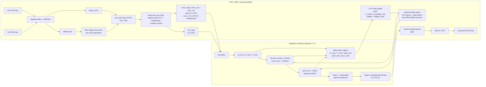

# Align-ULCNet

Hybrid `linear AEC -> joint RES + NR` reference candidate. Inputs are the
**frozen production linear-AEC error** and far-end reference; the target is
the common denoised, echo-free, early/dereverberated near-end speech. It is
not a direct neural AEC. This target is the project's comparison contract and
should not be reported as an upstream checkpoint-equivalent setting.

The implementation follows arXiv:2410.13620: component-wise power-law
compression; separate 32-channel NE/error and FE streams; two separable
convolutions per stream and max-pooling; 32-channel latent cross-attention;
ordinary joint convolutions with 64/96 channels; a 64-unit frequency GRU; two
parallel, two-layer 128-unit temporal subband GRUs; two full-band FC layers;
and the ULCNet second-stage CNN complex mask. The compressed real/imaginary
estimate is decompressed component-wise.

C-SamFR follows Figure 2 at the subband level. At `K=257`, `K_B=2`,
`gamma=5`, it pads to 130 subbands and produces five 52-bin channels; it does
not interleave individual FFT bins and break two-bin subbands apart.

Paper defaults are 16 kHz, `512/512/256`, 3-second samples, `alpha=0.3`, and a
64-frame (~1 s) delay buffer. At 48 kHz the project uses `1024/1024/512` and
derives the frame count from one physical second. No author code/checkpoint was
released. The paper leaves activation details inside the FC pair unspecified;
those remain a reconstruction choice. The 16 kHz graph has about 0.67 M
trainable parameters, matching the published 0.69 M class without inventing a
U-Net decoder.

For training, `[model] max_delay_frames` in `config.ini` directly selects D;
the shipped product-oriented config uses D=8.  The delay-stack activation and
streaming state grow linearly with D, so this is also the first memory knob to
reduce when a D=64 run exhausts CUDA memory.  This is a real forward-path
choice, not only an allocation hint: changing D changes the attention candidate
set.  Start a new run after changing it; checkpoint resume deliberately rejects
a different D.  If memory is still insufficient, reduce `[data] batch_size`.

For the listening examples on the paper's project page, the track labelled
``KF`` is the 16 kHz **error/residual Z**, not the KF echo estimate. To test
only this neural post-filter with that external frontend, use:

```bash
python3 inference.py checkpoint.pth official_err.mp3 official_lpb.mp3 out.wav \
  --input-is-linear-error
```

The page's ``mic``/``lpb`` tracks are 48 kHz while ``err`` is 16 kHz; the
script converts both to the checkpoint rate. Omit the flag to test the complete
repository flow (48 kHz mic/lpb -> resample -> frozen PBFDKF -> Align-ULCNet).
The external KF uses different parameters and is not bit-equivalent to PBFDKF.

## Streaming delay-profile sweep

`sweep_delay_depth.py` runs the same checkpoint through the real
`forward_stream()` path at several fixed delay depths.  The PBFDKF frontend
and STFT inputs are computed once, so the resulting WAV differences come only
from D.  Each run writes a float WAV, a frame-by-frame delay trace, the AEC
alignment trace, and one row in `summary.csv` containing the resolved delay
profile, state RAM, Python RTF, boundary-hit rate, and the waveform difference
from the checkpoint's D:

```bash
python3 sweep_delay_depth.py checkpoint.pth mic.wav far.wav d_sweep \
  --depths 64,32,16,8,4 --device cuda
```

A delay profile has two independent halves and the tool drives both:

| knob | flag | fixed at | governs |
|---|---|---|---|
| matched-filter bank size `n` | `--delay-num-filters` | AEC init | how far the bulk far-to-mic delay search reaches, and AEC pool |
| alignment depth `D` | `--depths` | ONNX export | how many past 16 ms frames the attention keeps, and model state |

They are not one delay budget: each layer only has to satisfy the input
condition the previous one delivers, which is why both appear in every summary
row instead of being summed.  Reliable reach of the bank is 125 / 221 / 317 /
413 / 509 ms for `n` = 1..5.

`--delay-num-filters` is a **runtime AEC init override** for the diagnostic
frontend. It is not a checkpoint-compatibility or retraining requirement:
dataset generation remains frozen at `n = 5`, while a product may choose a
smaller n when its measured bulk-delay range plus acquisition margin fits that
bank. Omitting the flag reproduces the dataset-generation frontend. The bank
size recorded in `summary.csv` is read back from the constructed engine, so a
row cannot name a profile the run did not actually execute.

```bash
# short-route candidate: smaller bank, aligned far, shallow attention
python3 sweep_delay_depth.py checkpoint.pth mic.wav far.wav short_route \
  --far-input-mode aligned_far --delay-num-filters 2 --depths 8,4
```

For a published or external KF residual, add `--input-is-linear-error` (it
bypasses PBFDKF entirely, so it cannot be combined with a bank-size override).
An aligned clean reference may be supplied with `--target-wav` to add SNR and
SI-SDR columns.  To test the proposed small-D deployment seam, add
`--far-input-mode aligned_far`; the tool then feeds the NN the post-delay-
buffer far samples that PBFDKF actually consumed.  In
`--input-is-linear-error` bypass mode it cannot recover that internal tap, so
the supplied far WAV is explicitly assumed to be pre-aligned.

Every clip is QA'd against an **estimator-independent** offline measurement of
the bulk delay: a windowed, energy-gated, normalized cross-correlation of the
raw far against the raw mic.  The applied delay must land at, or just before,
that measurement.  A clip that fails is reported as `mislock` and marked
invalid (`qa_valid` in `summary.csv`) so it cannot be averaged into a
delay-profile statistic. A delay outside the selected bank's reliable range
that stays unlocked is reported as valid `not_acquired`; failure to acquire a
decidable in-range delay is `not_acquired_in_range` and invalid.

The Python RTF is only a relative D comparison on the same machine; it does
not predict NPU runtime.  Compare the boundary rates/probability with the
uninformative softmax baseline `1/D`: a boundary value near that baseline may
only mean that attention is diffuse, whereas a trained head repeatedly
concentrating at the oldest slot suggests D is too small.  Listen to every
generated WAV and validate task metrics before fixing D in an ONNX export.

## Stateless accelerator deployment

The accelerator is assumed to retain no state between invocations.  CPU/DSP
code owns every K/V, score-convolution and GRU tensor in caller-provided
memory.  Align-ULCNet is a postfilter, so microphone PCM first enters the
linear AEC; the learned graph consumes `linear_error`, not raw microphone.



The production graph is fixed to `batch=1`, `T=1`, real/imaginary in the last
dimension. `D` is fixed at export time; D=4 and D=8 are different ONNX tensor
contracts even though their weight shapes are identical. The portable ABI
accepts `2 <= D <= 64`; D=1 would create zero-length history inputs, which are
not portable across target runtimes and is therefore evaluation-only.

The fixed front end never enters the quantized domain: the host computes the
signed-power compression (`sign(x) * |x|^0.3`), both magnitudes and the
compressed-domain phase as cos/sin in fp32, and the graph binds the five
feature tensors as separate inputs so each keeps its own quantization scale.
The far branch is the AEC aligned-far seam; it carries raw far before
acquisition and aligned far afterward.

Inputs per invocation:

| tensor | float32 shape | ordering |
|---|---:|---|
| `error_mag` | `[1,1,257]` | compressed-domain magnitude of linear error |
| `far_mag` | `[1,1,257]` | compressed-domain magnitude of the far branch |
| `error_cos` | `[1,1,257]` | cos of the compressed-domain error phase |
| `error_sin` | `[1,1,257]` | sin of the compressed-domain error phase |
| `error_ri` | `[1,1,257,2]` | COMPRESSED real/imag, last dim |
| `key_history` | `[1,32,D-1,26]` | newest first, beginning at t-1 |
| `value_history` | `[1,32,D-1,26]` | newest first, beginning at t-1 |
| `logit_history` | `[1,32,4,D]` | chronological, t-4 through t-1 |
| `h_gru0` | `[2,1,128]` | layer first |
| `h_gru1` | `[2,1,128]` | layer first |

Outputs per invocation:

| tensor | float32 shape | CPU action |
|---|---:|---|
| `output` | `[1,1,257,2]` | compressed-domain estimate; apply the inverse signed power (`sign(x) * |x|^(1/0.3)`), then WOLA/IFFT |
| `key_now` | `[1,32,1,26]` | push into key history |
| `value_now` | `[1,32,1,26]` | push into value history |
| `logit_now` | `[1,32,1,D]` | append to four-frame logit history |
| `h_gru0_out` | `[2,1,128]` | replace GRU-0 hidden |
| `h_gru1_out` | `[2,1,128]` | replace GRU-1 hidden |

This delta-state boundary avoids returning the complete K/V rings every 16 ms.
The graph uses `K_now`/`V_now` immediately and also exposes them as outputs;
the CPU incorporates them into the next invocation's histories.  `query_now`
is not state and is not returned.  Delay distribution is debug-only and is
not part of the production ABI.

The generic C helper exposes each history as one contiguous tensor, so its
logical ring update is implemented as a shift plus insertion. It avoids NPU
round-trips of the complete history, but it is not an O(1) circular-buffer
claim. A board runtime with scatter/gather or circular tensor views may replace
that internal copy while preserving the same ordering and public tensor ABI.

The board adapter uses the C boundary in this order (error paths fail open and
must not call `commit` with incomplete accelerator outputs):

```c
UlcnetModelIoDescriptor desc;
UlcnetModelIoMemReq req;
UlcnetModelIoInputs in;
UlcnetModelIoOutputs out;
UlcnetModelIoState *state;
void *pool;  /* board static arena address, assigned after the size query */

ulcnet_model_io_descriptor_default(8, &desc);
ulcnet_model_io_get_mem_requirements(&desc, &req);
/* Assign pool to req.bytes at req.alignment in the board's static arena. */
state = ulcnet_model_io_init(pool, req.bytes, &desc);

ulcnet_model_io_prepare(state, err_re, err_im, far_re, far_im, &in, &out);
/* Bind in.* and out.* to the accelerator tensors in the table above. */
if (run_accelerator(&in, &out) == 0 &&
    ulcnet_model_io_commit(state, enhanced_re, enhanced_im) == 0) {
    /* enhanced_re/im may now be sent to ulcnet_synthesis_push(). */
} else {
    /* Output the linear-error hop; persistent model state was not advanced. */
}
```

Export a true one-frame graph with:

```bash
python3 export_onnx.py \
  --checkpoint checkpoint.pth \
  --max-delay-frames 8 \
  --output output/align_ulcnet_d8_stream.onnx \
  --verify
```

Capture PTQ inputs for the same D with this model's calibration entry point:

```bash
python3 inference.py calib \
  --checkpoint checkpoint.pth \
  --primary-dir /path/to/linear_error \
  --far-dir /path/to/raw_far \
  --frames 256 --max-delay-frames 8 \
  --format npz --output calib/align_ulcnet_d8.npz
```

For NPU tools that consume one raw file per input per invocation, select the
binary directory format:

```bash
python3 inference.py calib \
  --checkpoint checkpoint.pth \
  --primary-dir /path/to/linear_error \
  --far-dir /path/to/raw_far \
  --frames 8192 --max-delay-frames 8 \
  --format bin \
  --output calib/align_ulcnet_d8
```

The layout is `<tensor>/<tensor>_<frame>.bin`, with zero-based frame numbers;
for example `h_gru0/h_gru0_0000.bin`. Each file is C-contiguous and
little-endian. `manifest.json` records dtype and per-frame shape. The output
directory must not already exist, so a shorter rerun cannot leave stale frames.

Calibration deliberately uses the training-domain raw far signal; the report
records that provenance separately from the production aligned-far seam. The
D value must match the exported graph because it fixes the K/V-history tensor
shapes and CPU state allocation, not because changing D requires retraining.

The exporter writes a sibling JSON descriptor containing the exact grid,
state layout version, D, the fixed `aligned_far` deployment contract, the
checkpoint's separate training provenance, and tensor schemas. Only the
model-local `export_onnx.py` is a supported user entry point.

**Every previously exported graph must be re-exported.** The model-I/O layout
is now v5 (v3 fixed the deployed far branch RAW -> ALIGNED, v4 renamed the
tensors, v5 moved the fixed front/back ends to the host), so a descriptor
written before this change fails `ulcnet_model_io_descriptor_validate()` on
`layout_version != ULCNET_MODEL_IO_LAYOUT_VERSION` (pre-v3 descriptors also
fail `far_input_mode != ULCNET_FAR_ALIGNED`), and
`ulcnet_accelerator_adapter_init()` therefore returns NULL. Re-exporting is
the whole remedy: nothing upstream of the graph changed. Checkpoints keep their
weights and their recorded training provenance, and datasets need no
regeneration -- the exporter reads the checkpoint's training
`far_input_mode` and writes it beside the fixed deployment value rather than
requiring the two to agree.

CPU state storage and ring updates are implemented by
`ulcnet_model_io.c/.h`.  They use one caller-owned pool, allocate RAM according
to D, prefill accelerator outputs with NaNs to detect partial writes, and leave
the prior state unchanged if commit validation fails.  `prepare()` keeps its
raw-spectra signature and computes the five feature tensors internally;
`commit()` applies the inverse signed power before unpacking `enhanced_re/im`,
so adapter and pipeline callers are unchanged by v5.  The queried pool size
includes persistent history plus feature-input/output and delta-output
staging; the smaller persistent-state figure alone is not a sufficient
allocation.
`ulcnet_process.c/.h`
continues to own only STFT/WOLA and the high-level model callback.  Vendor NPU
drivers and mono/4ch pipeline wiring are intentionally outside this model-side
deliverable.

`ulcnet_accelerator_adapter.c/.h` is the reusable bridge from this explicit
state ABI to `UlcnetModel`. It is included in
`AIAEC/build/libaiaec_prepost.a`; the mono and four-channel applications add
only their board runtime callback and surrounding audio flow.
