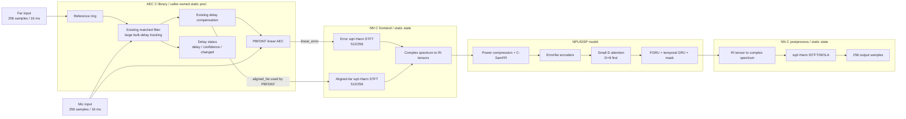
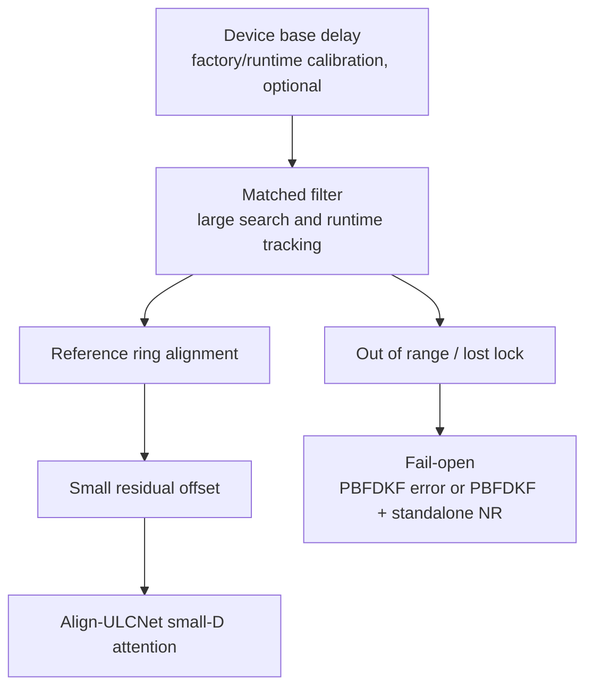
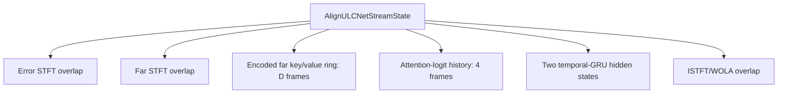
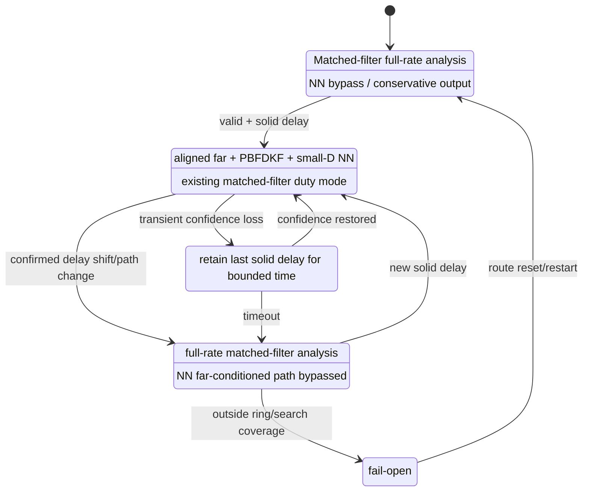

# PBFDKF + Align-ULCNet Embedded Streaming 設計提案

狀態：設計評估稿，尚未代表已實作或已選定的 release contract。

本文件供實作者評估如何將現有 PBFDKF + Align-ULCNet 路徑放到記憶體與
算力受限的 embedded system。產品測試一律使用本專案 PBFDKF 的 linear
output；論文展示頁提供的 KF residual 只作研究診斷，不是產品 frontend。

## 1. 目標與非目標

### 1.1 目標

- 固定主路徑為「本專案 matched filter + PBFDKF + Align-ULCNet」。
- 16 kHz、FFT/window/hop = `512/512/256`，每 256 samples（16 ms）處理一次。
- matched filter 處理設備與聲學路徑的大範圍 bulk delay。
- NN 只處理對齊後的小幅 residual alignment error，先評估 `D=8`，再評估
  `D=4`。
- 一次只送一個新 STFT frame 給模型，但所有必要狀態跨呼叫保留。
- C frontend/postprocess 使用 caller-owned static memory；模型 inference 由
  版端 NPU/DSP runtime 執行。
- 超出 delay search/ring 或失去可信對齊時 fail-open，不要求 NN 猜測錯位
  reference。

### 1.2 非目標

- 不重寫既有 AEC matched filter、delay controller 或 PBFDKF。
- 不把論文展示頁的外部 KF 當成產品品質基準。
- 不宣稱縮小 `D` 會縮小模型權重；`D` 不屬於 weight shape。
- 第一版不追求完全移除 time-alignment block。
- 第一版不改變 16 kHz signal grid，也不把模型切成互相獨立、每段重置的
  chunks。

## 2. 現況查證

### 2.1 AEC 已有的能力

現有 AEC 已經具備：

- AEC3-style matched-filter delay estimator；
- reference ring 與 delay compensation；
- PBFDKF 使用 delay-compensated `far_hop`；
- delay 穩定後降低 matched-filter analysis duty cycle；
- delay 變動或失去 confidence 時恢復 full-rate analysis；
- ERLE collapse watchdog（⚠ 見下方注意事項 3）；
- caller-owned static-memory API；
- `AecResContext` 與 `AecDebugStatus` read-only context。

因此本案不應新增第二套 matched filter 或第二個 large-delay tracker。現有 C
實作的 `a->far_hop` 在 delay compensation 完成後，就是該 hop 交給 PBFDKF
的 time-domain aligned reference。

現行 duty-cycle 預設值是：

- delay solid 且不變約 `delay_est_init_s = 0.3 s` 後進入 duty mode；
- `delay_est_period_s = 0.5 s` 經現有公式換算分析週期；
- 16 kHz、hop=256 時約每 6 hops 分析一次（約 96 ms），不是固定每 4 hops；
- reference/decimator/ring 仍每 hop 連續餵入，只有 matched-filter analysis
  降頻。

第一版應保留這套既有策略，先量測後再決定是否改 duty cycle。

已查證的三個注意事項（2026-08-13 逐行對照 C 實作）：

1. **grid 不是預設**：16 kHz 的 library 預設是 fft/hop = `256/128`（8 ms，
   `aec.c:44-46`）；本文件要求的 `512/512/256` 是合法可選 grid
   （`aec.c:186-189`），caller 必須顯式設定 `cfg.fft_size = 512`，否則
   AEC hop 與 NN hop 不同拍。
2. **duty-cycle 數字已驗證**：0.3 s（16k/hop256 = 19 hops ≈ 304 ms）進
   duty、之後每 6 hops（96 ms）分析一次（`aec.c:1711-1741`）；
   ring/decimator 每 hop 連續餵（`delay_aec3.c:1043-1046`）。
3. **ERLE 相關保護在本案組態下「死一半」**（2026-08-13 codex re-review
   後修正——先前版本誤寫成全部失效）：`enable_res=0 &&
   return_res_context=1`（NN seam 與 4ch pipeline 的實際組態）時，
   - **失效**：windowed-ERLE duty watchdog 與
     `delay_acquire_protect_converged`（兩者讀 `last_erle_windowed`，而
     C 只在 `enable_res` 時快取它）；
   - **仍有效**：warm tap-transfer gate——它讀的是 inst-ERLE ring，該
     ring 無條件每 hop 填充（aec.c 註解明寫 "works even with
     enable_res=0"）。
   另有一個已確認的 **C/Python 分歧**：Python 在
   `(enable_res or return_res_context)` 下就計算並快取
   `erle_windowed`（orchestrator），所以 Python 的 already-cancelling
   保護在 seam 組態下是活的、C 是死的。修法=C 快取條件對齊 Python，屬
   行為改變、獨立 commit + 驗證。watchdog leak 率固定每 hop `-0.001`
   未依 hop 重定時（`aec.c:1750`）亦待同批處理。

### 2.2 現有 AIAEC 資料邊界

目前 RES+NR model view 是：

```text
linear_error = PBFDKF materialized output
far_end      = raw far_render
target       = near_target
```

PBFDKF 內部已用 matched filter 對齊 reference，不代表 NN 收到的 `far_end`
也已對齊；目前 NN 收到的仍是 raw `far_render`。這也是 paper-compatible
Align-ULCNet 使用 `D=64` 搜尋長時間差的原因之一。

### 2.3 D 的實際影響

目前重建模型在 `D=4/8/16/32/64` 下皆為 672,441 parameters。改 `D`：

- 不改 checkpoint weight shape；
- 不需因為 load shape 而重新訓練；
- 線性改變 delay attention 的 history RAM、temporary RAM 與部分 MAC；
- 不改 encoder、CNN、FGRU、temporal GRU 與 mask head 的算量。

所以 `D=64 -> D=8` 只代表 delay-dependent attention work 約縮到 1/8，
不是整個模型變成 1/8。必須用版端 profiler 量整體改善。

兩個已查證的精確化：

- zero-shot 跨 D 換載在 shape 上安全（`load_state_dict(strict=True)` 實測
  成功；D 只進 `causal_delay_stack` 的呼叫，不進任何 `nn.*` 建構子），但
  輸出數值不嚴格相同：softmax 分母涵蓋範圍改變，且 score conv 在 delay
  軸的對稱 padding（kernel 3、左右各補 1）零邊界會隨 D 移動。訓練後
  distribution 若集中在 `d >= 8`，截斷即是實質行為改變——第 9 節的
  zero-shot A/B 因此是必要步驟，不是形式。
- `denoise.py` 從 checkpoint contract 的 `ctor_max_delay_frames` 重建模
  型，目前沒有任何 override 途徑；第 11 節 Phase 2 要求的 explicit
  deployment override 是待新增項，不是既有功能。

## 3. 建議產品 Flow



每 hop 的順序必須固定：

1. 收到 `mic[256]`、`far[256]`；
2. raw far 寫進現有 reference ring；
3. 現有 matched filter 按目前 state/duty policy 更新 delay；
4. 由現有 ring 讀出該 hop 的 `aligned_far[256]`；
5. PBFDKF 使用同一份 `aligned_far`，產生 `linear_error[256]`；
6. error 與 aligned far 分別進入自己的 stateful sqrt-Hann STFT；
7. 一個新 spectral frame 與 persistent NN states 送入 NPU；
8. enhanced spectrum 經 stateful ISTFT/WOLA；
9. 輸出 256 samples。

## 4. Delay 分工



- 設備已知 delay 只作 initial estimate，不取代 runtime matched filter。
- matched filter 處理 driver/buffer/acoustic-path 的主要 delay。
- small-D attention 吸收 matched-filter 量化誤差、短暫 drift、delay update
  transient 與少量 residual misalignment。
- 超出支援範圍就不解，不把錯位 far 強制交給 NN。

殘差預算（由 C 實作推得，Phase 0 實測確認）：delay 估計輸出的量化格是
64 raw samples = 4 ms（histogram bin，`delay_aec3.c:831/839/1062`；ring
讀取本身是 sample 級精確，`aec.c:1869`），加上恆正向的 headroom 32--92
samples（見 4.1 節），LOCKED 穩態殘差上界約 < 10 ms，小於 1 個 frame。
D=8（112 ms）對穩態約 10 倍裕度，D=4（48 ms）理論上也足夠——D 買的主要
是 delay-change transient 期間的緩衝，不是穩態殘差。matched filter 最大可
搜尋 delay 約 509 ms @16 kHz（**可靠 peak 上界**：reliability 條件
`lag < FILTER_SIZE-10` 推得；`c_user_manual_zh_TW.md` 寫的 608 ms 是
`DA_MAX_FILTER_LAG×4` 幾何全 span，定義不同、並不矛盾），超出即屬
fail-open 範圍（偵測現況見 5.1/8 節）。

### 4.1 Causal residual 範圍

目前 attention 只搜尋 current/past far，即 offset `d >= 0`。

查證結果：保守 causal margin 不是待評估選項，而是現有 C 實作的既定行
為，且方向一致地偏向「少補償」：

- headroom：candidate lag 一律先減 32 raw samples（`delay_aec3.c:873-878`）；
- floor 量化：histogram bin 用右移取整，恆不進位（`delay_aec3.c:772-773`
  與 `:831/:839`）；
- pre-echo onset 偵測把 lag 拉往「最早能解釋回音」的 tap group，回傳值
  恆不大於峰值 lag（`delay_aec3.c:469-481`）。

合成效果：aligned far 恆比 matched filter 認定的回音路徑提早 32--92 raw
samples（16 kHz 約 2--5.75 ms），殘差恆為正，causal attention（`d >= 0`）
即可修正。第一版維持 causal、不增加 future lookahead，也不需要另外實作
「刻意少補償」——它已經存在。

僅存的負殘差風險是 matched filter 本身把 lag 估過大：直達路徑極弱、晚期
反射主導、且 pre-echo 偵測尚未啟動（需要 >= 50 次更新，
`delay_aec3.c:591-599`）時，2--5.75 ms 的 margin 可能被吃掉。這屬於
Phase 0 量測要確認的邊角案例（負 offset 比例），不是主路徑設計問題。

## 5. AEC 對外介面提案

### 5.1 最小必要資料

NN frontend 需要：

- 該 hop 的 formed `linear_error`；
- PBFDKF 該 hop 實際使用的 time-domain `aligned_far`；
- applied delay 與 confidence；
- delay acquisition/change/reset generation。

建議新增專用 read-only view，或經 review 後擴充 `AecResContext`。專用 view
範例如下：

```c
typedef enum AecLinearDelayState {
    AEC_LINEAR_DELAY_UNLOCKED = 0,
    AEC_LINEAR_DELAY_LOCKED,
    AEC_LINEAR_DELAY_CHANGED,
    AEC_LINEAR_DELAY_OUT_OF_RANGE
} AecLinearDelayState;

typedef struct AecLinearContext {
    int hop_size;
    const float *formed_linear_hop;
    const float *aligned_far_hop;
    int delay_samples;
    float delay_confidence;
    AecLinearDelayState delay_state;
    unsigned int generation;
} AecLinearContext;

void aec_get_linear_context(const Aec *aec, AecLinearContext *context);
```

介面 contract：

- `aligned_far_hop` 必須 alias 該次 PBFDKF 真正讀取的 `a->far_hop`；
- 不配置新 heap，不複製一份 hop；
- pointer 只在下一次 process/reset 前有效；
- reset、first acquisition 與 delay shift 必須更新 `generation` 或等價 token；
- getter 不改任何 AEC state；
- struct layout/API change 要有版本與 changelog。

**實作狀態（2026-08-13 傍晚更新）**：本節提案已在 AEC standalone repo 實
作為 `AecLinearContext` + `aec_get_linear_context()`（本地 commit
`389ad6d`，`test-linear-context` 69 checks × KISS/NE10 × SIMD0/1 × 3 grid
全過、audio byte-equal）。與提案的差異：enum **刻意不含
`OUT_OF_RANGE`**——超出搜尋範圍在現有機制下與「未鎖定」不可區分（見下
表），第一版誠實地只回 `UNLOCKED`，fail-open 判斷屬 caller；`generation`
在 reset/first-acquisition/soft+hard shift 全部遞增（saturating）。
`Audio_ALG/lib/aec` pin 尚未 bump——依 workflow 待 AEC push 後一起，屆時
本節狀態再更新。以下對照表保留**實作前**的查證紀錄：

| 欄位 | 現況 |
|---|---|
| `formed_linear_hop` | 已有：`AecResContext.formed_hop`（`aec.c:2761`） |
| `aligned_far_hop` | 資料在（`a->far_hop` 是公開 struct 欄位，`aec.h:290`），但沒有任何 getter 回傳它 |
| `delay_samples` | 已有，僅在 `AecDebugStatus`（`aec.c:2791`；`-1` = 未 acquire） |
| `delay_confidence` | 已有，僅在 `AecDebugStatus`，且只有 0/0.5/1 三值（`delay_aec3.c:1225-1230`） |
| `delay_state` | 完全不存在；UNLOCKED 可由 `delay_samples < 0` 推得，OUT_OF_RANGE 與 UNLOCKED 在現有程式碼不可區分 |
| `generation` | 完全不存在。內部僅有當幀即被消費的 `pending_delay_change`（`aec.c:1811/1848/2441-2444`），且 soft-recovery 與 warm tap-transfer 路徑刻意不設旗標（`aec.c:1784-1799, 1828-1837`）——generation 必須做在 AEC 內部所有改變 ring 偏移的路徑上，外部 poll `delay_samples` 差分會漏掉短暫跳變 |

另一個必須補的防禦：`current_delay` 從未與 `ref_ring_size` 比對，caller
把 `max_delay_ms`/`delay_buffer_ms` 調小時取模會 alias 讀錯 far 且不報錯
（`aec.c:1869`）；4ch pipeline 已自建等價檢查（`4aec_nr_res.c:793-794`），
library 內沒有。

### 5.2 不建議直接共用 PBFDKF far spectrum

`AecResContext.far_spec` 是 PBFDKF frontend 的頻譜。NN frontend 的 contract
是 periodic sqrt-Hann、512/256、50% overlap。已查證兩者確定不同：
`far_spec` 是無 analysis window 的矩形 overlap-save rFFT
（`pbfdkf.c:444-445, 458`），sqrt-Hann 只用在 near/error 側
（`pbfdkf.c:88-109, 547`）。窗形不同，不可直接共用。

第一版應共用 time-domain `aligned_far_hop`，再由 NN frontend 做自己的
stateful STFT。未來若要去除這個 FFT，另立 parity/scale/window 專案驗證。

## 6. Streaming Model State

真正 streaming 是每次輸入少量新資料、但歷史 state 持續存在；不是把完整
forward 切成多個互相獨立的 N-frame chunks。



目前層級的時間狀態判定：

| 模組 | 跨時間 state |
|---|---|
| C-SamFR、stream encoders | 無；time kernel = 1 |
| JointConv blocks | 無；time kernel = 1 |
| Q/K/V projection | 無；1x1 |
| Delay candidate | encoded far key/value ring，長度 D |
| Attention score conv | 需前 4 frames；time kernel = 5（全模型唯一 time kernel > 1 的層） |
| FGRU | 沿 frequency 運行，每個 time frame 獨立；⚠ bidirectional over frequency，版端每 frame 要跑正反兩個方向 |
| Two subband temporal GRUs | 必須保存每層 hidden state |
| Stage-2 mask conv | 無；time kernel = 1 |
| STFT/ISTFT | overlap/window state |
| BatchNorm2d（×6） | 無跨時間 state，但 train 模式對時間軸取統計——streaming 等價的唯一數學風險。必須 `eval()` 並 fold 進 conv（實測 train 模式 prefix 差 0.44、eval 模式差 5.6e-9） |

建議 API：

```text
state = create_stream_state(batch=1, D=8)

for each 256-sample hop:
    output_hop, state = process_stream(
        linear_error_hop,
        aligned_far_hop,
        delay_status,
        state)
```

### 6.1 N 與 D 不同

- `N`：一次 NPU invocation 輸入幾個新 frames；可為 1、2、4 或 8。
- `D`：persistent far history 的 delay search span。

`N=1` 不代表 `D=1`。Embedded 第一版建議 `N=1, D=8`；若版端 batching
效率需要 `N=2/4`，states 仍必須跨 invocation 保留。

### 6.2 State RAM 粗估

16 kHz、512/256、float32、encoder width 26、32 key/value channels：

| Persistent state | D=8 粗估 |
|---|---:|
| encoded far key ring | 26.6 KB |
| encoded far value ring | 26.6 KB |
| attention-logit history（4 frames） | 4.0 KB |
| two 2-layer temporal-GRU hidden states | 2.0 KB |
| STFT/WOLA overlap | 數 KB |

總量約 60 KB（GRU hidden = 2 blocks × 2 layers × 128 × 4 B = 2.0 KB，
GRU 無 cell state），不含 model weights、NPU activation scratch 與 backend
alignment。D=4 可再降低 key/value ring 與 logit history；最終數字必須由
export 後的 tensor layout 與版端 allocator 報告。

### 6.3 Attention MAC 粗估

只計 delay-dependent dot/weighted-sum/score 部分，約隨 D 線性：

```text
D=8  : 約 1.1 M MAC/s
D=64 : 約 8.6 M MAC/s
```

這不包含 Q/K/V、encoders、FGRU、temporal GRUs 與 mask head。必須同時量：

- 整體 cycles/hop；
- attention cycles/hop；
- NPU scratch peak；
- end-to-end 16 ms deadline margin。

## 7. STFT/WOLA 與 Latency Contract

現有 Python offline feature path使用 `center=True`。Embedded streaming 不可每
個 chunk 各自呼叫 centered STFT；必須建立持續的 analysis/synthesis buffers。

第一版要求：

- periodic sqrt-Hann；
- FFT/window/hop = 512/512/256；
- error 與 aligned far 使用同一 frame timestamp；
- synthesis 為對應的 50% overlap WOLA；
- flush/tail 行為需明確；
- 對外 latency 以 samples 實測記錄，不只由公式推測。

若要與現有 offline `center=True` 完全對齊，需明確定義首幀 padding、256
samples lookahead/time origin 與末尾 flush。若產品改採純 past-only frame，
屬於 feature-time contract 變更，必須做 checkpoint A/B，不能只以「同樣是
512/256」視為等價。

**決策（2026-08-13）**：第一版重現 center=True timing，板端支付 256-sample
（16 ms）lookahead latency，保住 checkpoint parity，讓 D 的 zero-shot A/B
不被時序變因污染；past-only 留待量測完成後另行 A/B。

## 8. Delay 狀態機與 Fallback



第一版 policy 建議：

- unlocked/reacquire 時輸出 PBFDKF formed linear error；若產品已有 standalone
  NR，可接 PBFDKF + NR；
- 不把錯位 far 餵給 small-D NN；
- first lock 或 delay change 時清除 far key/value ring 與 attention-logit
  history；
- temporal GRU hidden state先保留並以 A/B 決定是否 reset；
- 新舊輸出以 2--4 hops crossfade，避免切換 click；
- hold timeout 先由既有 AEC timing convention換算，不新增裸 frame count。

以上 policy 必須與 AEC 現有 first-acquisition、pending delay、soft/hard
recovery 語意整合，避免同一個 delay event在 AEC 與 NN 被重複 reset。

現況注記（2026-08-13 更新）：`delay_state` 與 `generation` 已在 AEC
standalone 實作（見 5.1 節實作狀態）；out-of-range 偵測仍不存在（超出
約 509 ms 可靠搜尋上界時狀態停在 UNLOCKED，與冷啟動不可區分）。本節其餘
部分——HOLD/REACQUIRE policy、fail-open 路由、crossfade、與 NN state
reset 的整合——仍是「要新蓋的」。4ch pipeline 層已有一份可參考的自建實
作（delay changed/solid/confidence 差分與 reset 策略，
`4aec_nr_res.c:778-794, 901-914`）。

## 9. D 的候選與 Checkpoint

16 kHz、hop=256 時：

| D | causal candidate | 最大 past offset |
|---:|---:|---:|
| 4 | 0--3 frames | 48 ms |
| 8 | 0--7 frames | 112 ms |
| 16 | 0--15 frames | 240 ms |
| 64 | 0--63 frames | 1008 ms |

建議 A/B：

```text
A. raw far     + D=64   paper-compatible baseline
B. aligned far + D=64   isolate input-alignment effect
C. aligned far + D=8    embedded-safe candidate
D. aligned far + D=4    embedded-aggressive candidate
E. aligned far + no attention, if graph permits
```

縮小 D 不改 weight shape，現有 checkpoint可直接 zero-shot 評估；但是
`raw far -> aligned far` 是輸入分布改變，softmax candidate set 也改變。
因此：

1. 不應因 shape 預先要求重訓；
2. 先跑同一 checkpoint 的 zero-shot A/B；
3. 只有 C/D 品質未達標，才決定是否 fine-tune；
4. inference/export contract 必須記錄實際 D，不可靜默覆寫 checkpoint。

## 10. NPU Model Boundary

大多數版端 runtime 不應依賴 complex tensor。建議 graph boundary：

```text
Inputs per invocation:
    error_ri            [1, 2, N, 257]
    aligned_far_ri      [1, 2, N, 257]
    far_key_history     explicit state
    far_value_history   explicit state
    score_history       explicit state
    temporal_gru_h_*    explicit states

Outputs:
    enhanced_ri         [1, 2, N, 257]
    updated state tensors
```

先做 operator inventory：

- signed `pow(0.3)` 與 inverse power；
- `atan2/cos/sin`；
- unfold/ring gather；
- softmax；
- bidirectional GRU（沿 frequency）；
- stateful unidirectional GRUs；
- PReLU/ELU/BatchNorm folding。

若 runtime 不支援某些 complex/power算子，再決定移到 C frontend/postprocess。
不要在 operator scan 前任意改數學式，否則 checkpoint parity 不明。

## 11. 實作順序

### Phase 0：只做量測，不改音訊

1. 在 Python/C 記錄每 hop applied delay、confidence、delay change。
2. 對現有 AIAEC 測試集量 aligned far 與 linear error 的 residual-lag
   histogram。
3. 報告 p50/p90/p99/max、負 offset 比例、cold-start lock time。
4. 用 board profiler拆出 AEC、STFT、attention、其餘 NN、ISTFT cycles。

### Phase 1：AEC aligned-far seam

1. 新增最小 read-only context。
2. 不新增 heap/copy；static pool size若不變需測試鎖定。
3. Python 與 C 都暴露同一語意。
4. 測試 context pointer lifetime、reset/generation 與 delay-change。
5. 證明 exposed aligned far 就是同 hop PBFDKF 實際使用的 reference。

### Phase 2：Offline zero-shot A/B

1. 保持完整 utterance inference。
2. 加入 explicit deployment override `D=64/8/4`。
3. 跑第 9 節 A--E；不先重訓。
4. 比較音訊品質、attention distribution、RAM 與 cycles。

### Phase 3：Stateful Python streaming reference

1. 實作 stateful STFT/WOLA。
2. 為 FrameDelayAttention 實作 far ring 與 4-frame score history。
3. temporal GRU 接收/回傳 hidden state。
4. 保持 offline `forward()` 供訓練，新增 `forward_stream()` 供部署。
5. 同 D、同 input 下比較 full-utterance 與 frame-by-frame output。

### Phase 4：C frontend/postprocess + export wrapper

1. 所有 buffer 納入 caller-owned static memory。
2. 統一 `SIMD=0/1` flag；scalar/NEON parity。
3. export explicit-state RI graph。
4. 驗證 PyTorch vs export runtime vs board runtime。

### Phase 5：產品狀態機

1. 接入 AEC delay event，避免雙重 reset。
2. 實作 unlocked/hold/reacquire/fail-open。
3. 音訊切換加入 bounded crossfade。
4. 長時間、reset、counter saturation 與 no-heap 驗證。

### Phase 6：是否需要 fine-tune

只有 zero-shot aligned-far small-D 未達門檻時才做：

- 新增/重建 aligned-far training input；
- 從 D=64 checkpoint fine-tune D=8 或 D=4；
- 保留 raw+D64 baseline，不覆蓋 paper-compatible contract。

## 12. 驗證矩陣與放行條件

### 12.1 Correctness

- AEC exposed aligned far 與 PBFDKF consumed far 同 hop、同 samples。
- reset/delay change後不讀 stale context/state。
- scalar/NEON 與 KISS/NE10 適用路徑全部測試。
- full-utterance vs streaming comparison 明確說明 bit-exact 或 tolerance；
  不可只看 finite。
- PyTorch/export/board tensor逐層 max/RMS error。
- 10 分鐘以上 streaming：無 NaN/Inf、無 heap、無 state growth。

### 12.2 場景

- far-end single talk；
- near-end single talk；
- double-talk；
- cold start；
- 10--120 ms dataset bulk delay；
- 裝置實際最大正常 delay；
- delay jump/jitter；
- echo-path change；
- SRO/clock drift；
- render underrun/overrun；
- reset/route change；
- delay out of range。

### 12.3 指標

- AECMOS echo/deg；
- ERLE；
- STOI/PESQ 或既有 NR quality gate；
- near-end attenuation與 double-talk guard；
- lock/re-lock time；
- cycles/hop、p99 latency、deadline miss；
- persistent RAM、NPU scratch peak、model size。

### 12.4 建議放行判定

- `aligned+D8` 不得相對 `raw+D64` 出現已定義門檻外的品質回退；
- p99 每 hop總處理時間小於 16 ms，並保留平台要求的 safety margin；
- out-of-range/失鎖必須落入已測 fail-open，不能輸出未定義結果；
- board runtime與 reference 的 tolerance 必須在文件中固定；
- 未達標則保留 D=64 或進 fine-tune，不以單一平均分掩蓋 worst cases。

## 13. Claude 評估清單

請實作者先回答以下問題，再動核心流程：

1. 現有 `a->far_hop` 是否在所有 process entry point 都能安全作為
   `aligned_far_hop` 暴露？
2. 擴充 `AecResContext` 或新增 `AecLinearContext` 哪個對 ABI/versioning
   風險較低？
3. Python PBFDKF 能否用同一 contract暴露完全相同語意的 aligned far？
4. 現有 200-hour WAV/packed資料能否不重生原始場景，只重跑 PBFDKF
   materialization取得 aligned far？
5. NPU 是否支援本模型所有算子與 explicit recurrent states？
6. `center=True` offline contract 在板端要用 256-sample lookahead重現，還是
   接受改成 past-only feature timing？
7. board profiler顯示 attention 是不是實際 hotspot；D=8 對整體 latency
   的收益是多少？
8. aligned far residual-lag p99 是否真的落在 D=8 的 112 ms causal範圍？
9. negative residual offset比例是否要求 causal margin或 signed attention？
10. delay event時哪些 states 要 reset，哪些應保留，A/B 證據是什麼？

未回答第 1、3、6、8、9 點前，不應把 `aligned+D8` 宣告為 release-ready。

2026-08-13 查證後的回答：

1. **Q1 = yes，帶三個例外**。四個 process entry point 全部收斂到同一個
   core，`far_hop` 都會被填好；例外：(a) `enable_delay_est=0` 時 far_hop
   完全未對齊；(b) 尚未 acquire 或 ring 未填滿時 far_hop 是 raw far 且無
   訊號告知；(c) streaming underrun 時 far_hop 全 0 且會餵進 delay
   estimator（`aec.c:1866-1878, 2688`）。
2. **Q2**：建議新增小型 `AecLinearContext` getter 而非擴充
   `AecResContext`——後者語意綁 `enable_res||return_res_context`、欄位已
   20+，新 getter 對 ABI/versioning 風險較低。
3. **Q3 = yes，且可零 contract 變動**。Python 端 `filter.far_buffer[-hop:]`
   （`filters.py:264-265`）就是該 hop PBFDKF 實際使用的 aligned far，
   byte-exact；從 `linear_aec.py` 外側讀取即可。嚴禁在 `lib/aec` 內新增
   method——`aec_behavior_hash` 涵蓋整個 `modules/` 的 AST，會作廢既有
   shard 與 checkpoint。
4. **Q4 = yes**。aligned far 是 `(mic_postclip, far_render, contract)` 的
   確定性函數，200h WAV 已含兩路輸入，可只重跑 PBFDKF materialization 補
   channel（全量、不可 `--resume`、磁碟 +20%）；corpus 在遠端機器，工具
   備妥後遠端執行。packed shard 與 checkpoint 在模型改吃 aligned far 之前
   不受影響。
5. Q5：待 operator inventory 對板端 runtime 逐項核對（第 10 節清單）。
6. **Q6 = 已決策**：第一版重現 center=True（見第 7 節）。
7. Q7：待板端 profiler。
8. **Q8 = 待量測假說（有結構性論證與合成實證支持）**：estimator 程式碼
   給出殘差上界約 < 10 ms（64-sample 量化 + 32--92 headroom），合成
   self-test 實測 3.5--5.5 ms 恆正。⚠ 但現有量測工具的殘差是對
   `D_hat = mic - linear_error`（PBFDKF 自己的估計）做相關——filter 收
   斂時是有效量測，未收斂/DT/非線性段是自我參照 proxy，**不能單憑它宣
   告 D=8/4 足夠**。放行前必須：(a) 合成 diagnostic 用
   `RenderedSequence.audit["echo"]` 對真 echo 量測；(b) 真實 corpus 報
   告標明 proxy 性質；(c) lag 搜尋範圍擴到 >= 2048 samples（現行
   +-512 = +-32 ms 根本涵蓋不了 D=8 的 112 ms）並統計 peak 落在搜尋邊
   界的比例；(d) locked 窗判定改「confidence solid + generation 未變 +
   settle time」；(e) low-corr 窗納入「量測無法判定」比例與放行門檻。
9. **Q9 = 同上待量測**：結構上殘差恆正（見 4.1 節）、合成實證亦恆正，
   維持 causal-only 設計；真實 corpus 的負 offset 比例仍要以升級後的
   工具量測確認邊角案例（弱直達路徑 + pre-echo 未啟動）。
10. Q10：待 Phase 2/3 的 A/B。

