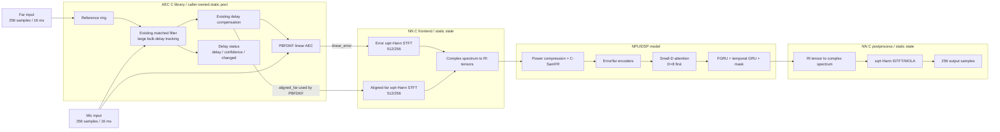
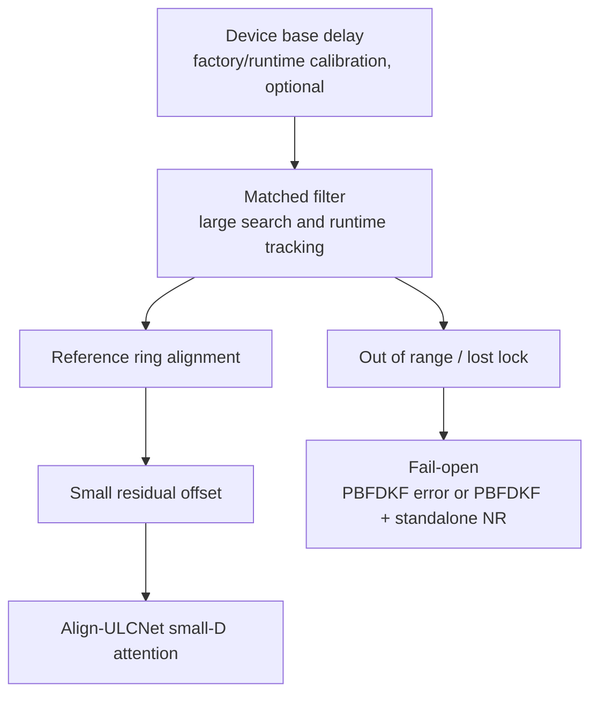
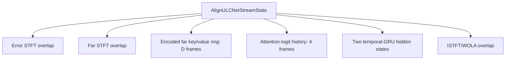
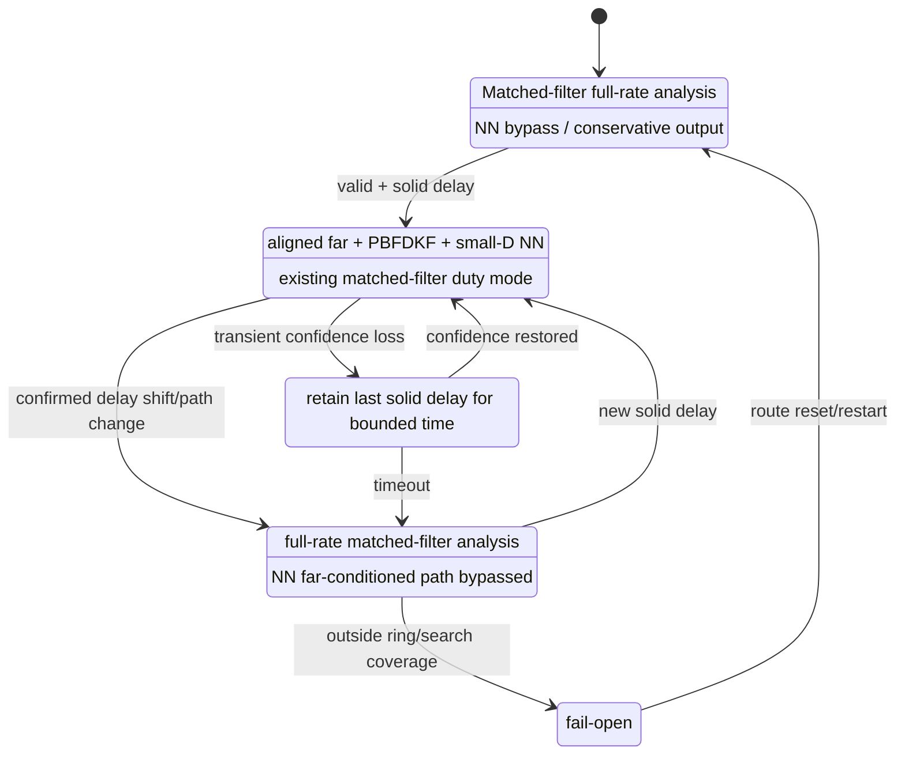
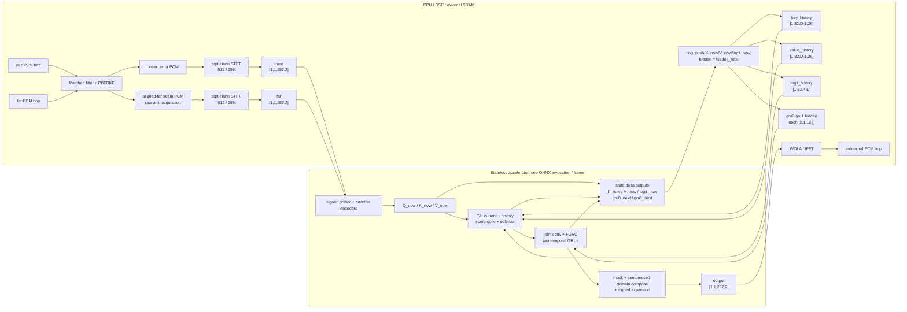

# PBFDKF + Align-ULCNet Embedded Streaming 設計提案

狀態：設計與實作對照稿（2026-08-16 覆核）。第 10 節的單幀 ONNX boundary
（`AIAEC/Align_ULCNet/export_onnx.py`）、CPU external-state
helper（`ulcnet_model_io.c/h`、`ulcnet_accelerator_adapter.c/h`）與 C
STFT/WOLA（`ulcnet_process.c/h`）已實作；§8 的 delay 狀態機/fail-open 邏輯
也已落地到 `pipelines/mono_alignulcnet/`、`pipelines/4ch_alignulcnet/`
兩個 ULCNet pipeline。production 固定讀 AEC 的 aligned-far seam：UNLOCKED
期間 seam 傳 raw far，模型仍執行並套用；取得 alignment 後 seam 改傳 aligned
far，切換前 reset K/V/logit/GRU。raw/aligned 選擇只留在 sweep 工具。
實際 board/NPU driver 尚未完成（目前 `main.c` 的 `run_accelerator()`
仍是回 -1 的 TODO 佔位）。
raw/aligned 與 small-D sweep 現已完成，release 裁定（2026-08-17）：
**部署固定使用 aligned-far seam**，不提供 runtime far-mode switch；exporter
分開記錄 checkpoint 的 raw-far training provenance 與 aligned-far deployment
contract。目前真正未完成的是 board/NPU driver、exporter 產
generated C descriptor（含 D/shape/layout）與
application 依 descriptor 配置（移除手寫 D=8）、各產品 route 的 n 範圍
量測。FIXED 首次由 raw ring-fill 切到 aligned far 的 reset 已在兩個 wrapper
補齊；4ch 的 solid 時序亦已與實際可讀 hop 對齊。

**既有 ONNX/JSON 必須全部重新匯出。** model-I/O layout 由 v2 進到 v3，
deployed far branch 由 RAW 改為 ALIGNED，因此本次改動之前產出的每一份
descriptor 在 `ulcnet_model_io_descriptor_validate()` 會同時卡在兩個欄位
（`layout_version` 與 `far_input_mode`），`ulcnet_accelerator_adapter_init()`
直接回 NULL。補救動作只有重新匯出 graph 一項：checkpoint 與 dataset
都**不需要**重新訓練或重新生成——權重未變，exporter 會把 checkpoint 原本的
training `far_input_mode` 與固定的 aligned-far deployment 值分開寫入，兩者
不需一致。

本文件供實作者評估如何將現有 PBFDKF + Align-ULCNet 路徑放到記憶體與
算力受限的 embedded system。產品測試一律使用本專案 PBFDKF 的 linear
output；論文展示頁提供的 KF residual 只作研究診斷，不是產品 frontend。

## 1. 目標與非目標

### 1.1 目標

- 固定主路徑為「本專案 matched filter + PBFDKF + Align-ULCNet」。
- 16 kHz、FFT/window/hop = `512/512/256`，每 256 samples（16 ms）處理一次。
- matched filter 處理設備與聲學路徑的大範圍 bulk delay。
- NN 只處理對齊後的小幅 residual alignment error，先評估 `D=8`，再評估
  `D=4`。
- 一次只送一個新 STFT frame 給模型，但所有必要狀態跨呼叫保留。
- C frontend/postprocess 使用 caller-owned static memory；模型 inference 由
  版端 NPU/DSP runtime 執行。
- 超出 matched search 時 seam 保持 raw far，模型仍執行；可處理範圍由 export
  的 D 決定。只有 callback 失敗、partial write 或 NaN/Inf 才走 identity
  fail-open。

### 1.2 非目標

- 不重寫既有 AEC matched filter、delay controller 或 PBFDKF。
- 不把論文展示頁的外部 KF 當成產品品質基準。
- 不宣稱縮小 `D` 會縮小模型權重；`D` 不屬於 weight shape。
- 第一版不追求完全移除 time-alignment block。
- 第一版不改變 16 kHz signal grid，也不把模型切成互相獨立、每段重置的
  chunks。

## 2. 現況查證

### 2.1 AEC 已有的能力

現有 AEC 已經具備：

- AEC3-style matched-filter delay estimator；
- reference ring 與 delay compensation；
- PBFDKF 使用 delay-compensated `far_hop`；
- delay 穩定後降低 matched-filter analysis duty cycle；
- delay 變動或失去 confidence 時恢復 full-rate analysis；
- ERLE collapse watchdog（⚠ 見下方注意事項 3）；
- caller-owned static-memory API；
- `AecResContext` 與 `AecDebugStatus` read-only context。

因此本案不應新增第二套 matched filter 或第二個 large-delay tracker。現有 C
實作的 `a->far_hop` 在 delay compensation 完成後，就是該 hop 交給 PBFDKF
的 time-domain aligned reference。

現行 duty-cycle 預設值是：

- delay solid 且不變約 `delay_est_init_s = 0.3 s` 後進入 duty mode；
- `delay_est_period_s = 0.5 s` 經現有公式換算分析週期；
- 16 kHz、hop=256 時約每 6 hops 分析一次（約 96 ms），不是固定每 4 hops；
- reference/decimator/ring 仍每 hop 連續餵入，只有 matched-filter analysis
  降頻。

第一版應保留這套既有策略，先量測後再決定是否改 duty cycle。

已查證的三個注意事項（2026-08-13 逐行對照 C 實作）：

1. **grid 不是預設**：16 kHz 的 library 預設是 fft/hop = `256/128`（8 ms，
   `aec.c:44-46`）；本文件要求的 `512/512/256` 是合法可選 grid
   （`aec.c:186-189`），caller 必須顯式設定 `cfg.fft_size = 512`，否則
   AEC hop 與 NN hop 不同拍。
2. **duty-cycle 數字已驗證**：0.3 s（16k/hop256 = 19 hops ≈ 304 ms）進
   duty、之後每 6 hops（96 ms）分析一次（`aec.c:1711-1741`）；
   ring/decimator 每 hop 連續餵（`delay_aec3.c:1043-1046`）。
3. **ERLE 相關保護在本案組態下全部有效**（先前版本記錄的 C/Python
   分歧已修復，見下）。`enable_res=0 && return_res_context=1`（NN seam
   與 4ch pipeline 的實際組態）時：
   - windowed-ERLE duty watchdog 與 `delay_acquire_protect_converged`
     讀 `last_erle_windowed`。C 端原本**只在 `enable_res` 時快取**它，
     所以這兩者在 seam 組態下是死的，而 Python 在
     `(enable_res or return_res_context)` 下就計算並快取
     `erle_windowed`（orchestrator）——這是一個真的 C/Python 分歧。
     **已修**：C 的快取條件改成與 Python 相同（`aec.c` 步驟 19 之後的
     `last_erle_windowed` 快取），兩端語意一致，seam 組態下保護是活的。
     此修正只填一個快取值、不進訊號路徑，**音訊輸出逐位元不變**
     （seam 組態渲染 512,000 bytes 前後相同）。
   - warm tap-transfer gate 讀的是 inst-ERLE ring，該 ring 無條件每 hop
     填充（aec.c 註解明寫 "works even with enable_res=0"），本來就有效。

   在此基礎上新增 `delay_backward_quarantine_enabled` / `_s`（預設 OFF，
   見 `lib/aec/docs/c_user_manual_zh_TW.md` 與
   `lib/aec/docs/delay_estimator_design_zh_TW.md`）：它是
   `delay_acquire_protect_converged` 的 Path-B 姊妹機制，針對的是**已鎖定
   後被 pre-echo 誤鎖搶走**（實測 true 6400 → 4800）。只隔離比現行 delay
   **更早**的候選，且有時間上限——到期就採用，所以是「延後一個窗」而不是
   「治癒誤鎖」。判別式 `aec_linear_is_cancelling()` 同時看 windowed 與
   inst-ERLE 兩個讀數，兩端共用同一函式；4ch core 只問
   `capture_proxy_channel` 那一條 lane（餵給共用 estimator 的那支 mic）。
   目前證據只有合成場景與 C／Python 逐 hop 對照，**真實錄音抽測尚未做**，
   所以產品組態維持預設 OFF；AIAEC 的 frozen frontend 也不開它。

   watchdog leak 率固定每 hop `-0.001` 未依 hop 重定時（`aec.c`）仍待處理。

### 2.2 現有 AIAEC 資料邊界

目前 RES+NR model view 是：

```text
linear_error = PBFDKF materialized output
far_end      = raw far_render
target       = near_target
```

PBFDKF 內部已用 matched filter 對齊 reference，不代表 NN 收到的 `far_end`
也已對齊；目前 NN 收到的仍是 raw `far_render`。這也是 paper-compatible
Align-ULCNet 使用 `D=64` 搜尋長時間差的原因之一。

### 2.3 D 的實際影響

目前重建模型在 `D=4/8/16/32/64` 下皆為 672,441 parameters。改 `D`：

- 不改 checkpoint weight shape；
- 不需因為 load shape 而重新訓練；
- 線性改變 delay attention 的 history RAM、temporary RAM 與部分 MAC；
- 不改 encoder、CNN、FGRU、temporal GRU 與 mask head 的算量。

所以 `D=64 -> D=8` 只代表 delay-dependent attention work 約縮到 1/8，
不是整個模型變成 1/8。必須用版端 profiler 量整體改善。

兩個已查證的精確化：

- zero-shot 跨 D 換載在 shape 上安全（`load_state_dict(strict=True)` 實測
  成功；D 只進 `causal_delay_stack` 的呼叫，不進任何 `nn.*` 建構子），但
  輸出數值不嚴格相同：softmax 分母涵蓋範圍改變，且 score conv 在 delay
  軸的對稱 padding（kernel 3、左右各補 1）零邊界會隨 D 移動。訓練後
  distribution 若集中在 `d >= 8`，截斷即是實質行為改變——第 9 節的
  zero-shot A/B 因此是必要步驟，不是形式。
- `inference.py`、`sweep_delay_depth.py` 與單幀 ONNX exporter 都已有 explicit
  `max_delay_frames` deployment override。D 會固定在輸出的 graph/descriptor
  tensor shape；可載入同一組 D-agnostic weights 不代表 small-D 品質已放行。

## 3. 建議產品 Flow



每 hop 的順序必須固定：

1. 收到 `mic[256]`、`far[256]`；
2. raw far 寫進現有 reference ring；
3. 現有 matched filter 按目前 state/duty policy 更新 delay；
4. 由現有 ring 讀出該 hop 的 `aligned_far[256]`；
5. PBFDKF 使用同一份 `aligned_far`，產生 `linear_error[256]`；
6. error 與 aligned far 分別進入自己的 stateful sqrt-Hann STFT；
7. 一個新 spectral frame 與 persistent NN states 送入 NPU；
8. enhanced spectrum 經 stateful ISTFT/WOLA；
9. 輸出 256 samples。

## 4. Delay 分工



- 設備已知 delay 只作 initial estimate，不取代 runtime matched filter。
- matched filter 處理 driver/buffer/acoustic-path 的主要 delay。
- small-D attention 吸收 matched-filter 量化誤差、短暫 drift、delay update
  transient 與少量 residual misalignment。
- 超出支援範圍就不解，不把錯位 far 強制交給 NN。

殘差預算（由 C 實作推得，Phase 0 實測確認）：delay 估計輸出的量化格是
64 raw samples = 4 ms（histogram bin，`delay_aec3.c:831/839/1062`；ring
讀取本身是 sample 級精確，`aec.c:1869`），加上恆正向的 headroom 32--92
samples（見 4.1 節），LOCKED 穩態殘差上界約 < 10 ms，小於 1 個 frame。
D=8（112 ms）對穩態約 10 倍裕度，D=4（48 ms）理論上也足夠——D 買的主要
是 delay-change transient 期間的緩衝，不是穩態殘差。matched filter 最大可
搜尋 delay 約 509 ms @16 kHz（**可靠 peak 上界**：reliability 條件
`lag < FILTER_SIZE-10` 推得；`c_user_manual_zh_TW.md` 寫的 608 ms 是
`DA_MAX_FILTER_LAG×4` 幾何全 span，定義不同、並不矛盾），超出即屬
fail-open 範圍（偵測現況見 5.1/8 節）。

### 4.1 Causal residual 範圍

目前 attention 只搜尋 current/past far，即 offset `d >= 0`。

查證結果：保守 causal margin 不是待評估選項，而是現有 C 實作的既定行
為，且方向一致地偏向「少補償」：

- headroom：candidate lag 一律先減 32 raw samples（`delay_aec3.c:873-878`）；
- floor 量化：histogram bin 用右移取整，恆不進位（`delay_aec3.c:772-773`
  與 `:831/:839`）；
- pre-echo onset 偵測把 lag 拉往「最早能解釋回音」的 tap group，回傳值
  恆不大於峰值 lag（`delay_aec3.c:469-481`）。

合成效果：aligned far 恆比 matched filter 認定的回音路徑提早 32--92 raw
samples（16 kHz 約 2--5.75 ms），殘差恆為正，causal attention（`d >= 0`）
即可修正。第一版維持 causal、不增加 future lookahead，也不需要另外實作
「刻意少補償」——它已經存在。

僅存的負殘差風險是 matched filter 本身把 lag 估過大：直達路徑極弱、晚期
反射主導、且 pre-echo 偵測尚未啟動（需要 >= 50 次更新，
`delay_aec3.c:591-599`）時，2--5.75 ms 的 margin 可能被吃掉。這屬於
Phase 0 量測要確認的邊角案例（負 offset 比例），不是主路徑設計問題。

## 5. AEC 對外介面提案

### 5.1 最小必要資料

NN frontend 需要：

- 該 hop 的 formed `linear_error`；
- PBFDKF 該 hop 實際使用的 time-domain `aligned_far`；
- applied delay 與 confidence；
- delay acquisition/change/reset generation。

建議新增專用 read-only view，或經 review 後擴充 `AecResContext`。專用 view
範例如下：

```c
typedef enum AecLinearDelayState {
    AEC_LINEAR_DELAY_UNLOCKED = 0,
    AEC_LINEAR_DELAY_LOCKED,
    AEC_LINEAR_DELAY_CHANGED
} AecLinearDelayState;

typedef struct AecLinearContext {
    int hop_size;
    const float *formed_linear_hop;
    const float *aligned_far_hop;
    int delay_samples;
    float delay_confidence;
    AecLinearDelayState delay_state;
    unsigned int generation;
} AecLinearContext;

void aec_get_linear_context(const Aec *aec, AecLinearContext *context);
```

介面 contract：

- `aligned_far_hop` 必須 alias 該次 PBFDKF 真正讀取的 `a->far_hop`；
- 不配置新 heap，不複製一份 hop；
- pointer 只在下一次 process/reset 前有效；
- reset、first acquisition 與 delay shift 必須更新 `generation` 或等價 token；
- getter 不改任何 AEC state；
- struct layout/API change 要有版本與 changelog。

**實作狀態**：`AecLinearContext` + `aec_get_linear_context()` 已存在於
standalone AEC 與 `Audio_ALG/lib/aec`。enum 刻意不含 `OUT_OF_RANGE`：超出
搜尋範圍在現有 estimator 下與「未鎖定」不可區分，第一版只回
`UNLOCKED`。此時 seam 仍持續供給 raw far、模型照常執行並套用，能不能處理
該偏移由 export 的 D 決定；`delay_state` 只供診斷與 alignment 切換 reset，
不閘控模型。`generation` 在
reset/first-acquisition/soft+hard shift 全部遞增並 saturate。目前 API
inventory：

| 欄位 | 現況 |
|---|---|
| `formed_linear_hop` | `AecLinearContext.formed_linear_hop`，alias formed linear-error hop |
| `aligned_far_hop` | `AecLinearContext.aligned_far_hop`，alias PBFDKF 本 hop 實際消費的 far；UNLOCKED 時為 raw far |
| `delay_samples` | 已套用的 ring offset；MATCHED 尚未 acquire 時為 `-1` |
| `delay_confidence` | 與 `AecDebugStatus` 同源的 0/0.5/1 confidence |
| `delay_state` | `UNLOCKED/LOCKED/CHANGED`；不宣稱能區分 out-of-range 與尚未鎖定 |
| `generation` | reset、first acquisition、soft/hard shift 均遞增並飽和；外部用於清除跨 hop cache |

另一個必須補的防禦：`current_delay` 從未與 `ref_ring_size` 比對，caller
把 `max_delay_ms`/`delay_buffer_ms` 調小時取模會 alias 讀錯 far 且不報錯
（`aec.c:1869`）；4ch pipeline 已自建等價檢查（`4aec_nr_res.c:793-794`），
library 內沒有。

### 5.2 不建議直接共用 PBFDKF far spectrum

`AecResContext.far_spec` 是 PBFDKF frontend 的頻譜。NN frontend 的 contract
是 periodic sqrt-Hann、512/256、50% overlap。已查證兩者確定不同：
`far_spec` 是無 analysis window 的矩形 overlap-save rFFT
（`pbfdkf.c:444-445, 458`），sqrt-Hann 只用在 near/error 側
（`pbfdkf.c:88-109, 547`）。窗形不同，不可直接共用。

第一版應共用 time-domain `aligned_far_hop`，再由 NN frontend 做自己的
stateful STFT。未來若要去除這個 FFT，另立 parity/scale/window 專案驗證。

## 6. Streaming Model State

真正 streaming 是每次輸入少量新資料、但歷史 state 持續存在；不是把完整
forward 切成多個互相獨立的 N-frame chunks。



目前層級的時間狀態判定：

| 模組 | 跨時間 state |
|---|---|
| C-SamFR、stream encoders | 無；time kernel = 1 |
| JointConv blocks | 無；time kernel = 1 |
| Q/K/V projection | 無；1x1 |
| Delay candidate | encoded far key/value ring，長度 D |
| Attention score conv | 需前 4 frames；time kernel = 5（全模型唯一 time kernel > 1 的層） |
| FGRU | 沿 frequency 運行，每個 time frame 獨立；⚠ bidirectional over frequency，版端每 frame 要跑正反兩個方向 |
| Two subband temporal GRUs | 必須保存每層 hidden state |
| Stage-2 mask conv | 無；time kernel = 1 |
| STFT/ISTFT | overlap/window state |
| BatchNorm2d（×6） | 無跨時間 state，但 train 模式對時間軸取統計——streaming 等價的唯一數學風險。必須 `eval()` 並 fold 進 conv（實測 train 模式 prefix 差 0.44、eval 模式差 5.6e-9） |

建議 API：

```text
state = create_stream_state(batch=1, D=8)

for each 256-sample hop:
    output_hop, state = process_stream(
        linear_error_hop,
        aligned_far_hop,
        delay_status,
        state)
```

### 6.1 N 與 D 不同

- `N`：一次 NPU invocation 輸入幾個新 frames；可為 1、2、4 或 8。
- `D`：persistent far history 的 delay search span。

`N=1` 不代表 `D=1`。Embedded 第一版建議 `N=1, D=8`；若版端 batching
效率需要 `N=2/4`，states 仍必須跨 invocation 保留。

### 6.2 State RAM 粗估

16 kHz、512/256、float32、encoder width 26、32 key/value channels。現有
Python `DelayRingCell` 在 step 後保存「本幀 + 過去 D-1 幀」的完整 D
ring；第 10 節方案 B 的 CPU pre-call persistent state 只需保存過去
D-1 幀，本幀 K/V 是 graph 的 delta output。兩者數學等價，但實體
I/O/RAM layout 不同：

| State | Python full-ring D=8 | 方案 B external-history D=8 |
|---|---:|---:|
| encoded far key history | 26.0 KiB（8 幀） | 22.8 KiB（7 幀） |
| encoded far value history | 26.0 KiB（8 幀） | 22.8 KiB（7 幀） |
| attention-logit history（4 frames） | 4.0 KiB | 4.0 KiB |
| two 2-layer temporal-GRU hidden states | 2.0 KiB | 2.0 KiB |
| STFT/WOLA overlap | 數 KiB | 數 KiB |

方案 B 的 NN persistent state 約 51.5 KiB（本幀 K/V delta outputs 為
activation/output scratch，不另算 persistent state）；另加 STFT/WOLA 數 KiB。
GRU hidden = 2 blocks × 2 layers × 128 × 4 B = 2.0 KiB，GRU 無
cell state。上述不含 model weights、NPU activation scratch 與 backend alignment。
D=4 可再降低 key/value ring 與 logit history；最終數字必須由 export
後的 tensor layout 與版端 allocator 報告。

### 6.3 Attention MAC 粗估

只計 delay-dependent dot/weighted-sum/score 部分，約隨 D 線性：

```text
D=8  : 約 1.1 M MAC/s
D=64 : 約 8.6 M MAC/s
```

這不包含 Q/K/V、encoders、FGRU、temporal GRUs 與 mask head。必須同時量：

- 整體 cycles/hop；
- attention cycles/hop；
- NPU scratch peak；
- end-to-end 16 ms deadline margin。

## 7. STFT/WOLA 與 Latency Contract

現有 Python offline feature path使用 `center=True`。Embedded streaming 不可每
個 chunk 各自呼叫 centered STFT；必須建立持續的 analysis/synthesis buffers。

第一版要求：

- periodic sqrt-Hann；
- FFT/window/hop = 512/512/256；
- error 與 aligned far 使用同一 frame timestamp；
- synthesis 為對應的 50% overlap WOLA；
- flush/tail 行為需明確；
- 對外 latency 以 samples 實測記錄，不只由公式推測。

若要與現有 offline `center=True` 完全對齊，需明確定義首幀 padding、256
samples lookahead/time origin 與末尾 flush。若產品改採純 past-only frame，
屬於 feature-time contract 變更，必須做 checkpoint A/B，不能只以「同樣是
512/256」視為等價。

**決策（2026-08-13）**：第一版重現 center=True timing；past-only 留待量測
完成後另行 A/B。

**釐清（2026-08-13 稍晚，推導+實作驗證）**：在本 grid（win=n_fft、
hop=win/2、同一 sqrt-Hann 窗）下，centered 第 k 幀與 non-centered 第
k-1 幀覆蓋**完全相同的樣本**（逐 bit 同頻譜）——兩種 framing 的穩態特徵
相同、且 STFT→NN→ISTFT 鏈的穩態 I/O 延遲都是同一個 1 hop（16 ms，WOLA
收尾本來就要等下一幀；centered 的半窗 lookahead 藏在其中，C 實作
`ulcnet_process.c` 與 dfn2 的 center=False 串流輸出排程逐 hop 相同可佐
證）。所以 center 是**邊界與編號慣例**：真實差異只有 (a) 串流開頭第一幀
（reflect 前綴 vs 冷啟動）造成的 recurrent-state start transient、(b) 檔
案級評測的幀數/邊界、(c) 幀時間戳語意。維持 center=True 的理由據此修正
為：**改 past-only 拿不到任何延遲收益，卻要重寫全部 parity 測試的幀對齊
簿記**——不是原先寫的「板端支付 16 ms 換 parity」（那 16 ms 兩種 framing
都要付，是鏈路下限）。要真正壓延遲屬重訓等級手段（非對稱窗、縮 hop）。

## 8. Delay 狀態機與 Fallback



第一版 policy 建議：

- unlocked/reacquire 時輸出 PBFDKF formed linear error；若產品已有 standalone
  NR，可接 PBFDKF + NR；
- 不把錯位 far 餵給 small-D NN；
- first lock 或 delay change 時，第一版 `model->reset` 會清除 far
  key/value ring、attention-logit history 與兩組 temporal GRU hidden；
- 日後若要只清 TA history、保留 GRU hidden，必須另做 A/B 並版本化；
- 新舊輸出以 2--4 hops crossfade，避免切換 click；
- hold timeout 先由既有 AEC timing convention換算，不新增裸 frame count。

以上 policy 必須與 AEC 現有 first-acquisition、pending delay、soft/hard
recovery 語意整合，避免同一個 delay event在 AEC 與 NN 被重複 reset。

現況注記（2026-08-13 更新）：`delay_state` 與 `generation` 已在 AEC
standalone 實作（見 5.1 節實作狀態）；out-of-range 偵測仍不存在（超出
約 509 ms 可靠搜尋上界時狀態停在 UNLOCKED，與冷啟動不可區分）。第一版
reset/fail-open 已落在兩個 pipeline 變體
（`pipelines/mono_alignulcnet/audio_pipeline_ulcnet` 與
`pipelines/4ch_alignulcnet/audio_pipeline_4ch_ulcnet`），且**兩個變體現在行為一致**：
UNLOCKED→模型照步進並套用成功輸出（seam 此時為 raw far）；CHANGED 或
FIXED 首次 UNLOCKED→LOCKED→`model->reset`；infer 失敗或輸出含非有限值
（NaN/Inf）→該 frame 走
identity，永不進 WOLA；HOLD/REACQUIRE 細分與 crossfade 仍待做。4ch 側的
先例實作在 `4aec_nr_res.c:778-794, 901-914`。

2026-08-17 更新（identity reprime，option A）：邊界的 `model->reset` 之後，
C 側 STFT 狀態仍連續，緊接著發射的幀其 512 樣本分析窗**跨在邊界上**（一半
是切換前推入的 hop）。這一版對那些幀改走 identity 且**完全不呼叫 infer**
（K/V、logit、GRU 都不前進），等 err 與 far 兩路窗都只含切換後的 hop 才
同時恢復 step 與 apply：mono `AUDIO_PIPELINE_ULCNET_REPRIME_FRAMES=1`、
4ch `AUDIO_PIPELINE_4CH_ULCNET_REPRIME_FRAMES=2`（4ch 兩路都比輸入慢一 hop：
beam WOLA 一 hop + 對應的 far 一 hop 補償）。兩個常數由各自 test suite 的
`test_reprime_straddle_derivation()` 以脈衝標記在**無邊界對照跑**中量出並
斷言，不是寫死的估計值。option B（邊界後照常 step、只是輸出仍套用）暫緩，
需先做音檔 A/B；crossfade 仍是更後面的 phase。

兩個變體的 production far branch 固定讀 AEC aligned-far seam，沒有 runtime
mode。checkpoint 的 raw-far 欄位僅作 training provenance；export descriptor
固定 ALIGNED。raw/aligned A/B 只在 sweep 工具保留。

⚠ **短延遲部署注意**：echo path 的 bulk delay 很小
（linear filter 的 832-tap 涵蓋範圍內）時，filter 未對齊就能收斂 → ERLE
超過 2.5 dB → Path-A already-cancelling 保護（`delay_acquire_protect_converged`，
Python/C 現已一致）會**永久擋下 first acquisition**，`delay_state` 恆為
UNLOCKED。這不會停用 NN：seam 會持續提供 raw far，模型能否處理該偏移由 D
決定；若日後要強制只接受 aligned far，才需要額外的 acquisition policy。

## 9. D 的候選與 Checkpoint

16 kHz、hop=256 時：

| D | causal candidate | 最大 past offset |
|---:|---:|---:|
| 4 | 0--3 frames | 48 ms |
| 8 | 0--7 frames | 112 ms |
| 16 | 0--15 frames | 240 ms |
| 64 | 0--63 frames | 1008 ms |

建議 A/B：

```text
A. raw far     + D=64   paper-compatible baseline
B. aligned far + D=64   isolate input-alignment effect
C. aligned far + D=8    embedded-safe candidate
D. aligned far + D=4    embedded-aggressive candidate
E. aligned far + no attention, if graph permits
```

縮小 D 不改 weight shape，現有 checkpoint可直接 zero-shot 評估；但是
`raw far -> aligned far` 是輸入分布改變，softmax candidate set 也改變。
因此：

1. 縮小 D 不需重訓，但 export graph 的 shape 與 state pool 必須重產；
2. raw/aligned far 的 zero-shot A/B 已完成，本輪不重跑泛用品質分數；
3. inference/export contract 必須記錄實際 D 與 far mode，不可靜默覆寫。

## 10. NPU Model Boundary

產品邊界假設加速器完全 **stateless**：加速器不保存 K/V ring、
score history 或 GRU hidden。這些都是 CPU 管理的 caller-owned
static memory，每幀以普通 tensor input/output 傳給 graph。「NPU runtime
保存 state」在本文一律是指 CPU/driver context 保存，不表示模型
或加速器有隱藏 persistent state。

Align-ULCNet 是 PBFDKF 後的 RES+NR model；原始 `mic` 只進 CPU
線性 AEC，模型的 primary input 是 `linear_error`，不是 raw mic。

### 10.1 CPU 與 stateless model 的完整流程



每個 256-sample hop 會在 centered-STFT priming 後產生一個 model
frame（第二次 push 的邊界例外會連續產生兩幀，但仍是兩次單幀
inference）。model graph 不收 PCM、不包 STFT/WOLA、不包
PBFDKF 或 delay state machine。

### 10.2 ONNX input/output contract（方案 B）

版端第一版固定 `batch=1, T=1`，RI 放在最後一維，不使用 ONNX
complex tensor。`D` 在 export 時固定；D=4 與 D=8 是不同 graph/
descriptor，雖然可共用同一份 checkpoint weights。
portable model-I/O ABI 限制 `2 <= D <= 64`；D=1 會產生長度為零的
history input，多數版端 runtime 無法穩定支援，只保留為 Python 評測模式。

Inputs：

| tensor | float32 shape | 來源／用途 |
|---|---:|---|
| `error` | `[1,1,257,2]` | CPU PBFDKF error 的 STFT |
| `far` | `[1,1,257,2]` | 固定取 AEC aligned-far seam；acquisition 前為 raw far，之後為 aligned far |
| `key_history` | `[1,32,D-1,26]` | 過去 D-1 幀 encoded far keys |
| `value_history` | `[1,32,D-1,26]` | 過去 D-1 幀 encoded far values |
| `logit_history` | `[1,32,4,D]` | TA `(5,3)` score conv 的前 4 幀 raw logits |
| `h_gru0` | `[2,1,128]` | temporal subband GRU 0，2 layers |
| `h_gru1` | `[2,1,128]` | temporal subband GRU 1，2 layers |

Outputs：

| tensor | float32 shape | CPU 操作 |
|---|---:|---|
| `output` | `[1,1,257,2]` | 送 WOLA/IFFT |
| `key_now` | `[1,32,1,26]` | push 進 `key_history` |
| `value_now` | `[1,32,1,26]` | push 進 `value_history` |
| `logit_now` | `[1,32,1,D]` | push 進 4-frame `logit_history` |
| `h_gru0_out` | `[2,1,128]` | 取代 `h_gru0` |
| `h_gru1_out` | `[2,1,128]` | 取代 `h_gru1` |

這是「delta-state output」：graph 不回傳完整 `*_history_next`，CPU 只把
新的 K/V/logit 寫進自己的 ring，避免每 16 ms 從加速器搬回
完整 history。`query_now` 與 error-encoder feature 下一幀不再使用，
不列為 output。`delay_distribution [1,1,D]` 只能作 debug output，
production graph 預設不輸出。

這裡的 ring 是邏輯語意。通用 C helper 為了交給 NPU 一個 contiguous
history tensor，目前以 shift + insert 更新，並非 O(1) circular buffer；若
版端 runtime 支援 scatter/gather 或 circular tensor view，可在不改 tensor
順序/ABI 的前提下替換該 copy。

邏輯上 `state_out` 仍是完整 next state，但實體 ABI 以 CPU
ring-update 實現：

```text
K candidates at t = [K_now, K(t-1), ..., K(t-D+1)]
key_history next = [K_now, K(t-1), ..., K(t-D+2)]
```

stream start/pipeline reset 必須清空所有 state。`delay_state=CHANGED`
至少清空 K/V ring 與 logit history；第一版為降低風險，連兩組 GRU
hidden 一起清空，之後才 A/B 「只清 TA」。清空後仍跨在邊界上的分析幀由
pipeline 端的 identity reprime 擋掉（不 step 模型），見 5.x 的
2026-08-17 更新。

### 10.3 C 交付邊界

本專案交付：

- `ulcnet_process.c/.h`：centered sqrt-Hann STFT/WOLA 與 RI frame。
- model-I/O/state `c/.h`：caller-owned memory requirement/init/reset、K/V/logit
  ring update、GRU hidden 保存、descriptor/layout validation。RAM 必須隨
  D 縮小。
- streaming ONNX exporter：單幀 stateless graph，explicit state inputs +
  delta-state outputs，同時生成 machine-readable descriptor。
- PyTorch `forward_stream()` vs export runtime 的長串流、reset 與 mutation
  parity tests。

本專案不交付：

- 特定廠商 NPU driver/runtime implementation。
- 加速器內部 persistent state（不存在）。
- 特定產品的狀態機與廠商 accelerator 呼叫。共用 CPU state adapter 與
  mono/4ch fail-open wiring 已在 `pipelines/`，其中 vendor callback 保留為
  board TODO。
- PBFDKF/matched-filter 演算法改動。

外層 `UlcnetModel.infer(user, error, far, enhanced)` 仍可保留；`user`
指向 CPU 的 accelerator context + external state buffers。pipeline 不需看到
K/V/GRU 細節，`reset(user)` 負責清空外部 state。

先做 operator inventory：

- signed `pow(0.3)` 與 inverse power；
- `atan2/cos/sin`；
- unfold/ring gather；
- softmax；
- bidirectional GRU（沿 frequency）；
- stateful unidirectional GRUs；
- PReLU/ELU/BatchNorm folding。

若 runtime 不支援某些 complex/power算子，再決定移到 C frontend/postprocess。
不要在 operator scan 前任意改數學式，否則 checkpoint parity 不明。

## 11. 實作順序

### Phase 0：只做量測，不改音訊

1. 在 Python/C 記錄每 hop applied delay、confidence、delay change。
2. 對現有 AIAEC 測試集量 aligned far 與 linear error 的 residual-lag
   histogram。
3. 報告 p50/p90/p99/max、負 offset 比例、cold-start lock time。
4. 用 board profiler拆出 AEC、STFT、attention、其餘 NN、ISTFT cycles。

### Phase 1：AEC aligned-far seam

1. 新增最小 read-only context。
2. 不新增 heap/copy；static pool size若不變需測試鎖定。
3. Python 與 C 都暴露同一語意。
4. 測試 context pointer lifetime、reset/generation 與 delay-change。
5. 證明 exposed aligned far 就是同 hop PBFDKF 實際使用的 reference。

### Phase 2：Offline zero-shot A/B（已完成）

1. 保持完整 utterance inference。
2. 加入 explicit deployment override `D=64/8/4`。
3. 跑第 9 節 A--E；不先重訓。
4. 比較音訊品質、attention distribution、RAM 與 cycles。

### Phase 3：Stateful Python streaming reference

1. 實作 stateful STFT/WOLA。
2. 為 FrameDelayAttention 實作 far ring 與 4-frame score history。
3. temporal GRU 接收/回傳 hidden state。
4. 保持 offline `forward()` 供訓練，新增 `forward_stream()` 供部署。
5. 同 D、同 input 下比較 full-utterance 與 frame-by-frame output。

### Phase 4：C frontend/postprocess + export wrapper

狀態：model-side 已實作；仍需拿實際 checkpoint/board runtime 完成最後一項
三方 parity，且不包含 Phase 5 pipeline wiring。

1. 保留 `ulcnet_process.c/.h` 的 caller-owned STFT/WOLA，統一
   `SIMD=0/1` 與 scalar/NEON parity。
2. 新增 model-I/O/state `c/.h`：D-dependent caller-owned RAM、reset、
   K/V/logit ring update、GRU hidden 與 descriptor validation。
3. 新增 `T=1` stateless streaming exporter：explicit state inputs +
   delta-state outputs；現有 fixed-block exporter 保留供 offline/debug，不得冒稱
   production streaming equivalent。
4. metadata 已產生；generated C descriptor header 尚待完成，並需將
   D、far-input mode、grid、tensor shape、layout version 與 checkpoint hash
   固定在同一份部署 contract。
5. 驗證 PyTorch `forward_stream()` vs ONNX Runtime 多幀輸出與每個
   state delta；本 phase 不實作特定 NPU driver，不整合 mono/4ch pipeline。

### Phase 5：產品狀態機

1. 接入 AEC delay event，避免雙重 reset。
2. 實作 unlocked/hold/reacquire/fail-open。
3. 音訊切換加入 bounded crossfade。
4. 長時間、reset、counter saturation 與 no-heap 驗證。

### Phase 6：是否需要 fine-tune

只有 zero-shot aligned-far small-D 未達門檻時才做：

- 新增/重建 aligned-far training input；
- 從 D=64 checkpoint fine-tune D=8 或 D=4；
- 保留 raw+D64 baseline，不覆蓋 paper-compatible contract。

## 12. 驗證矩陣與放行條件

### 12.1 Correctness

- AEC exposed aligned far 與 PBFDKF consumed far 同 hop、同 samples。
- reset/delay change後不讀 stale context/state。
- scalar/NEON 與 KISS/NE10 適用路徑全部測試。
- full-utterance vs streaming comparison 明確說明 bit-exact 或 tolerance；
  不可只看 finite。
- PyTorch/export/board tensor逐層 max/RMS error。
- 10 分鐘以上 streaming：無 NaN/Inf、無 heap、無 state growth。

### 12.2 場景

- far-end single talk；
- near-end single talk；
- double-talk；
- cold start；
- 10--120 ms dataset bulk delay；
- 裝置實際最大正常 delay；
- delay jump/jitter；
- echo-path change；
- SRO/clock drift；
- render underrun/overrun；
- reset/route change；
- delay out of range。

### 12.3 指標

- AECMOS echo/deg；
- ERLE；
- STOI/PESQ 或既有 NR quality gate；
- near-end attenuation與 double-talk guard；
- lock/re-lock time；
- cycles/hop、p99 latency、deadline miss；
- persistent RAM、NPU scratch peak、model size。

### 12.4 建議放行判定

- `aligned+D8` 不得相對 `raw+D64` 出現已定義門檻外的品質回退；
- p99 每 hop總處理時間小於 16 ms，並保留平台要求的 safety margin；
- out-of-range/失鎖必須落入已測 fail-open，不能輸出未定義結果；
- board runtime與 reference 的 tolerance 必須在文件中固定；
- 未達標則保留 D=64 或進 fine-tune，不以單一平均分掩蓋 worst cases。

## 13. 板端整合確認清單

核心 seam 與 explicit-state graph 已完成；板端整合仍需確認：

1. NPU 是否支援 graph 的所有算子與七入/六出 explicit-state I/O？
2. Board adapter 是否從 exporter descriptor 取得 D/tensor shapes，而非手寫？
3. CPU 是否在每次 invoke 後驗證全部 model outputs finite，再 commit state？
4. MATCHED/FIXED alignment transition 是否在同一 hop 清除 K/V/logit/GRU state？
5. `center=True` 的 256-sample lookahead 是否與 C STFT/WOLA timestamp 相符？
6. route delay 超出 n 的可靠範圍時，產品如何記錄、告警與選擇 fallback？
7. board profiler 下 D=4/8/16 的 state RAM、NPU time 與整體 hop margin 為何？
8. aligned far residual-lag p99 是否真的落在 D=8 的 112 ms causal範圍？
9. negative residual offset比例是否要求 causal margin或 signed attention？
10. delay event時哪些 states 要 reset，哪些應保留，A/B 證據是什麼？

未回答第 1、3、6、8、9 點前，不應把 `aligned+D8` 宣告為 release-ready。

2026-08-13 查證後的回答：

1. **Q1 = yes，帶三個例外**。四個 process entry point 全部收斂到同一個
   core，`far_hop` 都會被填好；例外：(a) `enable_delay_est=0` 時 far_hop
   完全未對齊；(b) 尚未 acquire 或 ring 未填滿時 far_hop 是 raw far 且無
   訊號告知；(c) streaming underrun 時 far_hop 全 0 且會餵進 delay
   estimator（`aec.c:1866-1878, 2688`）。
2. **Q2**：建議新增小型 `AecLinearContext` getter 而非擴充
   `AecResContext`——後者語意綁 `enable_res||return_res_context`、欄位已
   20+，新 getter 對 ABI/versioning 風險較低。
3. **Q3 = yes，且可零 contract 變動**。Python 端 `filter.far_buffer[-hop:]`
   （`filters.py:264-265`）就是該 hop PBFDKF 實際使用的 aligned far，
   byte-exact；從 `linear_aec.py` 外側讀取即可。嚴禁在 `lib/aec` 內新增
   method——`aec_behavior_hash` 涵蓋整個 `modules/` 的 AST，會作廢既有
   shard 與 checkpoint。
4. **Q4 = 不需重生 dataset**。raw/aligned zero-shot sweep 已接受現有
   權重直接部署；舊 WAV、packed shard 與 checkpoint 保持不變。只需讓
   export descriptor 與 pipeline 實際接線標示同一個 far branch。
   （後續裁定把這一項收斂成單一值：descriptor 固定寫 ALIGNED，
   `ulcnet_model_io.c` 的 validate 直接拒絕 RAW descriptor，checkpoint 的
   raw-far 只留作 training provenance。既有 ONNX/JSON 因此必須重新匯出，
   但不需重訓。）
5. Q5：待 operator inventory 對板端 runtime 逐項核對（第 10 節清單）。
6. **Q6 = 已決策**：第一版重現 center=True（見第 7 節）。
7. Q7：待板端 profiler。
8. **Q8 = 待量測假說（有結構性論證與合成實證支持）**：estimator 程式碼
   給出殘差上界約 < 10 ms（64-sample 量化 + 32--92 headroom），合成
   self-test 實測 3.5--5.5 ms 恆正。⚠ 但現有量測工具的殘差是對
   `D_hat = mic - linear_error`（PBFDKF 自己的估計）做相關——filter 收
   斂時是有效量測，未收斂/DT/非線性段是自我參照 proxy，**不能單憑它宣
   告 D=8/4 足夠**。放行前必須：(a) 合成 diagnostic 用
   `RenderedSequence.audit["echo"]` 對真 echo 量測；(b) 真實 corpus 報
   告標明 proxy 性質；(c) lag 搜尋範圍擴到 >= 2048 samples（現行
   +-512 = +-32 ms 根本涵蓋不了 D=8 的 112 ms）並統計 peak 落在搜尋邊
   界的比例；(d) locked 窗判定改「confidence solid + generation 未變 +
   settle time」；(e) low-corr 窗納入「量測無法判定」比例與放行門檻。
9. **Q9 = 同上待量測**：結構上殘差恆正（見 4.1 節）、合成實證亦恆正，
   維持 causal-only 設計；真實 corpus 的負 offset 比例仍要以升級後的
   工具量測確認邊角案例（弱直達路徑 + pre-echo 未啟動）。
10. **Q10 = 已完成**：raw/aligned 與 D sweep 不重跑；後續只做部署結構與
    產品 delay envelope 驗證。
