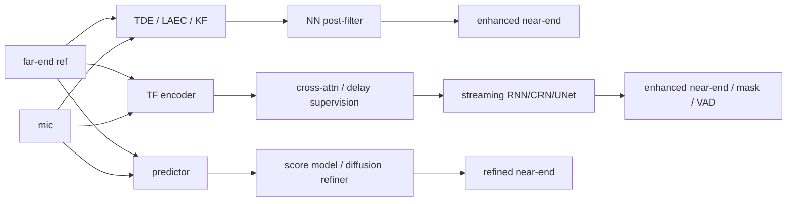
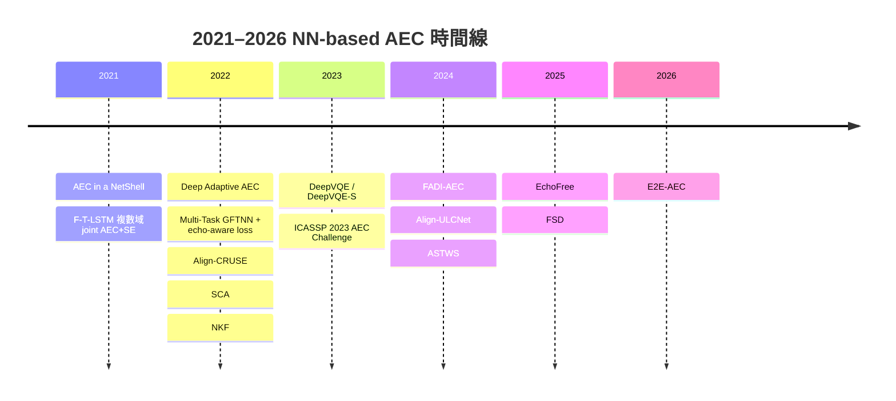
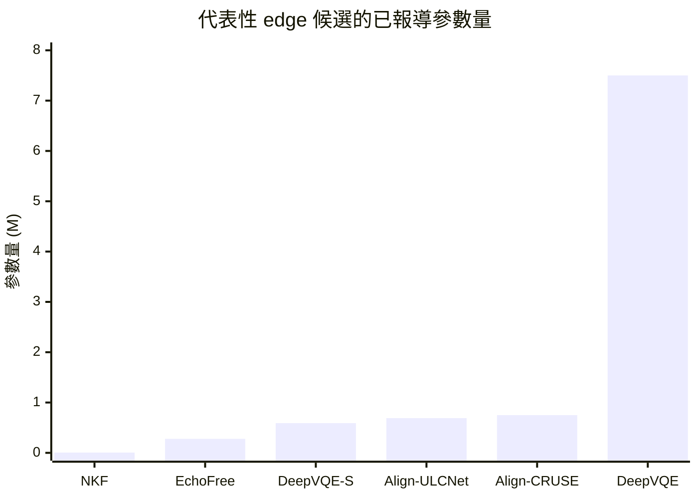

# Audio NN 型聲學回音消除研究報告

## 執行摘要

在 2021–2026 這段期間，音訊神經網路式 AEC 的主線演進非常清楚：早期工作多半在「純神經網路回音估測」與「複數域遮罩學習」之間摸索；2022 年開始，**對齊感知（alignment-aware）** 與 **混合式 DSP+NN** 重新成為主流；2023 年則由整合 AEC/NS/DR 的實用型架構把研究推向可部署水準；2024 年後，研究版圖又分裂成三條最重要的支線：**低複雜度 hybrid 前端**、**擴散式生成 AEC**、以及 **顯式 delay/VAD 監督的 streaming E2E**。整體來看，真正能在裝置端落地的模型，幾乎都不是「純粹追求最大模型」的結果，而是把**延遲、對齊穩健性、雙講保真、以及 CPU/DSP 可行性**一起納入設計目標。citeturn28view0turn28view7turn31view0turn27view2turn26view0turn32view7

若以 **2026 年 4 月可公開核對的證據**來做「SOTA」判斷，不能只報一個單一冠軍，因為不同論文的任務定義與評測協議不同：有些是 AEC-only，有些是 joint AEC+NS 或 AEC+NS+DR；有些在 16 kHz、24 kHz，有些回到 48 kHz challenge blind test；有些報 AECMOS，有些報 PESQ/ERLE/SDR/MOS。基於這個現實，本報告把「當前最佳」切成三個更有研究意義的類別：**研究級整體 SOTA**、**純 E2E 研究前沿**、以及 **擴散式 AEC 前沿**。同時，若目標是 edge 端高感知品質，最佳候選又與研究型 SOTA 不完全相同。citeturn28view4turn31view8turn32view7turn35view3turn26view0

本報告的明確結論如下。若你要選一個**研究品質、可公開驗證、且最接近產品級 SOTA** 的基準，首選仍是 **DeepVQE**；它在 AEC 2023/ DNS 2023 報告中都表現極強，而且其小型版 **DeepVQE-S** 已有真正的大規模實地部署證據。若你要追最新的**純 E2E streaming AEC frontier**，目前最值得直接重現的是 **E2E-AEC (2026)**：它在作者論文的 AEC Challenge 2023/2022 blind set 表上，最佳設定比其文中引用的 DeepVQE 與 Align-ULCNet 有更高的 MOSavg 與更高 ERLE，但它仍是 preprint、且未公開完整重現資源，因此更適合作為研究實驗起點，而不是立即量產藍圖。若你要追**生成式／擴散式 AEC frontier**，則是 **FSD**：它把擴散式方法壓到 9.14 ms latency，並在作者的 blind-test AECMOS 表中超越 ByteAudio 與先前 DI-AEC / FADI-AEC 路線。citeturn31view0turn31view7turn31view8turn32view7turn15view1turn15view3

若目標是**邊緣部署且要維持高主觀品質**，我不建議直接從最大模型開始。相反地，最值得優先排實驗的梯度是：**DeepVQE-S → EchoFree → Align-ULCNet / Align-CRUSE → NKF**。其中 DeepVQE-S 是最成熟、風險最低的 candidate；EchoFree 是目前最有吸引力的超輕量候選，因為只用 278K 參數與 30 MMAC/s 就已接近 DeepVQE-S；Align-ULCNet 與 Align-CRUSE 則分別代表「low-complexity joint AEC+NR」與「低延遲 alignment-aware 產品路線」；NKF 的參數量與 RTF 極佳，但它比較像是超低資源環境中可作為前級或強基線的方案，而不一定是最佳高感知品質終點。citeturn31view0turn26view0turn27view2turn16view0turn8search0turn33search6

## 問題設定與比較框架

AEC 的核心觀測模型可以寫成
\[
d(n)=s(n)+y(n)+v(n),
\]
其中 \(d(n)\) 是麥克風訊號，\(s(n)\) 是近端目標語音，\(y(n)\) 是由 far-end 參考訊號經過聲學與硬體路徑後回灌的回音，\(v(n)\) 則是背景噪音。混合式方法通常先用線性自適應濾波器估測 \(\hat y\)，再把殘餘回音與噪音交給神經網路後級；純 E2E 方法則直接學習 \((\text{mic}, \text{far-end})\mapsto \hat s\) 的映射；擴散式方法則在預測器之上再做 stochastic regeneration / score refinement。這三條路線在 2021–2026 的差異，最終幾乎都體現在「**如何處理 delay 對齊**、**如何兼顧 double-talk 保真與 echo leakage**、以及**能否符合 real-time 制約**」上。citeturn13view2turn17view1turn32view7turn21view6turn35view6

由 entity["organization","Microsoft","software company"] 主辦的 AEC Challenge 已成為此領域最重要的公開 benchmark 之一。到 ICASSP 2023 為止，challenge 明確要求：**RTF ≤ 0.5、演算法延遲加 buffering latency ≤ 20 ms、且推論不可使用未來資訊**。2023 challenge 的 real dataset 超過 50,000 筆錄音、涵蓋 10,000+ 真實環境／裝置／講者；此外還有 10,000 synthetic scenarios。更重要的是，challenge 也強調 AECMOS 與主觀分數具高相關，而傳統 ERLE/PESQ 對真實情境下的主觀品質並不總是可靠。citeturn28view0turn28view2turn28view3turn28view4

這也解釋了為什麼跨論文比較必須非常保守。舉例來說，DeepVQE 在 24 kHz 訓練與推論、再回升至 48 kHz 評測；E2E-AEC 也是用 24 kHz super-wideband；EchoFree 與不少低複雜度模型則在 16 kHz 上工作；Align-ULCNet 的 frame / hop 甚至選成 32/16 ms。只要 sample rate、task scope、是否含 NS/DR、以及 AECMOS 的子分量定義不同，單純拿一個數字橫向排名就容易失真。下文所有表格都因此把 **任務定義、資料集、取樣率、延遲、是否 causal** 一起列出，而不是只列「最好分數」。citeturn31view8turn32view7turn26view0turn27view4



上圖對應的三種 pipeline，正是本文後續比較的主軸：**Hybrid NN+DSP**、**Streaming E2E**、以及 **Diffusion / stochastic regeneration**。這些類別在 SCA、Align-CRUSE、DeepVQE、FADI/FSD、EchoFree、E2E-AEC 等代表工作中都相當清楚。citeturn14view5turn14view4turn9view1turn19view0turn14view7turn25view0turn9view2



## 當前 SOTA 與邊緣部署候選

我建議把截至 2026-04 的「最佳方法」分成三個研究類別與四個部署類別，而不是硬選單一冠軍。第一，**研究級整體 SOTA** 我會選 **DeepVQE**：理由不是它在每張表都絕對第一，而是它同時滿足 challenge 等級評測、跨 AEC 與 DNS 任務的整體強表現、明確的 real-time 效率數據，以及大規模產品驗證。第二，**純 E2E 研究前沿** 是 **E2E-AEC (2026)**：它在作者統一的 AEC Challenge blind-set 報表上，把 best config 的 MOSavg/ERLE 拉到比文中引用的 DeepVQE 與 Align-ULCNet 更高的區間，但目前仍缺少官方 code/checkpoint，因此是高潛力、高風險的研究型 SOTA。第三，**擴散式 AEC 前沿** 是 **FSD**：它在保有擴散式品質優勢的同時，把 latency 壓到 9.14 ms，這是 diffusion 路線第一次真正可被嚴肅討論為 edge-capable 的里程碑。citeturn31view0turn23view1turn32view7turn23view3turn15view1turn15view3

對 edge 端而言，最值得優先考慮的是 **DeepVQE-S、EchoFree、Align-ULCNet、Align-CRUSE、NKF**。DeepVQE-S 的優勢在成熟度：0.59M 參數、0.14 ms/frame、RTF 0.014，而且已在實務系統中驗證。EchoFree 的優勢在效率：278K 參數、30 MMAC/s、與 DeepVQE-S 接近的低複雜度品質。Align-ULCNet 的優勢在 joint AEC+NR，對消費性裝置更像完整聲學前端。Align-CRUSE 的優勢是 alignment-aware 且延遲低，已證明能處理真實 delay outlier。NKF 則是極小模型與超低 RTF 的極端點，適合作為 DSP 前級或 ultra-low-resource baseline。citeturn31view0turn26view0turn27view2turn16view0turn8search0

值得特別注意的是，AEC Challenge 2023 對 top models 的分析指出：**模型大小與 overall score 的 PCC = -0.54**，也就是「越大越好」在 AEC 並不成立；相反地，**RTF 與 score 呈正相關**，代表在 real-time 約束下，工程上更優的模型通常是「複雜度分配合理」而不是「盲目放大參數」。這個觀察與 DeepVQE-S、Align-CRUSE、EchoFree、Align-ULCNet 這些 edge-friendly 強模型的成功，方向是完全一致的。citeturn28view7turn31view0turn26view0turn16view0turn27view2



上面的圖只用已公開報導的參數量，不代表最終感知品質排序；但它清楚顯示當前 edge 候選已經把甜蜜點壓到 **0.28M–0.75M** 這個區間，而不是 5M–10M 的傳統「大而全」設計。對研究者來說，這意味著「先把對齊、損失、資料模擬做對」，通常比把 backbone 再加大更有效。citeturn8search0turn26view0turn31view0turn27view2turn16view0turn28view7

## 代表性文獻回顧

### 早期基礎與複數域路線

**Jan Franzen, Ernst Seidel, Tim Fingscheidt, “AEC in a NetShell: On Target and Topology Choices for FCRN Acoustic Echo Cancellation,” 2021.** citeturn17view1  
**問題**：作者直接質疑早期 DNN-AEC 的核心缺點不是 suppression 不夠，而是**近端語音品質破壞**。  
**架構**：FCRN encoder–decoder + ConvLSTM bottleneck，關鍵設計不是單純 backbone，而是比較三種 fusion 位置（early/mid/late）、skip 連接型態，以及三種 target：\(E=S\)、\(E=S+N\)、或直接估 echo \(D\)。  
**關鍵式**：頻域 MSE 目標  
\[
J_\ell = \frac{1}{K}\sum_{k\in\mathcal K}|\hat E_\ell(k)-E_\ell(k)|^2,
\]
或 echo-target 版  
\[
J_\ell = \frac{1}{K}\sum_{k\in\mathcal K}|\hat D_\ell(k)-D_\ell(k)|^2.
\]
這篇的真正貢獻，是把「輸出 near-end」與「輸出 echo 再相減」這兩種 AEC 建模方式分開比較。  
**訓練**：16 kHz、512/256 samples（32/16 ms），TIMIT、QUT、NOISEX-92、image-method IR；Adam，batch 16，seq length 50，初始 LR \(5\times10^{-5}\)。  
**結果**：參數量視 fusion 位置約 5.2M–7.1M；作者最終認為 **LateF/A + echo target** 在 echo suppression 與近端保真之間給出最佳 trade-off。  
**優點 / 限制**：優點是把 target design 講清楚；限制是指標仍偏 PESQ/dSNR/ERLE，且未對真實 crowdsourced blind test 做 challenge 級驗證。  
**重現資源**：未見官方 code/checkpoint。citeturn37view0turn37view3turn37view4turn38view0turn38view2turn38view6

**Shuai Zhang, Yuhang Kong, Shuyang Lv, Yijun Hu, Lei Xie, “F-T-LSTM Based Complex Network for Joint Acoustic Echo Cancellation and Speech Enhancement,” INTERSPEECH 2021.** citeturn14view1  
**問題**：在含噪、非線性失真、混響的情境中，把 AEC 與 speech enhancement 一起做。  
**架構**：複數卷積 + F-T-LSTM，同時沿頻率與時間遞迴；輸入是 far-end 與 mic 的 complex spectra；輸出是 complex ratio mask。  
**關鍵式**：複數卷積  
\[
H=(K_r*W_r-K_i*W_i)+j(K_r*W_i+K_i*W_r),
\]
CRM 與極座標重建
\[
\hat S = |Y|\,|M|\,e^{j(\angle Y + \angle M)}.
\]
loss 主要用 SI-SNR / Seg-SiSNR。  
**訓練**：20/10 ms, 320-point STFT；AEC challenge synthetic + LibriSpeech + DNS + image-method RIR；Adam，100 epochs，初始 LR \(10^{-3}\)。  
**結果**：1.4M 參數，40 ms overall delay，RTF 0.4385；blind MOS 從 baseline 的 3.87 提升到 4.14，尤其在 ST-FE 與 DT-ECHO 上改善明顯。  
**優點 / 限制**：優點是複數域與 joint enhancement；限制是 ST-NE 有失真退步，且 40 ms 延遲在 2023 之後的 20 ms 目標下已不夠前沿。  
**重現資源**：論文提到 demo page，但未見官方完整訓練碼。citeturn16view2turn16view4turn16view6turn39view1turn39view2turn39view4

### 混合式與對齊感知的轉折

**Hao Zhang, Srivatsan Kandadai, Harsha Rao, Minje Kim, Tarun Pruthi, Trausti Kristjansson, “Deep Adaptive AEC: Hybrid of Deep Learning and Adaptive Acoustic Echo Cancellation,” ICASSP 2022.** citeturn9view7  
**問題**：純神經網路雖強，但在 echo path 連續變化、低 SER / SNR 時常不穩；作者要把 adaptive filter 的在線更新能力重新拉回系統。  
**架構**：把 adaptive AEC 寫成可微 layer；LSTM 估 step size \(\mu_{k,m}\) 與非線性 reference/遮罩，推論時固定 DNN 參數、由 adaptive filter 持續更新。  
**關鍵式**：  
\[
\hat D_{k,m}=\hat W^H_{k,m}X_{k,m},\quad
E_{k,m}=Y_{k,m}-\hat D_{k,m},
\]
\[
\hat W_{k+1,m}=\hat W_{k,m}+\frac{\mu_{k,m}}{X^H_{k,m}X_{k,m}}E_{k,m}X_{k,m}.
\]
這篇的核心不是 loss 新奇，而是把 LMS/FDAF 類更新規則直接嵌入 end-to-end 訓練圖中。  
**訓練**：LSTM 四層、每層 300 units；TIMIT 近端、10,000 sound-effect noises 訓練、Auditec babble 測試、真實錄音 echo；SER \([-30,0]\) dB，SNR \([-5,5]\) dB。  
**結果**：在 SER = -20/-10 dB 下，proposed 分別達到 PESQ 2.00/2.59、SDR 3.89/7.79、ERLE 52.09/51.50 dB，均優於 NLMS、DNN-AEC、DNN-AES。  
**優點 / 限制**：優點是 path-change 韌性與較小模型需求；限制是論文未清楚報導完整參數量、延遲與公開實作。  
**重現資源**：未提供官方 code/checkpoint。citeturn13view2turn13view3turn13view4turn13view5

**Shimin Zhang, Ziteng Wang, Jiayao Sun, Yihui Fu, Biao Tian, Qiang Fu, Lei Xie, “Multi-Task Deep Residual Echo Suppression with Echo-aware Loss,” ICASSP 2022.** citeturn19view1  
**問題**：混合式 linear AEC + neural post-filter 常見的問題是過抑制；作者要讓後級網路知道「哪裡 echo 比 speech 強」。  
**架構**：GFTNN post-filter + VAD auxiliary branch，前面接 TDE + MDF / wRLS。  
**關鍵式**：echo-aware 權重  
\[
W_{\text{echo}}(t,f)=\frac{|Z(t,f)|^2}{|Z(t,f)|^2+|S(t,f)|^2},
\]
\[
L_{\text{echo}}=\frac{1}{TF}\sum_{t,f}\big[L_{\text{mag}}(t,f)(1+W_{\text{echo}}(t,f))+L_{\text{pha}}(t,f)\big],
\]
再加上 VAD loss 與 masking loss。這是把 SER 顯式灌進 loss 的代表作。  
**訓練**：3-band split/synthesize；20/10 ms, 30 ms latency；LibriSpeech + DNS + AEC Challenge + simulated/real echo；Adam，60 epochs。  
**結果**：官方 blind test 上，作者聲稱相對於 baseline 有 **+0.158 WAcc、+0.112 final score**，拿到 **WAcc 第 1、最終第 3**。  
**優點 / 限制**：優點是 echo-aware loss 的思想非常實用；限制是系統仍高度依賴前端 DSP，而且參數量/MACs 未完整公開。  
**重現資源**：有官方 demo / repo（較偏 demo），但非完整 benchmark package。citeturn20view0turn21view0turn21view1turn20view4turn20view5turn33search15

**Evgenii Indenbom, Nicolae-Cătălin Ristea, Ando Saabas, Tanel Pärnamaa, Jegor Gužvin, Ross Cutler, “Deep model with built-in self-attention alignment for acoustic echo cancellation,” 2022 preprint.** citeturn14view4  
**問題**：真實裝置上的 far-end / mic 常嚴重 misalignment；傳統 cross-correlation 對 delay outlier 很脆弱。  
**架構**：Align-CRUSE，把 cross-attention alignment block 直接塞進 low-complexity CRUSE 類網路裡；對齊在特徵空間做 soft alignment，而不是單點 delay 校正。  
**關鍵式**：以 query–key 相似度得到 delay 機率分布，再對 far-end features 加權重建對齊特徵。  
**訓練**：16 kHz、log power spectra、20/10 ms、DFT 320、Adam，batch 400，150 epochs，\(d_{\max}=100\)。  
**結果**：0.75M 參數，0.218 ms/frame；在 LD-M/LD-H/FEST-HD/FEST-GEN 都顯著優於 CRUSE 與線上對齊版 CRUSE，且在 AEC blind test 上 DT Echo MOS 4.45、FEST MOS 4.67。論文還明確指出其已成功部署於 Microsoft Teams。  
**優點 / 限制**：優點是 alignment 問題被模型化、且真正可量產；限制是 DT-other 提升不如最重型 challenge winner。  
**重現資源**：官方完整訓練碼未公開，但有官方 project page；另有非官方實作。citeturn15view8turn16view0turn23view4turn7search8turn6search10

**Yang Liu, Yangyang Shi, Yun Li, Kaustubh Kalgaonkar, Sriram Srinivasan, Xin Lei, “SCA: Streaming Cross-attention Alignment for Echo Cancellation,” 2022 preprint / 2023 會議路線。** citeturn14view5  
**問題**：要做 streaming E2E AEC，但不能依賴外部對齊模組。  
**架構**：CRN 尾接 streaming cross-attention alignment，並用 masked attention 限制 look-ahead。  
**關鍵式**：  
\[
\text{Attention}(q,k,v)=\mathrm{Softmax}\!\left(\frac{\mathrm{Mask}(qk^T)}{\sqrt{d_h}}\right)v,
\]
\[
\mathcal L=\alpha\sum_n|\hat s(n)-s(n)|+\beta\sum_{n,k}w_k|S(\hat s(n))-S(s(n))|.
\]
它的創新是把 streaming attention 與 AEC delay 特性結合。  
**訓練**：AEC challenge synthetic + 私有增強資料；720 原始對話經 augmentation 後約 2k hours。  
**結果**：SCA-CRN 7.8M 參數，streaming 版相對不帶 attention 的 streaming CRN，把 FEST ERLE 從 23.68 拉到 32.17、DT PESQ 從 2.01 拉到 2.60。  
**優點 / 限制**：優點是讓對齊成為模型內生能力；限制是沒有 DeepVQE 那種產品級效率數據，也未公開 code。  
**重現資源**：未提供。citeturn21view2turn23view5

**Dong Yang, Fei Jiang, Wei Wu, Xuefei Fang, Muyong Cao, “Low-Complexity Acoustic Echo Cancellation with Neural Kalman Filtering,” arXiv 2022 / ICASSP 2023 路線。** citeturn8search0  
**問題**：在極低資源平台上，如何保留 Kalman filter 的收斂與重收斂優點，而不用重型神經網路。  
**架構**：用小型 NN 隱式建模 state/observation covariance，直接輸出 Kalman gain。  
**訓練與資料**：論文摘要可得，完整細節在摘要頁中未完全展開；作者提到 synthetic 與 real-recorded test set。  
**結果**：模型大小僅 **5.3K**，RTF **0.09**，在合成與實錄資料上收斂/重收斂表現優於傳統 model-based 方法。  
**優點 / 限制**：優點是超小、超實用；限制是 public summary 中缺少 challenge-style AECMOS 與完整 hyperparameters。  
**重現資源**：有官方 repo。citeturn7search3turn33search6

### 產品級 unified 模型與新一代低複雜度路線

**Evgenii Indenbom, Nicolae-Cătălin Ristea, Ando Saabas, Tanel Pärnamaa, Jegor Gužvin, Ross Cutler, “DeepVQE: Real Time Deep Voice Quality Enhancement for Joint Acoustic Echo Cancellation, Noise Suppression and Dereverberation,” INTERSPEECH 2023.** citeturn9view1  
**問題**：不是只做 AEC，而是做 real-time unified AEC + NS + DR，並希望同時通過 AEC 2023 與 DNS 2023。  
**架構**：mic 分支 + far-end 分支 + cross-attention alignment block + GRU bottleneck + decoder + CCM block；小型版為 DeepVQE-S。  
**關鍵式**：residual block  
\[
Y=X+\mathrm{ELU}(\mathrm{BatchNorm}(\mathrm{Conv2D}(X))).
\]
對齊則把 far-end query / key 展開後做 delay-distribution soft alignment。  
**訓練**：24 kHz、20/10 ms、DFT 480、power-law compressed complex spectra；AdamW，batch 400，250 epochs，LR \(1.2\times10^{-3}\)，weight decay \(5\times10^{-7}\)，\(d_{\max}=100\)。訓練資料來自 AEC 2022 與 DNS，並做 online synthesis。  
**結果**：DeepVQE 在作者表中 AEC 2023 final score 0.854；DeepVQE-S 於 AEC-DT AECMOS\(_e\)=4.66、AECMOS\(_d\)=4.63、WER 31.79，且 DNS track 也強。效率上，DeepVQE 7.5M 參數 / 3.66 ms per frame；DeepVQE-S 0.59M / 0.14 ms per frame / RTF 0.014。  
**優點 / 限制**：優點是**研究-產品雙重成立**；限制是官方 repo 未完全公開，且 DeepVQE 本體仍不是最小。  
**重現資源**：官方 project page 與多個非官方重實作可用。citeturn12view0turn12view1turn31view7turn31view0turn23view1turn33search0turn33search5

**Yang Liu, Li Wan, Yun Li, Yiteng Huang, Ming Sun, James Luan, Yangyang Shi, Xin Lei, “FADI-AEC: Fast Score Based Diffusion Model Guided by Far-end Signal for Acoustic Echo Cancellation,” arXiv 2024.** citeturn19view0  
**問題**：擴散式方法理論上有更好 artifact / quality，但太慢，難以用在 real-time AEC。  
**架構**：先有 predictive model \(D_\theta\)，再用 score-based diffusion 生成式 refiner \(G_\phi\)；FADI 版本把 reverse process 壓成每 frame 只跑一次 fast score。  
**關鍵式**：denoising score matching  
\[
J^{(\mathrm{DSM})}(\phi)=\mathbb E\left\|s_\phi(s_t,h,t)+\frac{z}{\sigma}\right\|_2^2,
\]
總損失結合 DSM 與 predictor 的 supervised regularization：
\[
L^{(\mathrm{StoRM})} = L^{(\mathrm{DSM})} + \alpha\,\mathbb E\|s-D_\theta(h)\|_2^2.
\]
其創新是用 far-end signal 生成更符合 echo 結構的 noise，而不是單純高斯噪聲。  
**訓練**：AEC challenge synthetic + 私有增強資料，最終約 720K conversations / 2,000 h。  
**結果**：6.9M 參數，FADI latency 9.14 ms；在 augmented eval 上，FADI-AEC Far-Guided 版達到 FEST ERLE 89.41 dB、NEST PESQ 4.83、DT PESQ 3.21。blind test AECMOS 上，FADI-AEC 約達 FEST 4.719、DT 4.781、DT-other 4.321。  
**優點 / 限制**：優點是首次把 diffusion 壓進可討論的延遲範圍；限制是仍無官方 code、且 DT PESQ 稍落後於最重型 DI-AEC。  
**重現資源**：未提供。citeturn21view3turn21view5turn35view0turn35view1turn35view3turn35view4

**Shrishti Saha Shetu, Naveen Kumar Desiraju, Wolfgang Mack, Emanuel A. P. Habets, “Align-ULCNet: Towards Low-Complexity and Robust Acoustic Echo and Noise Reduction,” 2024 preprint.** citeturn9view6  
**問題**：低複雜度 joint AEC+NR 要在真實 device band-limiting、KF 失配、alignment 誤差下仍穩定。  
**架構**：KF 前級 + latent-space Time Alignment block + ULCNetAENR 後級；另引入 C-SamFR 取代 sequential subband splitting。  
**關鍵式**：complex mask 重建  
\[
\tilde S = Z_{em}\cdot M_m \cdot e^{j(Z_{ep}+M_p)}.
\]
方法論上的重點，在於「time alignment 在 latent space、而非 waveform / GCC 單點對齊」。  
**訓練**：NFFT 512，32/16 ms，power-law compression \(\alpha=0.3\)，\(D_{\max}=64\)（約 1 s），Adam，初始 LR 0.004。  
**結果**：0.69M 參數、0.10 GMACs。DT / FST 上分別達 EMOS 4.66 / 4.75，DMOS 3.95 / 4.29；作者強調它適合 resource-constrained consumer devices。  
**優點 / 限制**：優點是 AEC+NR 綜合性與低複雜度；限制是 blind-set 指標與 sample rate 與其他 SOTA 不完全同協議。  
**重現資源**：未見官方 source code；有官方 samples page。citeturn12view6turn13view0turn27view1turn27view2

**Fei Zhao, Xueliang Zhang, “Attention-Enhanced Short-Time Wiener Solution for Acoustic Echo Cancellation,” arXiv 2024.** citeturn9view4  
**問題**：深度學習 AEC 常忽略傳統 Wiener 理論；作者要把「可解釋的短時 Wiener 解」嵌回輕量 DNN。  
**架構**：Attention module → short-time Wiener solution → ICCRN-based AEC module。  
**關鍵式**：作者把傳統 Wiener 解改成有限當前輸入長度的短時版本：
\[
S_W[t,f]=D[t,f]-\sum_{k=0}^{m-1}H_W[k,f]X[t-k,f].
\]
這是本篇最重要的推導，因為它把非因果的全局 Wiener 轉成可 real-time 的局部版本。  
**訓練**：16 kHz；RI+Mag loss 的 STFT 設為 20 ms window / 5 ms shift；Adam，初始 LR 0.001，plateau halve。  
**結果**：ASTWS 只有 0.148M 參數、0.963 GMAC；synthetic test 上在 DT SER=-10/0/10 與 ST-FE 都比 ICRN / MTFAA / ICCRN 強，ST-FE ERLE 56.41；AEC 2023 blind set 上 MOS\_ECHO=4.275，優於 MTFAA 的 4.009。  
**優點 / 限制**：優點是**極小模型 + 理論可解釋性**；限制是 paper 聚焦 echo/noise，對更廣泛真實場景仍待外部驗證。  
**重現資源**：官方 repo 含 code 與 checkpoint。citeturn21view6turn21view7turn22view1turn22view3turn22view4turn34search1

### 超輕量與最新 streaming E2E 前沿

**Xingchen Li, Boyi Kang, Ziqian Wang, Zihan Zhang, Mingshuai Liu, Zhonghua Fu, Lei Xie, “EchoFree: Towards Ultra Lightweight and Efficient Neural Acoustic Echo Cancellation,” arXiv 2025.** citeturn25view0  
**問題**：既有方法不是太大，就是延遲/運算不適合低資源 edge。  
**架構**：PFD adaptive Kalman 線性前級 + Bark-scale neural post-filter；mic 分支 4 層 depthwise-separable conv，echo 分支 1 層 conv，GRU bottleneck，subpixel decoder；兩階段 SSL 訓練。  
**關鍵式**：第一階段由 frozen WavLM-Large embedding MSE 引導，第二階段用 Bark-scale gain loss + SSL regularization。這條路線的創新點不在新 backbone，而在**把 SSL 當 coarse-to-fine teacher**。  
**訓練**：16 kHz，STFT 512/256/512，100 Bark filters，輸入維度 112；80,000/10,000 DNS clean samples，動態模擬 SER -15 至 15 dB、delay 10–512 ms；Adam、batch 128、10 秒 segment。  
**結果**：**278K 參數、30 MMAC/s**。在作者統一重訓比較下，EchoFree-proposed 對比 DeepVQE-S：ST-FE EchoMOS 4.20 vs 4.13、ST-NE DegMOS 3.27 vs 3.24，但 DT EchoMOS / DegMOS 為 3.88 / 3.53，略遜於 DeepVQE-S 的 3.96 / 3.69。  
**優點 / 限制**：優點是當前最漂亮的 efficiency–quality trade-off；限制是尚未有官方完整 code release，且 DT 場景仍有改進空間。  
**重現資源**：官方 demo page，有 ar5iv HTML 可讀全文。citeturn24view0turn24view3turn26view0

**Yiheng Jiang, Biao Tian, Haoxu Wang, Shengkui Zhao, Bin Ma, Daren Chen, Xiangang Li, “E2E-AEC: Implementing an end-to-end neural network learning approach for acoustic echo cancellation,” arXiv 2026.** citeturn9view2  
**問題**：在不依賴外部 alignment / linear AEC 的前提下，做可 streaming 的純 E2E AEC。  
**架構**：TF-GridNet 風格的 RNN blocks + attention-based time alignment + progressive learning + VAD prediction / masking。  
**關鍵式**：soft alignment  
\[
\tilde R(c,t,f)=\sum_{d=0}^{H-1}A(t,d)\,R_u(c,t,d,f),
\]
delay expectation  
\[
D_e(t)=\sum_{d=0}^{H-1}A(t,d)\,d,
\]
總 loss  
\[
L=\lambda_1L_{\text{spec1}}+\lambda_2L_{\text{spec2}}+\lambda_3L_{\text{delay}}+\lambda_4L_{\text{vad}}.
\]
這是近年少數把 alignment supervision、PL、VAD masking 放在同一 streaming E2E 圖內的工作。  
**訓練**：24 kHz；20/10 ms；1.2M 參數；資料來自 DNS clean/noise、gpuRIR、AEC 2023 FarST。delay supervision 的標籤用 GCC-PHAT 離散化，VAD label 用 WebRTC-VAD。  
**結果**：最佳設定（Exp 6）在 AEC Challenge 2023 上達到 DT EMOS 4.65、DT DMOS 4.18、FarST ERLE 78.69、FarST EMOS 4.77、MOSavg 4.51；在 AEC 2022 上 MOSavg 4.49、ERLE 79.02。這個 best config 在作者表中超過其列舉的 DeepVQE 與 Align-ULCNet。  
**優點 / 限制**：優點是純 E2E streaming 路線在公開表上很強；限制是尚未開源、且仍屬 preprint，重現風險高。  
**重現資源**：未提供。citeturn12view3turn12view4turn32view7turn23view2turn23view3

### 臺灣學位論文與本地研究脈絡

就 entity["organization","國家圖書館","taipei, taiwan"] 臺灣博碩士論文系統可見 metadata 而言，本主題近年已經開始出現與國際主線相當一致的研究方向。公開檢索結果可見一篇題名為**《結合交叉注意力與改進損失函數的DTLN-AEC 模型》**的論文；但目前 NDLTD 檢索頁面有 CAPTCHA 機制，造成完整作者、摘要、學校與全文 metadata 無法穩定自動擷取，因此本報告僅能做 metadata-level 收錄，不把它納入數值比較。citeturn29search0

另一方面，陽明交大機構典藏可見**《基於與失真程度相關損失函數的多階段回音與噪音抑制》**；從可見摘要片段判斷，其研究主題與「echo-aware loss / staged enhancement」高度相符，與 ICASSP 2022 challenge 系列的 GFTNN / echo-aware loss 流派有直接親緣性。這說明臺灣本地學位研究已經開始吸收國際 AEC 主線中的兩個關鍵觀念：**交叉注意力對齊**與**失真感知 loss 設計**。但同樣地，若要做嚴格文獻回顧，仍需人工通過檢索系統驗證與取得全文。citeturn29search2turn20view0turn21view0

## 綜合比較與部署建議

下表整理本報告選取的代表性方法。特別提醒：若研究目標是做「公平橫向比較」，你不應直接拿不同 sample rate、不同任務範圍、不同 blind-set 協議的 AECMOS 數字做單一排名。正確做法是先選一個**共同資料生成與共同評測腳本**，再在相同 frame size / sample rate / latency budget 下重訓。citeturn28view0turn28view4turn31view8turn26view0turn32view7

| Year | Authors | Work | Model type | Params | MACs | Input features | Frame/hop | Causal | Learning | Dataset(s) | Metrics reported | Latency / RTF | Real-time feasibility | Code |
|---|---|---|---|---:|---:|---|---|---|---|---|---|---|---|---|
| 2021 | Franzen et al. | AEC in a NetShell citeturn17view1 | 純 NN FCRN echo estimator | 5.2–7.1M | 未指定 | complex STFT real/imag | 32/16 ms | 是 | 監督式 | TIMIT, QUT, NOISEX-92, simulated IR | PESQ, dSNR, ERLE | 未指定 | 條件式 | 未提供 |
| 2021 | Zhang et al. | F-T-LSTM citeturn14view1 | 複數域 joint AEC+SE | 1.4M | 未指定 | far-end+mic complex spectra | 20/10 ms | 是 | 監督式 | AEC Challenge, LibriSpeech, DNS, simulated RIR | PESQ, STOI, ERLE, MOS | 40 ms / 0.4385 | 條件式 | 未提供 |
| 2022 | Zhang et al. | Deep Adaptive AEC citeturn9view7 | Hybrid differentiable adaptive filter + LSTM | 未指定 | 未指定 | 頻域參考/麥克風特徵 | 未指定 | 是 | 監督式 | 真實錄音 echo, TIMIT, 10k noise | PESQ, SDR, ERLE | 未指定 | 條件式 | 未提供 |
| 2022 | Zhang et al. | Multi-Task GFTNN citeturn19view1 | Hybrid linear AEC + GFTNN PF | 未指定 | 未指定 | 分頻後 D/E/X/Y 特徵 | 20/10 ms | 是 | 監督式 + auxiliary VAD | AEC Challenge, LibriSpeech, DNS, simulated/real echo | WB-PESQ, ERLE, MOS, WAcc | 30 ms / 未指定 | 是 | Demo repo |
| 2022 | Indenbom et al. | Align-CRUSE citeturn14view4 | Alignment-aware E2E low-complexity | 0.75M | 未指定 | log power spectra | 20/10 ms | 是 | 監督式 | AEC Challenge | AECMOS, ERLE, MOS | 20 ms / 0.218 ms per frame | 是 | 官方頁；source 未提供 |
| 2022 | Liu et al. | SCA citeturn14view5 | Streaming E2E CRN + cross-attn | 7.8M | 未指定 | 複數投影特徵 | 未指定 | 是 | 監督式 | AEC Challenge + 2k h augmented private data | ERLE, PESQ, AECMOS | 未指定 | 條件式 | 未提供 |
| 2022/23 | Yang et al. | NKF citeturn8search0 | Neural Kalman hybrid | 5.3K | 未指定 | covariance / gain-related features | 未指定 | 是 | 監督式 | synthetic + real-recorded test sets | convergence, reconvergence, real tests | 未指定 / 0.09 | 是 | 官方 repo |
| 2023 | Indenbom et al. | DeepVQE citeturn9view1 | Unified E2E AEC+NS+DR | 7.5M | 未指定 | 24 kHz power-law compressed complex spectra | 20/10 ms | 是 | 監督式 | AEC 2022 + DNS + online synthesis | ERLE, AECMOS, WER, DNSMOS, SRR, final score | 20 ms / 3.66 ms per frame | 是 | 官方頁；非官方實作可用 |
| 2023 | Indenbom et al. | DeepVQE-S citeturn9view1 | DeepVQE 小型版 | 0.59M | 未指定 | 同上 | 20/10 ms | 是 | 監督式 | 同上 | AECMOS, WER, DNSMOS, SRR | 20 ms / 0.14 ms per frame, RTF 0.014 | 是 | 官方頁；非官方實作可用 |
| 2024 | Liu et al. | FADI-AEC citeturn19view0 | Predictive + diffusion refiner | 6.9M | 未指定 | mic + far-end guided diffusion state | 未指定 | 條件式 | 監督式生成 | AEC Challenge + 2k h augmented data | ERLE, PESQ, AECMOS | 9.14 ms / 未指定 | 是 | 未提供 |
| 2024 | Liu et al. | FSD citeturn14view7 | Fewer-step diffusion | 6.9M | 未指定 | 同 FADI | 未指定 | 條件式 | 監督式生成 | ICASSP 2023 AEC Challenge | ERLE, PESQ, AECMOS | 9.14 ms / 未指定 | 是 | 未提供 |
| 2024 | Shetu et al. | Align-ULCNet citeturn9view6 | Hybrid KF + low-cost AENR | 0.69M | 0.10 GMAC | Z, Y, latent TA features, power-law compression | 32/16 ms | 條件式 | 監督式 | AEC Challenge, DNS | AECMOS, SI-SDR, SIGMOS, BAKMOS | 未指定 | 是（但 telephony 20 ms 需評估） | 未提供 |
| 2024 | Zhao & Zhang | ASTWS citeturn9view4 | Knowledge-infused ICCRN + ST Wiener | 0.148M | 0.963 GMAC | mic + far-end + ST Wiener estimate | loss STFT 20/5 ms; backbone 未指定 | 條件式 | 監督式 | synthetic test + ICASSP 2023 blind set | PESQ, SDR, ERLE, MOS_ECHO | 未指定 | 條件式 | 官方 repo + ckpt |
| 2025 | Li et al. | EchoFree citeturn25view0 | Hybrid Kalman + Bark U-Net PF + SSL | 0.278M | 30 MMAC/s | Bark power + delta/delta2 | 32/16 ms | 是 | 監督式 + SSL-guided | DNS clean + dynamic echo simulation + AEC 2023 blind eval | EchoMOS, DegMOS | 未指定 | 是 | demo；完整 source 未指定 |
| 2026 | Jiang et al. | E2E-AEC citeturn9view2 | Streaming E2E RNN + align + PL + VAD | 1.2M | 未指定 | STFT features | 20/10 ms | 是 | 監督式 | DNS, gpuRIR, AEC 2023 FarST | AECMOS, ERLE | 未指定 | 是 | 未提供 |

以 edge 為中心的模型選擇，我建議先看下表。**「建議量化」與「目標硬體類別」是依據論文報導的參數量、MACs、frame 設定與結構特性所做的工程推估**；它不是論文原文直接給出的結論，但這種推估對實驗規劃比單看 AECMOS 更實際。citeturn31view0turn26view0turn27view2turn16view0turn8search0

| 推薦模型 | 取捨摘要 | Params / MACs | 已報導品質 | 建議量化 | 建議硬體類別 |
|---|---|---|---|---|---|
| DeepVQE-S | 產品風險最低；品質與效率兼具 | 0.59M / 未指定 | AEC-DT EchoMOS 4.66、DegMOS 4.63；RTF 0.014 | conv/GRU int8，attention 維持 fp16/int16 accumulate | x86/ARM CPU、手機 NPU、會議終端 |
| EchoFree | 超輕量最佳候選；ST-FE/ST-NE 很強，DT 稍弱 | 0.278M / 30 MMAC/s | ST-FE 4.20、ST-NE 3.27、DT 3.88/3.53 | 全 post-filter int8；WavLM 僅訓練期使用 | 智慧音箱 SoC、手機 DSP/NPU、低功耗會議裝置 |
| Align-ULCNet | joint AEC+NR，較像完整前端 | 0.69M / 0.10 GMAC | DT/FST EMOS 4.66/4.75 | int8 conv/GRU；KF 維持 fixed-point / fp16 | 消費型裝置 CPU/DSP、soundbar、TV |
| Align-CRUSE | 對齊穩健度與低延遲最好 | 0.75M / 未指定 | FEST MOS 4.67、DT Echo MOS 4.45 | int8 conv，注意力 softmax 保留 fp16 | 會議終端、PC 通訊軟體、通話裝置 |
| NKF | 最小、最省；適合前級或極低資源 | 5.3K / 未指定 | AECMOS 未指定；RTF 0.09 | fixed-point / int8 極佳 | MCU 級 DSP、超低功耗設備 |
| ASTWS | 超小且有理論可解釋性；很適合研究蒸餾 | 0.148M / 0.963 GMAC | blind set MOS_ECHO 4.275 | int8 ICCRN；Wiener 部分可固定點 | 邊緣 CPU / DSP，研究型 prototype |

下列連結以**官方 challenge / 官方作者頁 / 官方 repo**優先；若只有 demo 或非官方重實作，我已在註解中標示。相關資料可用來建立你的重現基線與資料管線。citeturn6search2turn33search6turn34search1turn34search2turn34search3turn33search0turn6search10turn25view0

```text
# Datasets / benchmarks
Microsoft AEC Challenge (official): https://github.com/microsoft/AEC-Challenge
Microsoft DNS Challenge (official repo root): https://github.com/microsoft/DNS-Challenge
gpuRIR: https://github.com/DavidDiazGuerra/gpuRIR
LibriSpeech (OpenSLR): https://www.openslr.org/12
TIMIT (LDC): https://catalog.ldc.upenn.edu/LDC93S1
QUT-NOISE-TIMIT: https://researchdatafinder.qut.edu.au/display/nr737397
NOISEX-92: http://spib.rice.edu/spib/select_noise.html

# Metrics / tooling
AECMOS local service (inside AEC Challenge repo): https://github.com/microsoft/AEC-Challenge

# Official or author-provided code / pages
NKF-AEC (official): https://github.com/fjiang9/NKF-AEC
ASTWS-AEC (official, with checkpoint): https://github.com/ZhaoF-i/ASTWS-AEC
SDAEC (official): https://github.com/ZhaoF-i/SDAEC
Deep Echo Path Modeling (official, with checkpoint): https://github.com/ZhaoF-i/Deep-echo-path-modeling-for-acoustic-echo-cancellation
Align-CRUSE official page: https://ristea.github.io/aec-align-cruse/
DeepVQE official page: https://ristea.github.io/deep-vqe/
EchoFree demo page: https://echofree2025.github.io/EchoFree-demo/

# Non-official but useful reimplementations
DeepVQE reimplementation: https://github.com/Xiaobin-Rong/deepvqe
DeepVQE GGML/PyTorch reimplementation: https://github.com/richiejp/deepvqe-ggml
Align-CRUSE unofficial implementation: https://github.com/lhwcv/self_attention_alignment
```

## 趨勢、挑戰與研究路線

**資料集與 benchmark 習慣** 已經高度收斂。最核心的是 AEC Challenge 的 real + synthetic 資料；其次是 DNS clean/noise；再來是 LibriSpeech、TIMIT、QUT、NOISEX-92、以及 image-method / gpuRIR 生成的 RIR。幾乎所有 2022 之後的強模型都至少使用 challenge data，再用 DNS 或自建 augmentation 去補足噪音與房間變異。這代表你若想規劃新實驗，最務實的起點不是重新發明資料模擬，而是**直接遵循 AEC Challenge + DNS 的混合資料策略**。citeturn28view2turn28view3turn31view8turn32view7turn26view0turn37view4

**性能趨勢** 則可以濃縮成五點。第一，**alignment-aware** 已從「加分項」變成「必備項」：Align-CRUSE、SCA、DeepVQE、E2E-AEC 全都把對齊內生化，並且在 hard delay cases 上得到明顯收益。第二，**hybrid 架構重新崛起**：邊緣部署上，linear AEC / Kalman / KF 前級加神經 post-filter 的路線，在效率–品質上反而比很多純 E2E 更漂亮。第三，**大模型不是唯一方向**：2023 challenge 已經明示模型大小與分數負相關。第四，**perceptual / structure-aware loss** 很重要，從 echo-aware loss、VAD masking、Bark gain loss 到 SSL loss，都是同一條邏輯。第五，**擴散式方法雖然開始站穩腳跟，但能否在 DT 場景穩定贏過更簡潔的 hybrid/e2e teacher，仍需更多嚴格對照**。citeturn16view0turn21view2turn31view0turn32view7turn28view7turn21view0turn26view0turn15view1

**未解挑戰** 依然非常集中。最重要的是 **double-talk 下的語音保真與 residual echo 的平衡**。AEC Challenge 2023 的 headroom 分析就明確指出，double-talk other、single near-end SIG/BAK 還有很大剩餘空間。第二個難點是**真實系統 delay/jitter 與 path change**，這也是 alignment-aware 方法持續主導的原因。第三個難點是**objective metric 與真實聆聽品質**之間仍存在落差，因此 AECMOS 雖然重要，但你最好仍安排小規模主觀測試，特別是在失真與音色方面。第四個難點是**重現性**：不少強論文沒有官方程式，blind test 也不是隨手可重跑。citeturn28view1turn28view4turn16view0turn23view4turn32view7

如果你是研究者，準備規劃下一輪實驗，我會推薦以下研究路線。**第一條主線**：以 DeepVQE-S 或 EchoFree 為 student，加入 E2E-AEC 的 delay supervision 與 VAD masking，再用 FSD/FADI 的 teacher-style diffusion perceptual target 做蒸餾，而不是直接部署 diffusion。這條線最有希望同時得到 challenge-friendly AECMOS 與 edge-compliant complexity。**第二條主線**：把 ASTWS 的 short-time Wiener 先驗或 Deep Adaptive AEC 的 differentiable adaptive layer，嵌到 EchoFree / Align-ULCNet 類輕量 post-filter 中；這是把可解釋 DSP 與小模型結合的自然方向。**第三條主線**：建立「同一資料、同一 sample rate、同一 20 ms latency budget」的公平比較框架，專門對比 DeepVQE-S、EchoFree、Align-ULCNet、E2E-AEC，否則你很難知道改進究竟來自架構、loss、還是資料管線。這三條路線都比再加深 backbone 更有研究產出率。citeturn31view0turn26view0turn32view7turn15view1turn21view7turn13view2

最後談**部署實務**。若你的硬體目標是通話或會議終端，請優先遵守 20 ms 以下總延遲；32/16 ms 類設定比較適合智慧音箱、TV 或 speakerphone，不一定適合嚴格互動式通訊。若你的目標是 CPU 優先，應盡量選擇 **Bark/gain 類輸出** 或小型 masking 模型，因為 complex-valued full-band decoder 對 cache 與 bandwidth 較不友好。若你的目標是 DSP/NPU 協同，最佳切分通常是：**DSP 跑 linear AEC / KF + feature extraction，NPU/CPU 跑 NN post-filter**。量化上，GRU/Conv 大多可安全 int8；但 attention softmax、complex mask phase 分支、以及某些 diffusion score branch 常需要保留較高精度。也因此，**最可能量產的不是純 diffusion，而是被蒸餾過的 hybrid / compact E2E student**。這個判斷與近年代表性方法的公共證據是一致的。citeturn28view0turn31view0turn26view0turn27view2turn16view0turn15view1