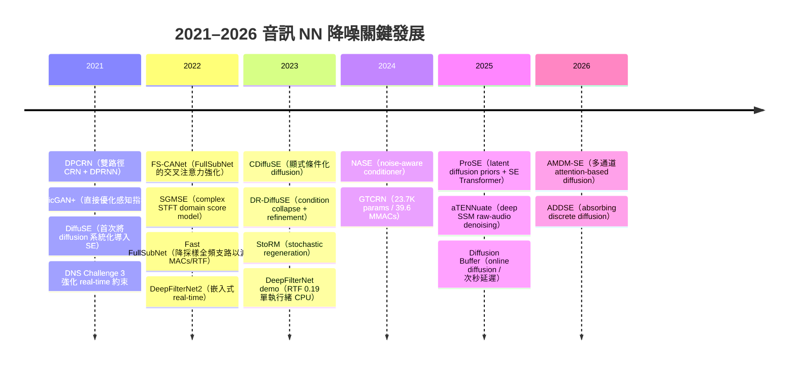
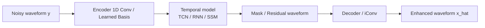
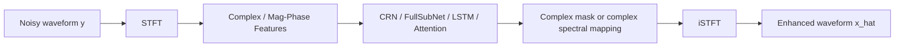
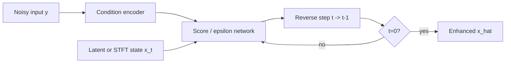
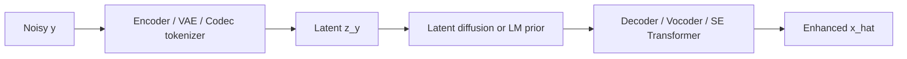
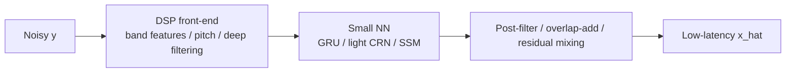
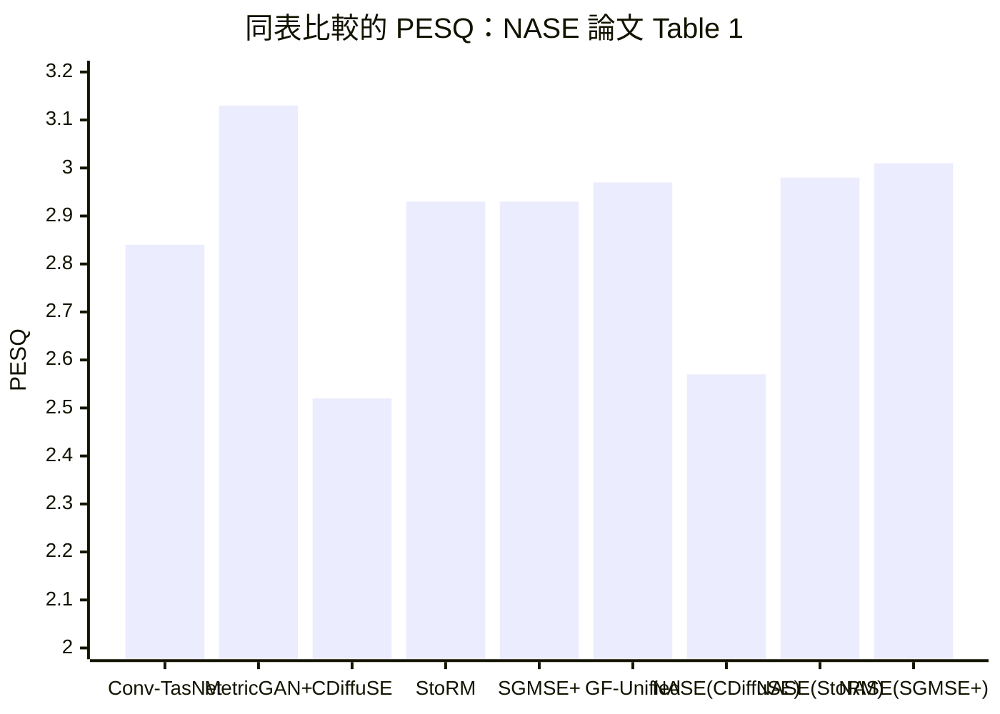

# 音訊神經網路降噪演算法研究報告

## 執行摘要

2021–2026 的音訊神經網路降噪（audio NN denoising / speech enhancement）演進，可以概括成三條主線。第一條是**低延遲、可部署的頻域/波形域判別式模型**持續精進，例如 DPCRN、FullSubNet 系列、DeepFilterNet、GTCRN、aTENNuate；它們的共同目標是以單次前向推論維持高語音品質、低延遲與可預測算力。第二條是**擴散/score-based 生成式模型**從 2021 的 DiffuSE、2022 的 SGMSE、2023 的 CDiffuSE/StoRM/DR-DiffuSE，一路發展到 2024 的 NASE 與 2025 的 ProSE，重點從「能不能用 diffusion 做增強」轉向「如何減少步數、避免 condition collapse、提升 cross-domain robustness」。第三條則是**工程導向的輕量混合式方法**，例如 RNNoise、PercepNet、DeepFilterNet、GTCRN，它們在學術 SOTA 清單中常被低估，但在 edge、會議通話、車載、助聽器與嵌入式部署情境中，反而是最實用的一群。citeturn16view0turn26view3turn10view1turn21view0turn26view4turn28view6turn27view1

若只看**本報告納入且能由原始/官方來源核驗**的結果，代表性「領先值」大致如下：在 matched 的 VoiceBank/VoiceBank+DEMAND 類基準上，2025 的 aTENNuate 在其標準化管線中報告 VBDMD PESQ 3.27、CSIG 4.57、COVL 3.96；在 generative matched benchmark 中，2024 的 NASE（以 SGMSE+ 為 backbone）報告 PESQ 3.01、eSTOI 0.87、SI-SDR 17.6；在 CHiME-4 真實環境資料上，2025 的 ProSE 報告 STOI 88.18%、PESQ 1.73、COVL 2.30；在 DNS 2021 主觀盲測上，2021 的 DPCRN 報告 Overall MOS 3.57；在 DNS3 盲測客觀指標上，2024 的 GTCRN 報告 DNSMOS-P.808 3.44、DNSMOS-P.835 OVRL 2.70。**但這些數字不能被當成單一統一排行榜**，因為不同論文混用了 VoiceBank、VCTK-DEMAND、VBDMD、DNS1、DNS3、CHiME-4 等資料切分與計分管線，而且 PESQ 常未指明是 NB 還是 WB。citeturn27view4turn15view1turn26view5turn29view0turn21view0

PESQ 的可比性必須特別警告。entity["organization","ITU","telecom standards body"] 的 P.862 原本對應 narrowband，P.862.2 是 wideband 延伸；P.862.3 另提供切段、靜音、電平與使用方式的應用指引。ITU 官方資料庫也明確說明 P.862、P.862.2、P.862.3 已在 2024-01-05 被刪除並建議改參照 P.863 系列，因此 2021–2026 文獻中沿用的 PESQ 數值，若未同時明示 sample rate、前後靜音處理、是否重採樣、使用的是 NB/WB 與哪個 reference implementation，就只能做**弱比較**。本報告因此在所有表格中，凡原始來源未清楚標示者，一律標註為「未指明」。citeturn30search0turn30search1turn30search3turn30search5turn30search7turn30search11

### 目前可核驗的代表性領先結果摘要

| 基準/情境 | 代表模型 | 代表結果 | 可比性說明 | 原始 URL |
|---|---|---:|---|---|
| VBDMD / matched intrusive metrics | aTENNuate (base) | PESQ 3.27, CSIG 4.57, COVL 3.96, SI-SDR 15.04 | 同文內標準化管線；與他文不可直接比較 | `https://www.isca-archive.org/interspeech_2025/pei25_interspeech.pdf` |
| VoiceBank generative family | NASE (SGMSE+) | PESQ 3.01, eSTOI 0.87, SI-SDR 17.6 | 同表對比 SGMSE+/StoRM/GF-Unified；較可比 | `https://www.isca-archive.org/interspeech_2024/hu24c_interspeech.pdf` |
| CHiME-4 real-world / diffusion family | ProSE | STOI 88.18, PESQ 1.73, COVL 2.30 | 與同表 DiffuSE/CDiffuSE/SGMSE/DR-DiffuSE 較可比 | `https://aclanthology.org/2025.naacl-long.619.pdf` |
| DNS 2021 blind subjective | DPCRN-2 | Speech MOS 3.76, Noise MOS 4.34, Overall MOS 3.57 | 主觀 P.835；與 DNSMOS 不可直接比較 | `https://www.isca-archive.org/interspeech_2021/le21b_interspeech.pdf` |
| DNS3 blind objective / edge | GTCRN | DNSMOS-P.808 3.44, P.835 OVRL 2.70 | 與 DNS 2021 主觀盲測不可直接比較 | `https://sigport.org/documents/gtcrn-speech-enhancement-model-requiring-ultralow-computational-resources` |

上表整理自原始論文、官方會議頁與作者官方實作。citeturn27view4turn15view1turn26view5turn29view0turn21view0

## 關鍵時間線與架構譜系

2021–2026 的關鍵轉折，不是單純「模型更大」，而是**目標函數、條件注入方式、推論步數與部署約束**一起改變。2021 年的 DPCRN 與 MetricGAN+ 代表「判別式頻域模型與 metric-aware 訓練」；同年來自 entity["organization","Academia Sinica","taiwan research institute"] 的 DiffuSE 則是 diffusion 進入 SE 的里程碑。2022 年 SGMSE 把 score-based generative modeling 正式帶入複數 STFT 域，FS-CANet 和 Fast FullSubNet 把 FullSubNet 路線往更快、更輕量的 real-time 方向推進。2023 年 CDiffuSE、DR-DiffuSE、StoRM 聚焦於條件建模、domain shift 與擴散效率。2024 年 NASE 用顯式 noise conditioner 改善 generative model 對 unseen noise 的適應，GTCRN 則把 edge 設計推到 23.7K params / 39.6 MMAC/s。2025 年 ProSE 把 latent diffusion prior 與 SE Transformer 結合，將 diffusion 步數壓到 T=2；aTENNuate 則把 state-space model 推入 raw audio real-time denoising。2026 年的 AMDM-SE 與 ADDSE 反映兩個值得關注的方向：**多通道擴散**與**離散/吸收式擴散**。citeturn0view1turn0view2turn16view0turn26view3turn0view3turn0view4turn12search2turn12search3turn26view4turn21view0turn28view6turn27view1turn0view11turn0view12

### 代表架構的概念流程圖

**time-domain 一次式增強**

**frequency-domain 複數遮罩/映射**

**diffusion / score-based**

**latent / codec-based**

**hybrid 工程路線**

上述五類架構幾乎囊括了本期文獻的主流路線；其中 real-time 與 edge 部署最常落在 frequency-domain 複數遮罩、hybrid DSP+NN、以及極小型 time-domain/SSM 模型；擴散與 latent 模型則在**非配對噪音、domain mismatch 與自然度**方面更有優勢，但通常付出較高推論成本。citeturn29view0turn26view3turn10view1turn26view4turn28view6turn27view1

## 重要論文與代表方法總表

下表優先納入使用者指定與本研究中反覆出現的代表方法；URL 盡量指向官方/原始來源或作者官方 repo。citeturn0view1turn0view2turn0view3turn0view4turn16view0turn0view5turn12search2turn12search3turn26view4turn0view9turn0view10turn10view1turn10view0turn21view0turn1view0turn1view2turn6view2turn1view6turn1view7turn1view8

| 論文 / 模型 | 主要作者 | 會議 / 期刊 | 年份 | URL | 定位 |
|---|---|---:|---:|---|---|
| DPCRN: Dual-Path Convolution Recurrent Network for Single Channel Speech Enhancement | Xiaohuai Le et al. | Interspeech | 2021 | `https://www.isca-archive.org/interspeech_2021/le21b_interspeech.pdf` | 頻域 CRN + DPRNN，real-time 強 |
| MetricGAN+: An Improved Version of MetricGAN for Speech Enhancement | Szu-Wei Fu et al. | Interspeech | 2021 | `https://www.isca-archive.org/interspeech_2021/fu21_interspeech.pdf` | 直接優化感知指標 |
| A Study on Speech Enhancement Based on Diffusion Probabilistic Model | Yen-Ju Lu et al. | arXiv / ICASSP 系列脈絡 | 2021 | `https://arxiv.org/abs/2107.11876` | DiffuSE；SE diffusion 開山作 |
| FS-CANet | Kai Chen et al. | Interspeech | 2022 | `https://www.isca-archive.org/interspeech_2022/chen22k_interspeech.pdf` | FullSubNet 交叉注意力強化 |
| Speech Enhancement with Score-Based Generative Models in the Complex STFT Domain | Simon Welker et al. | Interspeech | 2022 | `https://www.isca-archive.org/interspeech_2022/welker22_interspeech.pdf` | SGMSE；complex STFT score model |
| Fast FullSubNet | Xinyi Lin et al. | arXiv | 2022 | `https://arxiv.org/abs/2212.09019` | FullSubNet 降採樣加速版 |
| CDiffuSE: Conditional Diffusion Probabilistic Model for Speech Enhancement | Alexander Richard et al. | 官方 PDF / TASLP 脈絡 | 2023 | `https://alexanderrichard.github.io/publications/pdf/richard_cdiff_speech_enhancement.pdf` | 顯式條件式 diffusion |
| DR-DiffuSE | Wenxin Tai et al. | AAAI | 2023 | `https://ojs.aaai.org/index.php/AAAI/article/view/26597/26369` | 條件崩潰分析 + refinement |
| StoRM: A Stochastic Regeneration Model for Speech Enhancement and Dereverberation | Jean-Marie Lemercier et al. | TASLP | 2023 | `https://arxiv.org/abs/2212.11851` | stochastic regeneration |
| NASE: Noise-aware Speech Enhancement using Diffusion Probabilistic Model | Cheng-Hsin Hu et al. | Interspeech | 2024 | `https://www.isca-archive.org/interspeech_2024/hu24c_interspeech.pdf` | 顯式噪音 conditioner |
| GTCRN: A Speech Enhancement Model Requiring Ultralow Computational Resources | Xiaobin Rong et al. | ICASSP | 2024 | `https://sigport.org/documents/gtcrn-speech-enhancement-model-requiring-ultralow-computational-resources` | 超低複雜度 edge 模型 |
| ProSE: Diffusion Priors for Speech Enhancement | Somil Kumar et al. | NAACL | 2025 | `https://aclanthology.org/2025.naacl-long.619.pdf` | latent diffusion prior + transformer |
| aTENNuate: Optimized Real-time Speech Enhancement with Deep SSMs on Raw Audio | Yan Ru Pei et al. | Interspeech | 2025 | `https://www.isca-archive.org/interspeech_2025/pei25_interspeech.pdf` | SSM raw-audio edge 路線 |
| AMDM-SE: Attention-based Multichannel Diffusion Model for Speech Enhancement | 未指明 | arXiv | 2026 | `https://arxiv.org/abs/2601.13140` | 多通道 diffusion |
| ADDSE: Absorbing Discrete Diffusion for Speech Enhancement | 未指明 | arXiv | 2026 | `https://arxiv.org/abs/2602.22417` | 離散/吸收式 diffusion |
| RNNoise | Jean-Marc Valin | 官方 repo / MMSP 脈絡 | 2018 / 持續維護 | `https://github.com/xiph/rnnoise` | 輕量工程基線 |
| NSNet2 | Sebastian Braun et al. | arXiv / DNS baseline 脈絡 | 2020 | `https://arxiv.org/abs/2008.06412` | DNS baseline |
| DCCRN | Yanxin Hu et al. | arXiv / ICASSP 脈絡 | 2020 | `https://arxiv.org/abs/2008.00264` | phase-aware complex CRN |
| DeepFilterNet / DeepFilterNet2 / DeepFilterNet3 | Hendrik Schröter et al. | ICASSP / IWAENC / arXiv / 官方 repo | 2022–2023 | `https://github.com/Rikorose/DeepFilterNet` | 全頻、工程可部署 |
| PercepNet | Jean-Marc Valin et al. | Interspeech / arXiv | 2020 | `https://arxiv.org/abs/2008.04259` | 感知導向低複雜度 |
| Demucs Denoiser | Alexandre Défossez et al. | Interspeech 脈絡 / 官方 repo | 2020 / 持續維護 | `https://github.com/facebookresearch/denoiser` | waveform U-Net/LSTM 路線 |
| Conv-TasNet | Yi Luo et al. | TASLP / arXiv | 2019 | `https://arxiv.org/abs/1809.07454` | 波形域經典基線 |
| SEGAN | Santiago Pascual et al. | Interspeech / arXiv | 2017 | `https://arxiv.org/abs/1703.09452` | GAN 經典基線 |

### 架構類型總比較

| 類型 | 代表方法 | 核心優勢 | 核心限制 | 即時性傾向 | URL |
|---|---|---|---|---|---|
| Time-domain one-pass | Demucs, Conv-TasNet, aTENNuate | 直接波形建模，避免 noisy phase 上限 | 長序列記憶與部署成本常高 | 中到高，視網路大小 | `https://github.com/facebookresearch/denoiser` / `https://arxiv.org/abs/1809.07454` / `https://www.isca-archive.org/interspeech_2025/pei25_interspeech.pdf` |
| Frequency-domain complex mask/mapping | DCCRN, DPCRN, FullSubNet, FS-CANet, GTCRN | 成熟、可控、易滿足低延遲與串流 | 相位與 STFT 管線影響大 | 很高 | `https://arxiv.org/abs/2008.00264` / `https://www.isca-archive.org/interspeech_2021/le21b_interspeech.pdf` / `https://github.com/Audio-WestlakeU/FullSubNet` |
| GAN / metric-aware | SEGAN, MetricGAN+ | 感知品質可直接導向 | 訓練不穩、跨域穩健性未必最好 | 中 | `https://arxiv.org/abs/1703.09452` / `https://www.isca-archive.org/interspeech_2021/fu21_interspeech.pdf` |
| Diffusion / score-based | DiffuSE, SGMSE, CDiffuSE, StoRM, DR-DiffuSE, NASE | 自然度與 mismatch robustness 強 | 多步推論昂貴；condition 設計關鍵 | 低到中 | `https://arxiv.org/abs/2107.11876` / `https://www.isca-archive.org/interspeech_2022/welker22_interspeech.pdf` / `https://www.isca-archive.org/interspeech_2024/hu24c_interspeech.pdf` |
| Latent / codec-based | ProSE, SELM | 在 latent 空間可減少步數，引入高階語義 | 容易出現內容/韻律偏移；系統複雜 | 中 | `https://aclanthology.org/2025.naacl-long.619.pdf` / `https://arxiv.org/html/2312.09747v2` |
| Hybrid DSP + NN | RNNoise, PercepNet, DeepFilterNet | 算力/延遲最佳；最適合 edge/即時部署 | 最終上限常受 hand-crafted front-end 約束 | 很高 | `https://github.com/xiph/rnnoise` / `https://arxiv.org/abs/2008.04259` / `https://github.com/Rikorose/DeepFilterNet` |

### 代表方法的計算量與即時性比較

| 方法 | 類型 | 參數量 | FLOPs / MACs | RTF | 是否可即時 | 典型延遲 | 備註 | URL |
|---|---|---:|---:|---:|---|---:|---|---|
| RNNoise | Hybrid | 0.06M | 0.04 G/s | 未指明 | Yes | 未指明 | GTCRN 論文以其為 baseline | `https://github.com/xiph/rnnoise` |
| NSNet2 | Frequency | 2.8M | 未指明 | 未指明 | Yes | 0 ms look-ahead | DNS baseline | `https://arxiv.org/abs/2008.06412` |
| DTLN | Hybrid / time-domain | 0.99M | 0.11 G/s | 0.043 | Yes | 32 ms | TF-Lite / ONNX | `https://github.com/breizhn/DTLN` |
| DCCRN | Frequency | 3.7M | 未指明 | 0.128（DCCRN-E） | Yes | 37.5 ms look-ahead | 複數頻譜經典基線 | `https://arxiv.org/abs/2008.00264` |
| DPCRN | Frequency | 0.8M | 約 7.45 GFLOPs/s | 未指明 | Yes | 0 ms look-ahead | i5-6300HQ 單 frame 8.9 ms | `https://www.isca-archive.org/interspeech_2021/le21b_interspeech.pdf` |
| FullSubNet | Frequency | 5.64M | 30.73 G/s | 0.511 | 條件式 | 未指明 | 品質高，較重 | `https://github.com/Audio-WestlakeU/FullSubNet` |
| DeepFilterNet | Hybrid / frequency | 1.80M | 0.35 G/s | 0.19（DeepFilterNet demo） | Yes | 未指明 | DeepFilterNet2 RTF 0.04 | `https://github.com/Rikorose/DeepFilterNet` |
| DeepFilterNet3 | Hybrid / frequency | 2.13M | 0.344 G/s | 未指明 | Yes | 40 ms | aTENNuate 論文同表比較 | `https://github.com/Rikorose/DeepFilterNet` |
| PercepNet | Hybrid | 8.00M | 0.80 G/s | 未指明 | Yes | 未指明 | <5% CPU core（原論文） | `https://arxiv.org/abs/2008.04259` |
| GTCRN | Frequency | 0.0237M | 0.0396 G/s | 未指明 | Yes | 未指明 | 超低複雜度 | `https://github.com/Xiaobin-Rong/gtcrn` |
| Demucs Denoiser | Time-domain | 33.53M | 7.72 G/s | 未指明 | Yes | 40 ms | 波形域高品質 | `https://github.com/facebookresearch/denoiser` |
| aTENNuate | Time-domain / SSM | 0.84M | 0.33 G/s | 未指明 | Yes | 46.5 ms | raw-audio SSM | `https://www.isca-archive.org/interspeech_2025/pei25_interspeech.pdf` |

上表中多個數字來自不同論文或同一論文中的 standardized pipeline，**不可被誤讀為統一 benchmark 下的單一排名**。citeturn28view10turn29view0turn28view0turn10view0turn10view1turn21view0turn27view5

### 代表性結果比較圖

下圖採用 NASE 論文同表結果，因為該表把 discriminative 與 generative 方法放在相同 evaluation setting 下，較適合展示趨勢。citeturn26view4

## 核心論文深析

以下選擇 10 篇核心論文做深度剖析；其他重要方法如 MetricGAN+、FS-CANet、Fast FullSubNet、StoRM、Conv-TasNet、SEGAN、DCCRN 等，已在總表與比較表中納入，並在後文的部署與 trade-off 章節中進一步對照。citeturn0view2turn0view3turn0view4turn12search3turn1view7turn1view8turn6view1

**DPCRN（2021）**  
DPCRN 的問題設定非常明確：在 DNS Challenge 風格的 real-time 約束下，同時提升未知噪音條件下的語音品質與 intelligibility。其架構屬於「頻域複數遮罩/映射」家族：先在 STFT 上做編碼，再把 bottleneck 特徵送入 dual-path RNN，最後輸出複數遮罩。核心公式為複數遮罩重建
\[
\hat{S}_e=(X_rM_r-X_iM_i)+j(X_rM_i+X_iM_r),
\]
再以 iSTFT 回到波形；損失則由 time-domain 負 SNR 與複數/幅度 MSE 組成，
\[
f(s,\hat{s})=-10\log_{10}\frac{\sum_t s(t)^2}{\sum_t (s(t)-\hat{s}(t))^2},
\]
\[
L_{\text{MSE}}=f(s,\hat{s})+\log\!\big(\text{MSE}(S_r,\hat{S}_r)+\text{MSE}(S_i,\hat{S}_i)+\text{MSE}(|S|,|\hat{S}|)\big).
\]
這個設計的要點是：不用 SI-SNR，而用負 SNR 控制輸出幅度，減少 RT 流程中的 level offset；再用頻譜域 MSE 讓複數遮罩學到更穩的相位/幅度結構。訓練上，作者使用 DNS 2021 challenge data，約 500 小時混響語音，Adam、batch 8、初始 lr 1e-3、驗證集無改善時 halve lr、GTX 1080Ti；測試上在 WSJ0-MUSAN、WSJ0-NOISEX92、DNS dev 與 DNS blind 上評估。代表結果：WSJ0-MUSAN 平均 PESQ 2.85 / STOI 92.02 / SDR 10.99；DNS dev DNSMOS 3.472；DNS blind P.835 Overall MOS 3.57。模型僅 0.8M 參數、0 ms look-ahead、約 7.45 GFLOPs/s，i5-6300HQ 上單 frame 8.9 ms。優點是低延遲、品質/算力比極佳；限制是 RNN 蒐集全域時序資訊仍不利於高度平行訓練。官方 repo：未指明。citeturn31view5turn26view6turn29view0

**DiffuSE（2021）**  
DiffuSE 是 diffusion 正式進入語音增強的里程碑。它把 DiffWave 風格的 waveform diffusion 用到 SE，並提出 supportive reverse process：不是只從高斯噪音往回走，而是在每一步顯式把 noisy speech \(y\) 重新注入 reverse process。其數學主軸仍然是 DDPM 的 forward / reverse：
\[
q(x_t|x_{t-1})=\mathcal{N}(\sqrt{1-\beta_t}x_{t-1},\beta_t I),
\]
模型學習 \(\epsilon_\theta(x_t,t,\cdot)\) 以估計加到資料中的 noise；但 DiffuSE 再引入 supportive reverse，把 noisy signal 以額外支持訊號型式帶回每一步。直觀上，這把「SE 不只是生成」，而是「從 noisy mixture 中逐步消去非語音成分」明確化。訓練資料為 VoiceBank+DEMAND，16 kHz；測試集 824 utterances、SNR 2.5/7.5/12.5/17.5 dB；模型採 30 residual layers、三個 dilation cycles，與 DiffWave 相近。原始來源可讀到 learning rate，但具体 batch、GPU/小時未完整指明。結果方面，在作者表內，Large DiffuSE + supportive reverse + fast sampling 報告 PESQ 2.43、CSIG 3.63、CBAK 2.81、COVL 3.01，優於同表 SEGAN / DSEGAN / SE-Flow。其真正價值不只在 matched benchmark，而在於它建立了後續 CDiffuSE、SGMSE、NASE、DR-DiffuSE 的整條 generative SE 分支。程式碼：原始論文未指明。citeturn16view0turn17view1turn17view4

**SGMSE（2022）**  
SGMSE 把 score-based generative modeling 搬到**複數 STFT 域**，這點非常關鍵。相較於 DiffuSE 的 waveform diffusion，SGMSE 讓模型直接對 complex STFT 的 score
\[
s_\theta(x_t,t,y)\approx \nabla_{x_t}\log p_t(x_t|y)
\]
建模，再透過 reverse SDE/ODE 進行還原。對工程來說，complex STFT 是更穩的表示；對理論來說，score model 不需要顯式 parameterize clean distribution，而是學局部密度梯度。作者使用 one-sided STFT，DFT 512、hop 128、75% overlap、Hann window，每個 epoch 隨機裁 256 STFT frames；訓練 325 epochs、Adam、lr \(10^{-4}\)、batch 32。碰到 DiffuSE 時，SGMSE 的優勢不是「在所有 matched benchmark 輾壓」，而是**在更一般的生成式統一框架與後續延展性**。作者表中，對比 noisy mixture，DiffuSE 的 SI-SDR 約 10.5，而 SGMSE 的完整數值在可存取片段中未完整呈現；但 open-source repo 明確提供 VoiceBank-DEMAND 與 WSJ0-CHiME3 的 pretrained checkpoints，這使它在研究社群中成為 diffusion SE 的事實標準工具之一。優點是理論一致、開源完整、可做 dereverberation；限制是推論步數仍高。官方 repo：`https://github.com/sp-uhh/sgmse`。citeturn26view3turn28view4turn25view0turn25view1

**CDiffuSE（2023）**  
CDiffuSE 的核心問題是：標準 diffusion 通常假定高斯 prior，但真實 SE 的 noisy condition 並不高斯，也不是單純的 clean speech + white noise；若條件資訊沒有被顯式利用，模型遇到 domain shift 時容易崩。CDiffuSE 因此把 noisy signal 的條件統計顯式化，使 reverse process 更能對應真實噪音特性。簡化地說，它仍沿用 diffusion reverse，但 condition encoder 估計與噪音相關的額外條件向量，讓 \(\epsilon_\theta\) 或 reverse kernel 的條件集合從 \((x_t,t)\) 變成 \((x_t,t,c(y))\)。這使它相對 DiffuSE 更穩。作者在 VoiceBank matched set 上報告 CDiffuSE (Large) PESQ 2.52、CSIG 3.72、CBAK 2.91、COVL 3.10，全面優於同表 DiffuSE；更重要的是，在以 VoiceBank 訓練、CHiME-4 模擬測試的 mismatched 條件下，CDiffuSE (Large) 仍有 PESQ 1.66、CSIG 2.98、CBAK 2.19、COVL 2.27，且文中明確指出 Demucs、Conv-TasNet、WaveCRN 在 domain shift 下掉分更大。這是「生成式模型不一定在 matched 最強，但在 mismatch 更穩」最早被清楚量化的證據之一。訓練細節在當前可存取片段中不完整，標記為未指明。程式碼：後續 NASE 論文引用作者 repo `https://github.com/neillu23/CDiffuSE`。citeturn18view1turn18view3turn18view4

**DR-DiffuSE（2023）**  
DR-DiffuSE 的問題意識更進一步：conditional diffusion 在 SE 很容易發生 **condition collapse**，也就是模型忽略 noisy condition、退化成弱條件生成器；同時，多步 diffusion 的誤差會隨加速採樣被放大。DR-DiffuSE 的對策是三種 condition injection 策略，加上一個 refinement network，目的在於校正 accelerated DDPM 的輸出，並讓條件產生器本身更 robust / generalizable。其 repo 明確指出基本架構沿用 UNet-type speech enhancement model，refinement network 也基於同一型基底網路。這條工作的重要性，不在於絕對分數，而在於它把 2022–2023 diffusion SE 常見的兩個痛點——**條件崩潰**與**高步數效率問題**——正式命名、分析，並變成後續 ProSE、NASE、DOSE 類工作的直接前置。以 ProSE 在 CHiME-4 的對照表來看，DR-DiffuSE 的 STOI 78.03、PESQ 1.31、COVL 1.82，明顯落後於 SGMSE、DiffuSE、CDiffuSE 與 ProSE；但這不代表其價值低，反而說明它更偏向機制修補與框架分析。原始論文的 batch、optimizer、GPU 小時在目前可存取來源中未指明。官方 repo：`https://github.com/judiebig/DR-DiffuSE`。citeturn25view3turn26view5turn12search2

**DeepFilterNet / DeepFilterNet2 / DeepFilterNet3（2022–2023）**  
DeepFilterNet 家族的價值，在於它不是單純追逐 leaderboard，而是把「**全頻 48 kHz、real-time、可落地**」這三件事真正做成系統。其核心數學不是點對點遮罩，而是深度濾波（deep filtering）：
\[
\hat{S}_{t,f}=\sum_{\tau=0}^{K-1}H_{t,f,\tau}X_{t-\tau,f},
\]
亦即直接在頻域學習一個多幀複數 FIR 濾波器，利用短時相關性修正語音。DeepFilterNet2 的 arXiv abstract 指出，透過訓練流程、資料增強與網路優化，模型在 notebook Core-i5 CPU 上可達 RTF 0.04；DeepFilterNet 2023 demo 則報告單執行緒 notebook CPU 上 RTF 0.19，並開源框架與 pretrained weights。官方 repo 也明示：程式庫含訓練、評估、視覺化、Rust/C 處理迴圈、LADSPA plugin、pretrained models；預設可直接載入 DeepFilterNet2。這意味著在所有學術模型中，DeepFilterNet 是非常少數兼顧「paper + code + pretrained + system integration」的一個完整工程產品。GTCRN 論文將其作為 baseline 時列出約 1.80M params / 0.35 G/s；aTENNuate 則以 DeepFilterNet3 為比較對象，列出 2.13M params / 0.344 G / 40 ms。優勢是全頻音訊、開源成熟、可直接進 Linux 聲音管線；限制是最終 upper bound 常不如大型 generative/transformer 方法。官方 repo：`https://github.com/Rikorose/DeepFilterNet`。citeturn10view1turn10view0turn25view5turn6view4turn27view5turn28view8

**NASE（2024）**  
NASE 的核心觀點是：許多 diffusion SE 模型雖然用 noisy signal 當 condition，但對噪音本身的**顯式描述**不夠，遇到 unseen noise 時仍會掉分。因此作者另外提取「noise conditioner」並與 backbone diffusion 模型融合，且加入多工學習的 noise classification loss：
\[
L=L_{\text{SE}}+\lambda_{\text{NC}}L_{\text{cls}}.
\]
在 feature fusion 上，作者實驗了 addition、concat、cross-attn，結果 addition 反而最好。這一點很有意思——說明對很多 SE 任務，額外噪音條件不一定需要昂貴的 cross-attention；只要 condition 本身資訊夠明確，單純相加就足以有效引導 denoising。NASE 最有價值的部分，是它在**相同表設定**下比較了 generative 系列：CDiffuSE 2.52、StoRM 2.93、SGMSE+ 2.93、GF-Unified 2.97，而 NASE(SGMSE+) 來到 PESQ 3.01、eSTOI 0.87、SI-SDR 17.6；在 unseen noise 上，對 Helicopter / Baby-cry / Crowd-party 三種 noise 都比 SGMSE+ 更穩。優點是幾乎不必改 backbone 即可提升 robustness；限制是本質上仍保留 diffusion 的多步推論成本。官方 repo：`https://github.com/YUCHEN005/NASE`。citeturn26view4turn15view1turn15view3turn15view5turn15view7

**GTCRN（2024）**  
GTCRN 可視為 2024 年 edge SE 的代表作。其設計目標不是「在所有 benchmark 最高分」，而是**在極低算力下維持可接受品質**。架構上，它屬於頻域家族，但引入 grouped temporal convolution、grouped DPRNN、subband feature extraction 與 temporal recurrent attention，讓通道操作與頻帶操作都可以極度壓縮。GTCRN poster 明確給出兩組關鍵數據：只有 23.7K 參數與 39.6 MMAC/s；在 VCTK-DEMAND 上 PESQ 2.87、在 DNS3 blind test 上 DNSMOS-P.808 3.44、P.835 OVRL 2.70。更重要的是，同表 baseline 包含 RNNoise、PercepNet、DeepFilterNet、S-DCCRN，GTCRN 的複雜度顯著更低，品質則至少與 DeepFilterNet / S-DCCRN 同級或更優。這代表它非常適合 mobile call、車載、穿戴式、低功耗會議設備等場景。其缺點也在 poster 中被作者直接承認：低 SNR 下性能下降、generalization 仍受模型容量限制。官方 repo：`https://github.com/Xiaobin-Rong/gtcrn`。citeturn21view0turn5view7

**ProSE（2025）**  
ProSE 的突破，在於它不是把 diffusion 直接拿來生成 waveform 或 STFT，而是把 diffusion prior 放到**latent space**，再用 SE Transformer 做還原。它的核心直覺是：SE 任務未必需要像 speech synthesis 那樣在原始表示空間跑很多 diffusion steps；如果先用壓縮 latent 表示提取「乾淨語音先驗」，那 diffusion 只要補局部細節即可。因此 ProSE 使用兩階段訓練：第一階段學 latent encoder/decoder 與重建，第二階段在 latent 上訓練 diffusion prior，整體可寫成
\[
L = L_{\text{recon}} + \beta \,\mathrm{KL}(q_\phi(z|x)\|p(z)) + L_{\text{LDM}}.
\]
原文明確給出關鍵訓練細節：固定 2 秒切片，Adam，\(\beta_1=0.9,\beta_2=0.99\)；第一階段 300K iterations，初始 lr \(2\times10^{-4}\) 並 cosine annealing 至 \(10^{-6}\)；第二階段用相同設定；LDM 使用 \(T=2\) 訓練與推論，batch 8，4×A100 GPU。這是目前 diffusion SE 文獻中最值得注意的「效率突破」之一。結果上，ProSE 在 CHiME-4 表內對 Diffwave、DiffuSE、CDiffuSE、SGMSE、DR-DiffuSE、DOSE 全面領先，達到 STOI 88.18、PESQ 1.73、CBAK 2.25、COVL 2.30；表 3 另指出其模型複雜度低於 DOSE。優點是步數極少且仍維持 generative 優勢；限制是兩階段系統較複雜，edge 落地仍不如 GTCRN/DeepFilterNet。官方 repo：`https://github.com/sonalkum/ProSE`。citeturn14view0turn14view2turn28view6turn14view3turn12search17

**aTENNuate（2025）**  
aTENNuate 代表 2025 年另一條很有潛力的路：把 **state-space model** 用於 raw-audio streaming enhancement。它不是 transformer，也不是傳統 RNN，而是使用可離散化的 linear time-invariant state-space：
\[
A_d=\exp(\Delta A),\quad 
B_d=(\Delta A)^{-1}(\exp(\Delta A)-1)\Delta B,
\]
\[
x[t+1]=A_d x[t]+B_d u[t], \qquad y[t]=Cx[t].
\]
這等價於一種線性 RNN layer，但兼具 online inference 與 training parallelization 的好處。作者明確強調其目標是 edge 上的 real-time raw speech denoising。對使用者最有價值的，是表 2 與表 3 的整齊比較：base aTENNuate 有 0.84M 參數、0.33 G MACs/s、46.5 ms latency；標準化評估下，VBDMD PESQ 3.27、DNS1 no-reverb PESQ 2.98；更細項表則給出 VBDMD 上 CSIG 4.57、CBAK 2.85、COVL 3.96、SI-SDR 15.04。這表示 SSM 在 edge SE 上不只是「可行」，而且已可與 DeepFilterNet3、PercepNet、Demucs 同台比較。限制也很明顯：46.5 ms 對極嚴格通話場景偏高，而且目前部署生態不如 GRU/CRN 成熟。評估程式可由 PyPI 安裝 `attenuate`；完整 repo/預訓練模型在原文可存取片段中未完整指明。citeturn27view1turn27view4turn27view5

**DeepFilterNet 與 GTCRN 為何在早期學術清單中常被漏掉**  
這兩者常被漏列，不是因為它們不重要，而是因為許多 survey 或 leaderboard 習慣偏向「新穎架構」與「高 intrusive score」，而非**端到端部署價值**。RNNoise、NSNet2、PercepNet、DeepFilterNet、GTCRN、DTLN 大多屬於輕量、工程導向或 challenge baseline 脈絡；它們在論文故事上不如 diffusion/transformer 顯眼，但對邊緣部署、功耗、實際延遲、記憶體與系統整合卻更重要。GTCRN 的 23.7K 參數與 DeepFilterNet 的開源完整度，正是這種「文獻排名不一定反映系統價值」的典型案例。citeturn21view0turn10view1turn10view0turn1view0turn6view0

## 工具鏈、資料集與邊緣部署

### 非論文資源與工具鏈

entity["organization","SpeechBrain","speech toolkit"]、entity["organization","NVIDIA NeMo","speech ai toolkit"]、entity["organization","ESPnet","speech processing toolkit"] 是目前最常見的三條 tooling 路線。SpeechBrain 官方網站與文件明確指出它支援 speech enhancement、source separation，並有從 scratch 建立 enhancement recipe 的教學；NeMo 的官方文件則把 speech/audio processing 視為核心 collection，含 speech enhancement、restoration 與 extraction；ESPnet 的官方 repo 更直接列出 time-domain 與 frequency-domain 的 enhancement/separation 元件，並提供預訓練模型與 demo。至於 SpeechStew，則是明確的 **ASR-oriented 大資料混訓**工作，本身不是 enhancement toolkit，但對 robust ASR front-end/back-end 整合設計很有參考價值。citeturn25view7turn25view8turn6view7turn22search11turn25view9turn22search8turn1view13

| 資源類型 | 名稱 | 角色 | 主要能力 | URL |
|---|---|---|---|---|
| Toolkit | SpeechBrain | 研究與教學 | enhancement / separation / pretrained models / recipe tutorial | `https://speechbrain.github.io/` |
| Toolkit | NVIDIA NeMo | 研究與部署 | speech/audio collection、speech enhancement/restoration/extraction | `https://docs.nvidia.com/nemo-framework/user-guide/latest/nemotoolkit/audio/intro.html` |
| Toolkit | ESPnet | 研究與 recipe | time-domain、frequency-domain、SE/SS recipes、ASR integration | `https://github.com/espnet/espnet` |
| Recipe extension | ESPnet-SE++ | robust speech pipeline | enhancement + ASR/ST/SLU 整合 | `https://www.isca-archive.org/interspeech_2022/lu22c_interspeech.pdf` |
| ASR-oriented large-scale mixing | SpeechStew | 非 SE toolkit | robust ASR 資料混訓與擴充參考 | `https://arxiv.org/abs/2104.02133` |
| Open-source repo | SGMSE | diffusion SE 標準實作 | VoiceBank/WSJ0-CHiME3 checkpoints | `https://github.com/sp-uhh/sgmse` |
| Open-source repo | NASE | noise-aware diffusion | backbone 擴充與論文重現 | `https://github.com/YUCHEN005/NASE` |
| Open-source repo | DeepFilterNet | 工程部署 | pretrained、Rust/C/Python/LADSPA | `https://github.com/Rikorose/DeepFilterNet` |
| Open-source repo | GTCRN | edge | ultra-lightweight SE | `https://github.com/Xiaobin-Rong/gtcrn` |
| Open-source repo | RNNoise | 工程基線 | C library、real-time noise suppression | `https://github.com/xiph/rnnoise` |
| Open-source repo | DTLN | edge baseline | TF-Lite、ONNX、Raspberry Pi real-time | `https://github.com/breizhn/DTLN` |

### 常用資料集與官方下載頁

| 資料集 | 內容 | 典型用途 | 官方 / 主要頁面 |
|---|---|---|---|
| VoiceBank + DEMAND / Valentini 系列 | clean/noisy/reverb 平行資料 | 單通道增強 benchmark | `https://datashare.ed.ac.uk/handle/10283/2791` / `https://datashare.ed.ac.uk/handle/10283/1942` / `https://datashare.ed.ac.uk/handle/10283/2826` |
| DNS Challenge | 大規模真實與合成噪音語音資料、blind test | real-time noise suppression | `https://github.com/microsoft/DNS-Challenge` |
| CHiME-4 | 遠場、多通道、真實環境錄音 | robust SE / ASR | `https://www.chimechallenge.org/challenges/chime4/data` |
| LibriSpeech | 約 1000h 16k read speech | clean speech source / pretrain | `https://www.openslr.org/12` |
| MUSAN | speech / music / noise corpus | 噪音與干擾增強 | `https://www.openslr.org/17/` |
| WHAM! | noisy single-channel separation/enhancement | noise-robust source separation / SE | `https://wham.whisper.ai/` |
| WHAMR! | WHAM! + synthetic reverberation | noisy + reverberant separation / SE | `https://arxiv.org/abs/1910.10279` |
| LibriMix | LibriSpeech + WHAM noise | 開源替代分離/增強資料 | `https://github.com/JorisCos/LibriMix` |
| VCTK | 英語多說話人語料 | clean speech source | `https://datashare.ed.ac.uk/handle/10283/2950` |
| DEMAND | 多環境實錄噪音 | 真實噪音來源 | `https://zenodo.org/records/1227121` |

這些資料集並非完全等價。VoiceBank 類資料偏 matched、人工混合；DNS 偏大規模真實/合成噪音與 blind evaluation；CHiME-4 偏遠場與下游 ASR；WHAM!/WHAMR! 介於 separation 與 enhancement 之間。不同模型若在不同資料源訓練，再跨到 CHiME-4 或 DNS blind 上評測，最終反映的往往是**泛化能力**而不只是「乾淨 benchmark 分數」。citeturn11search0turn11search3turn11search7turn8search1turn8search18turn9search3turn9search2turn23search3turn23search1turn8search15turn9search1turn9search4

### 適合 edge 且兼顧品質的候選模型

| 模型 | 代表論文 / repo | 參數量 | FLOPs / MACs | RTF | 典型延遲 | 量化 / ONNX / TFLite | 適用場景 |
|---|---|---:|---:|---:|---:|---|---|
| RNNoise | `https://github.com/xiph/rnnoise` | 0.06M | 0.04 G/s | 未指明 | 未指明 | C library；量化/ONNX/TFLite 未指明 | VoIP、網頁通話、嵌入式麥克風 |
| DTLN | `https://github.com/breizhn/DTLN` | 0.99M | 0.11 G/s | 0.043 | 32 ms | **有** TF-Lite、ONNX、量化 | mobile call、Raspberry Pi、IoT |
| DPCRN | `https://www.isca-archive.org/interspeech_2021/le21b_interspeech.pdf` | 0.8M | 約 7.45 GFLOPs/s | 未指明 | 0 ms look-ahead；frame processing 8.9 ms | 未指明 | 會議通話、車載、PC 音訊前端 |
| DeepFilterNet2/3 | `https://github.com/Rikorose/DeepFilterNet` | 1.8M–2.13M | 0.344–0.35 G/s | 0.04（DFN2）/ 0.19（DFN demo） | 約 40 ms（DFN3 表中） | Rust/C/Python plugin；ONNX/TFLite 未指明 | Linux 桌機、直播、全頻虛擬麥克風 |
| GTCRN | `https://github.com/Xiaobin-Rong/gtcrn` | 0.0237M | 0.0396 G/s | 未指明 | 未指明 | 官方 repo；串流/ONNX 範例在相關 repo | 手機、耳機、低功耗車機 |
| PercepNet | `https://arxiv.org/abs/2008.04259` | 8.00M | 0.80 G/s | 未指明 | 未指明 | 未指明 | hearing aid、fullband call、邊緣 CPU |
| aTENNuate | `https://www.isca-archive.org/interspeech_2025/pei25_interspeech.pdf` | 0.84M | 0.33 G/s | 未指明 | 46.5 ms | PyPI evaluation code；量化/ONNX/TFLite 未指明 | 低資源 raw-audio 平台、行動裝置 |
| NSNet2 | `https://arxiv.org/abs/2008.06412` | 2.8M | 未指明 | 未指明 | 0 ms look-ahead | 未指明 | DNS-style real-time baseline |

在 edge 選型上，若優先順序是**極簡部署與成熟度**，RNNoise / DTLN / DeepFilterNet 會比 diffusion 類更實際；若優先是**品質/算力比**，GTCRN 與 DPCRN 很有吸引力；若優先是**full-band 與語音自然度**，DeepFilterNet / PercepNet / aTENNuate 更合適。citeturn28view10turn28view9turn29view0turn10view1turn10view0turn21view0turn6view2turn27view5

### 輕量/基線模型與 diffusion / transformer / latent / codec-based 方法的 trade-off

| 家族 | 代表 | 何時優先選它 | 主要代價 | 最佳應用場景 |
|---|---|---|---|---|
| 輕量 / 工程基線 | RNNoise, NSNet2, DTLN, DPCRN, DeepFilterNet, PercepNet, GTCRN | 需要固定延遲、可預測功耗、容易量測/驗證 | matched score 未必最高；高語義自然度上限可能較低 | mobile call、會議軟體、助聽器、車機 |
| Diffusion / score-based | DiffuSE, SGMSE, CDiffuSE, StoRM, NASE, DR-DiffuSE | domain mismatch 嚴重、想提高自然度與 robustness | 多步推論、條件設計困難、部署昂貴 | 離線後處理、高品質錄音、研究原型 |
| Transformer-based | ProSE 的 SE Transformer、Metric-guided / large attention variants | 長程依賴強、可和 latent prior 結合 | 記憶體壓力、實時性差於 GRU/CRN/SSM | 伺服器端、batch 推論 |
| Latent / codec-based | ProSE、SELM | 想在較低步數下引入高階語音先驗 | 系統複雜、容易有內容或韻律偏移、edge 仍重 | 高品質離線 enhancement、研究 2026+ 路線 |
| SSM / 新序列模型 | aTENNuate | 想兼得長序列記憶與串流能力 | 生態尚早、極低延遲產品化仍待驗證 | raw-audio edge、可穿戴裝置 |

總結一句話：**若今天就要上產品，先看 GTCRN / DeepFilterNet / DTLN / DPCRN；若在做下一代 robustness 研究，先看 SGMSE / NASE / ProSE；若要布局 2026+，再看 latent diffusion、SSM 與離散 token 路線。**citeturn21view0turn10view1turn29view0turn26view4turn28view6turn27view1turn12search15

## 台灣來源與後續研究

### 台灣博碩士論文與台灣來源

台灣在 2021–2026 間的相關研究，除了 entity["organization","Academia Sinica","taiwan research institute"] 參與的 DiffuSE 脈絡外，臺灣博碩士論文也開始把語音增強與多語言泛化、車載應用、多通道個人化增強、陣列幾何無關性等議題結合。但由於臺灣博碩士論文系統目前檢索頁常需驗證碼，本報告僅列出可由公開搜尋結果核驗的書目層資訊；凡原系統頁面細節未能直接讀取者，一律標註「未指明」。citeturn16view0turn7search0turn24search1turn24search2turn24search3

| 標題 | 學校 | 年份 | 備註 | URL |
|---|---|---|---|---|
| 多語言情境下之深度學習語音強化模型比較與泛化分析 | 未指明 | 未指明 | 搜尋結果摘要指出比較 DTLN、SEMamba、MP-SENet、Wave-U-Net、denoiser；原頁需驗證碼 | `https://ndltd.ncl.edu.tw/cgi-bin/gs32/gsweb.cgi/login?o=dnclcdr&s=id%3D%22114YZU00442008%22.&searchmode=basic` |
| 適用於汽車環境之低計算深度語音增強模型 | entity["organization","國立陽明交通大學","taiwan university"] | 2022 | NYCU thesis search 結果可核驗；與車載低計算增強直接相關 | `https://thesis.lib.nycu.edu.tw/search?f.has_content_in_original_bundle=true%2Cequals&f.subject=denoise%2Cequals&spc.page=1&view=list` |
| 與陣列配置無關之多通道個人化語音增強系統 | entity["organization","國立清華大學","taiwan university"] | 112學年度 | 標題與外文題名可見，細節未完整取得 | `https://ndltd.ncl.edu.tw/cgi-bin/gs32/gsweb.cgi/login?o=dnclcdr&s=id%3D%22112NTHU5442137%22.&searchmode=basic` |
| 基於深度學習聲學陣列信號處理之語音增強及遠距雙耳音訊重現 | entity["organization","國立清華大學","taiwan university"] | 112學年度 | 聲學陣列 + 深度學習 + binaural telepresence | `https://ndltd.ncl.edu.tw/cgi-bin/gs32/gsweb.cgi/login?o=dnclcdr&s=id%3D%22112NTHU5311035%22.&searchmode=basic` |

### 推薦閱讀路線

若你要在最短時間建立完整知識圖譜，推薦的順序不是照年份，而是照**研究目的**。想理解 low-latency / edge，先讀 RNNoise、PercepNet、DTLN、DPCRN、DeepFilterNet2、GTCRN。想理解 generative SE 的演化，先讀 DiffuSE，再讀 SGMSE、CDiffuSE、DR-DiffuSE、StoRM，最後讀 NASE 與 ProSE。想追 2026+ 的新主題，再把 aTENNuate、SELM、AMDM-SE、ADDSE 加進來。這條路線能同時兼顧理論、分數與部署。citeturn1view0turn6view2turn28view9turn29view0turn10view1turn21view0turn16view0turn26view3turn18view1turn25view3turn12search3turn26view4turn28view6turn27view1turn12search15turn0view11turn0view12

### 研究缺口與可驗證的新想法

第一個缺口是**“極小型 one-pass 模型 + 極少步 latent refinement”**的混合式系統還沒被做透。可以用 GTCRN 或 DeepFilterNet 做 deterministic front-end，後面只接 1–2 步 latent diffusion residual refiner；假說是 matched benchmark 幾乎不掉、mismatched 條件則接近 ProSE/NASE。實驗設計上，可在 VoiceBank+DEMAND 訓練 teacher（ProSE/NASE）與 student（GTCRN/DFN），損失採 \(L=L_{\text{SI-SDR}}+\lambda_1L_{\text{mag}}+\lambda_2L_{\text{DNSMOS-distill}}\)，再上 CHiME-4 與 DNS blind 驗證。若 1×RTX 4090 訓練 student，估計 8–16 小時可收斂；teacher 則需多卡或較長時間。citeturn21view0turn10view1turn26view4turn28view6

第二個缺口是**多語言與多文化噪音條件下的泛化**。目前許多 benchmark 仍偏英語，NASE 用噪音 conditioner，GTCRN poster 甚至額外引入 Mandarin corpus，已暗示跨語言可以幫助 robustness，但公開文獻對「語言多樣性究竟提升了什麼」仍缺實證。建議設計 bilingual / multilingual SE benchmark：VoiceBank + DNS + Mandarin clean speech（如 DiDiSpeech 脈絡）混訓，並把 unseen noise 與 unseen language 分開 report。主要觀察指標不只 PESQ/STOI，還要加 DNSMOS-P.835 與 downstream ASR WER。citeturn21view0turn13search0turn7search0

第三個缺口是**PESQ 導向訓練與真實主觀品質之間的偏差**。MetricGAN+ 這類工作證明直接優化感知指標有效，但 ITU 對 P.862/P.862.3 的應用限制也說明這些指標容易被前後靜音、切段與電平流程影響。2026+ 的合理方向，是把 DNSMOS-P.835、P.863 類指標、甚至 differentiable subjective proxy 結合成多目標訓練，並以 challenge blind subjective score 做最終驗證，而不是只追單一 PESQ。citeturn13search0turn30search0turn30search3turn30search11

第四個缺口是**SSM 與 discrete token / codec prior 在 SE 上的結合**。aTENNuate 已證明 SSM 能在 raw audio real-time 取得不錯品質；SELM 類工作則顯示 discrete token 與 language model prior 可能對語義連續性有幫助。下一步值得驗證的是：用 SSM 做 streaming backbone、用小型離散 latent prior 做後驗修補，是否能在不顯著增加延遲的情況下提升自然度。citeturn27view1turn12search15

### 建議復現與延伸實驗

| 實驗 | 目標 | 主要超參數 | 資料 | 估計算力 | 預期時間 | 觀察重點 |
|---|---|---|---|---|---|---|
| DPCRN reproduction | 建立低延遲 strong baseline | Adam, batch 8, lr 1e-3, 5 s chunks | DNS / WSJ0-MUSAN / WSJ0-NOISEX92 | 1×中高階 GPU | 6–12 小時 | PESQ/STOI/SDR 與 DNSMOS 的一致性 |
| SGMSE / NASE reproduction | 比較 generative backbone 與 noise conditioner | STFT 512 / hop 128 / crop 256, batch 32, Adam 1e-4, 325 epochs | VoiceBank-DEMAND, WSJ0-CHiME3, unseen noises | 1–4×GPU | 1–3 天 | unseen noise robustness、sampling steps 成本 |
| GTCRN edge replication | 驗證超低參數部署可行性 | 16 kHz, DNS3 8 s crops，loss 係數部分未完整可讀 | VCTK-DEMAND + DNS3 | 1×GPU + CPU profiling | 4–10 小時 | MMAC/s、實機功耗、低 SNR 退化 |
| ProSE replication | 驗證 latent diffusion T=2 的品質/效率折衷 | 2 s chunks, stage1 300K iters, Adam, batch 8, 4×A100, T=2 | VBD + CHiME-4 | 4×A100 或多卡替代 | 2–5 天 | matched / mismatched 效率與品質 |
| aTENNuate extension | 測試 SSM 在更嚴格 streaming latency 下的潛力 | raw audio streaming, low-latency chunking；其餘部分未指明 | VBDMD / DNS1 | 1×GPU + CPU profiling | 1–2 天 | 16–32 ms latency 下是否仍保品質 |

在復現上，**評測流程一定要先固定再訓練**。最低限度應先明確：sample rate；PESQ 是 NB 還是 WB；是否保留 0.5 s 前後靜音；是否重採樣；STOI vs eSTOI；DNSMOS 版本（P.808 還是 P.835）；是否以 utterance-level 還是 fixed-length clips 平均。沒有這一步，後續所有表格都會失真。citeturn30search0turn30search3turn30search11turn13search0

### 最終判斷

若以 2026 年的視角總結，**不存在單一全場景 SOTA**。對 matched benchmark 與 paper-level leaderboard，NASE、ProSE、aTENNuate 代表了不同方向上的先進值；對 DNS-style blind test 與工程可落地性，DPCRN、DeepFilterNet、GTCRN 更有意義；對未來研究，latent diffusion、SSM、以及顯式 noise conditioning 是最值得押注的三個方向。真正實務上最重要的，不是把所有方法排成一條線，而是先回答：你的應用是要**最低延遲、最低功耗、最穩健的 mismatch 泛化，還是最高的離線感知品質**。一旦應用場景被釐清，模型選型其實會非常清楚。citeturn27view4turn26view5turn29view0turn10view1turn21view0turn28view6turn27view1